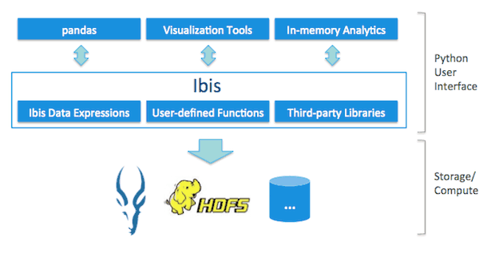

### tl;dr

*   visualizing [MovieLens](http://grouplens.org/datasets/movielens/) 20M data (famous movie rating data) with [Ibis](http://www.ibis-project.org/)
*   build predictive model for movie favor with scikit-learn
*   [repo](https://github.com/chezou/ibis-demo) / [notebook](https://github.com/chezou/ibis-demo/blob/master/ibis_demo_en.ipynb)

### What is Ibis?

Ibis is a bridge between Python and Big Data. Ibis enables pandas handling Big Data.

architecture of Ibis

For more detail, see Wes’s presentation.

As you know, pandas is known as a killer application for data analysis. In my previous job, which is known as a developer of [world largest monolithic Ruby on Rails application](https://speakerdeck.com/a_matsuda/the-recipe-for-the-worlds-largest-rails-monolith), many Rails developer attracted with pandas and Jupyter notebook for sharing analysis result.

### Why Ibis?

pandas loads data on memory, so we have to filter with some SQL before analyzing. But we actually want to get insight and handle without SQL.

### Preparation

### Impala cluster

*   CDH 5.7 with Cloudera Director 2.1
*   table is created with parquet on S3

#### required port

*   impalad node’s 21050 port
*   NN’s 50070 port

### Ibis

*   Python 3.5
*   using wheel and virtualenv, I didn’t use anaconda

### Notebook

Full notebook repo is [here](https://github.com/chezou/ibis-demo/). I also executed same code for Redshift, but several dialects prevent execution…

[**chezou/ibis-demo**  
_ibis-demo - Demo notebook of Ibis for "Spark + Python + Dita science Festival"_github.com](https://github.com/chezou/ibis-demo/blob/master/ibis_demo_redshift.ipynb "https://github.com/chezou/ibis-demo/blob/master/ibis_demo_redshift.ipynb")

### FAQ

#### What is the difference between PySpark?

*   Easy to setup. It is just like connecting DB
*   Fast x10. So that we can x10 experiences. It makes us innovations!
*   We can rapid prototyping with Ibis.

#### Which is prefer to build model Ibis + scikit-learn or Spark + MLlib?

*   It depends on data size.
*   [Netflix uses Spark and R for building predictive models](https://www.infoq.com/news/2016/07/meson-framework-netflix). Netflix uses R in order to model filtered data such as specific country, and they use Spark for global model.
