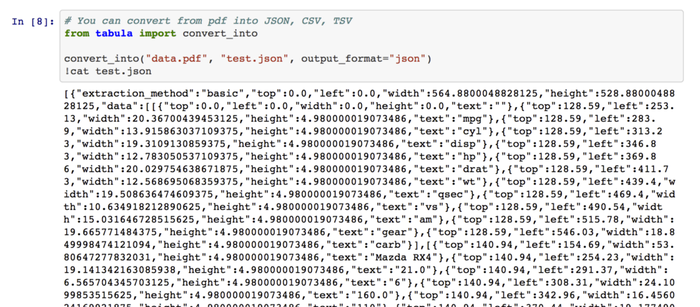
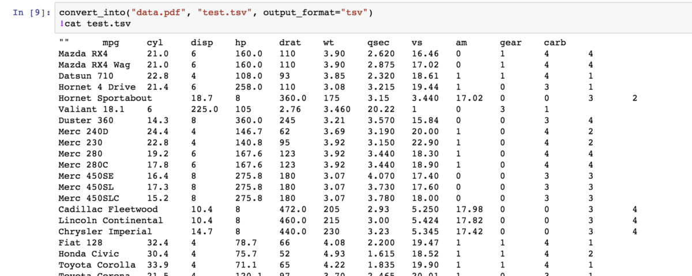

{}
(Oct 7th, 2019)
As of Oct. 2019, I launched a [documentation site](https://tabula-py.readthedocs.io/en/latest/) and [Google Colab notebook](https://colab.research.google.com/github/chezou/tabula-py/blob/master/examples/tabula_example.ipynb) for tabula-py. The FAQ would be good place to execute accurate extraction.

Screenshots in this article is based on the old version interface. See the latest version example in the Colab notebook.
{}


Today, I released tabula-py 0.3.0, which extracts table from PDF into Python pandas’s DataFrame.

<div class="iframely-embed"><div class="iframely-responsive" style="height: 140px; padding-bottom: 0;"><a href="https://github.com/chezou/tabula-py" data-iframely-url="//iframely.net/0WmgXWY?card=small"></a></div></div><script async src="//iframely.net/embed.js" charset="utf-8"></script>

It is simple wrapper of [tabula-java](https://github.com/tabulapdf/tabula-java) and it enables you to extract table into DataFrame or JSON with Python. You also can extract tables from PDF into CSV, TSV or JSON file.

[tabula](http://tabula.technology/) is a tool to extract tables from PDFs. It is GUI based software, but tabula-java is a tool based on CUI. Though there were [Ruby](http://github.com/tabulapdf/tabula-extractor), [R](https://github.com/leeper/tabulizer), and [Node.js](https://github.com/ezodude/tabula-js) bindings of tabula-java, before tabula-py there isn’t any Python binding of it. I believe PyData is a great ecosystem for data analysis and that’s why I created tabula-py. If you are familiar with R, I highly recommend to use [tabulizer](https://github.com/leeper/tabulizer), which has the most richest bindings including rich GUI.

You can install tabula-py via pip:

```sh
pip install tabula-py
```

With tabula-py, you can get DataFrame with `read_pdf()` method.


example of `read_pdf()`

You can also extract tables as JSON format:


example of JSON

You can extract tables into a file like JSON, CSV or TSV with `convert_into()` method.




You can see more examples in Jupyter notebook.

<div class="iframely-embed"><div class="iframely-responsive" style="height: 140px; padding-bottom: 0;"><a href="https://github.com/chezou/tabula-py/blob/master/examples/tabula_example.ipynb" data-iframely-url="//iframely.net/yCWTraF?card=small"></a></div></div><script async src="//iframely.net/embed.js" charset="utf-8"></script>

I hope you will enjoy data wrangling with tabula-py. Any feedback would be welcome!

### Waiting for your collaboration!

If you have any trouble with tabula-py, please file [an issue on GitHub](https://github.com/chezou/tabula-py/issues). I don’t want to receive emails because the answer will not share with other people. Make sure to fill [the issue template](https://github.com/chezou/tabula-py/blob/master/.github/ISSUE_TEMPLATE.md), it will reduce many costs for me to solve the problem. Or, I also check StackOverflow. You can ask about it.

#### Other tabula-py articles

*   [https://blog.chezo.uno/tabula-py-now-able-to-extract-remote-pdf-and-multiple-tables-at-once-6108e24ac07c](https://blog.chezo.uno/tabula-py-now-able-to-extract-remote-pdf-and-multiple-tables-at-once-6108e24ac07c)
*   [https://blog.chezo.uno/a-recent-update-of-tabula-py-a923d2ab667b](https://blog.chezo.uno/a-recent-update-of-tabula-py-a923d2ab667b)
