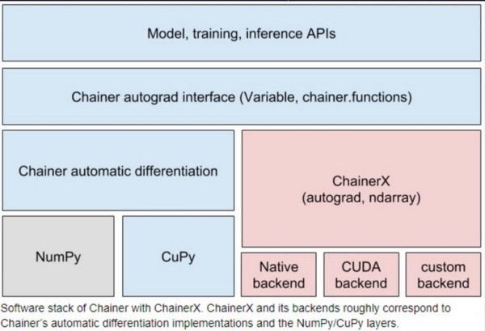

I attended [RubyKaigi 2019](https://rubykaigi.org/2019) held at Fukuoka from Apr 18 to Apr 21. This year’s RubyKaigi was a really great opportunity for me to know the possibility of Data Science and Machine Learning for Ruby.

### Data Science and Ruby

As many of you may know, Ruby is widely known for web application with such as Ruby on Rails, but there is another momentum of Ruby or non-Python language. Here is the list of the sessions about Data Science.

*   [Ruby for NLP](http://youchan.org/RubyKaigi2019 "http://youchan.org/RubyKaigi2019")
*   A Deep Learning Adventure \[[repo](https://github.com/nusco/deep_learning_adventure)\] (talked by Paolo Perrotta, the author of Metaprogramming Ruby!)
*   [Ruby Data Workshop](https://docs.google.com/presentation/d/1wYBqdlv-rBqCcjqaT4pbqYnpA9cDlTr2iKpGAQ-Mz-I/edit "https://docs.google.com/presentation/d/1wYBqdlv-rBqCcjqaT4pbqYnpA9cDlTr2iKpGAQ-Mz-I/edit")
*   Reducing ActiveRecord memory consumption using Apache Arrow
*   [Red Chainer and Cumo: Practical Deep Learning in Ruby](https://speakerdeck.com/sonots/red-chainer-and-cumo-practical-deep-learning-in-ruby-at-rubykaigi-2019 "https://speakerdeck.com/sonots/red-chainer-and-cumo-practical-deep-learning-in-ruby-at-rubykaigi-2019")
*   [Make Ruby Differentiable](https://www.slideshare.net/nagachika/make-ruby-differentiable "https://www.slideshare.net/nagachika/make-ruby-differentiable")

### Center of data science with Ruby

There is three core software supporting these movements:

1.  Apache Arrow
2.  Numo/Cumo
3.  Red Chainer (Deep Learning framework ported from Chainer, implemented in Python)

Apache Arrow is a cross-language data structure for in-memory data. Kohei Sutou, the creator of Red Arrow, Ruby binding of Apache Arrow, who is a Japanese PMC of Apache Arrow. He has also been organizing an initiative called Red Data tools, monthly developer meet-ups for Ruby data tools. The meetup drives Ruby data ecosystem, especially for beginners. I heard from mrkn, a Ruby committer, that Arrow is trying to implement data manipulations those pandas does as C++ code. That means, calculations of tabula style data, a.k.a. DataFrame can be done in Apache Arrow’s Table format so that Ruby would be able to be suitable for data manipulation.

Another essential thing is Numo, which enables to handle numeric array like Numpy and is the fundamental part of DS/ML execution. Cumo is the GPU version of Numo and 75 times faster than Numo for the hello world for Deep Learning, a.k.a. MNIST. The talk about Cumo suggested that many Deep Learning related executions depend on CUDA so that scripting languages can be just a wrapper of them.

Red Chainer enables Deep Learning tasks, but it seems still young. Rather than that, [Menoh-Ruby](https://github.com/pfnet-research/menoh-ruby "https://github.com/pfnet-research/menoh-ruby") can be a great tool, which allows to inference/predict with pre-trained models with PyTorch, Chainer, or any other frameworks which can export ONNX, the intermediate format of DL.

### So, how will be the Ruby data science going on?

Looking at those momenta of Apache Arrow and Cumo, I feel the data science on Ruby would become much easier since the core problems which are related to execution speed can be hidden into C++/GPU layer. And using Menoh-Ruby can be a good opportunity for Ruby on Rails applications to serve prediction results on Ruby!

Red Data tools also create opportunities for many software engineers to jump into ML/DS world. One of my friends told me why he started working on Red Data tools that he wanted to change his field, and it’s an excellent area to join.

If you interested in this movement, let’s join [Red Data tools](https://red-data-tools.github.io/)!