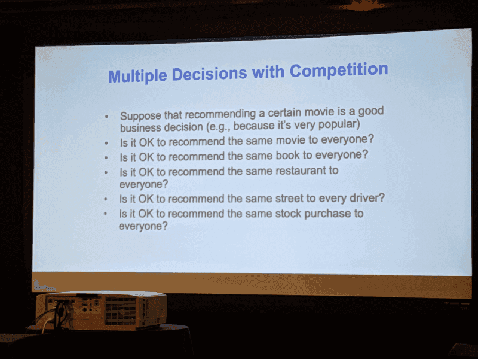
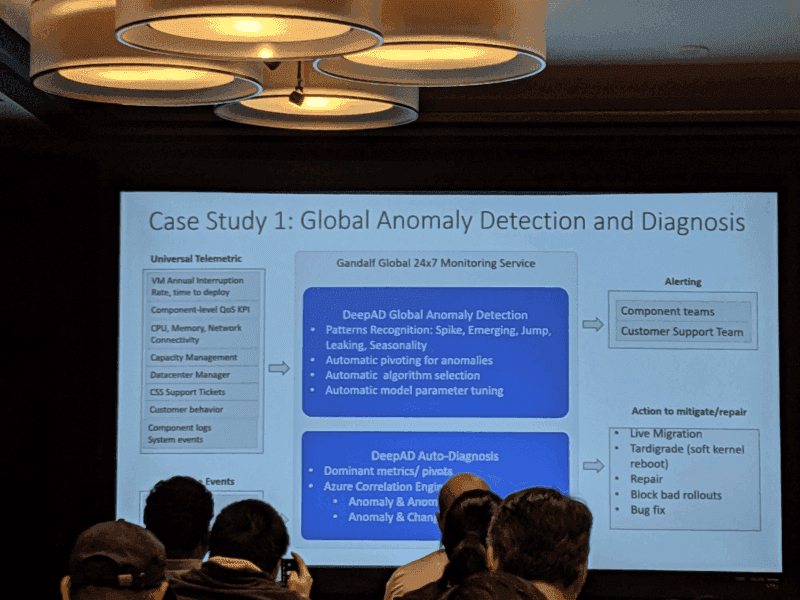

I attended OpML ’19 is a conference for “Operational Machine Learning” held at Santa Clara on May 20th.

[**OpML '19**  
_The 2019 USENIX Conference on Operational Machine Learning (OpML '19) will take place on Monday, May 20, 2019, at the…_www.usenix.org](https://www.usenix.org/conference/opml19 "https://www.usenix.org/conference/opml19")

The scope of this conference is varied and seems not to be specified yet, even if I attended it. I’ll borrow the description from the OpML website.

> _The 2019 USENIX Conference on Operational Machine Learning (OpML ’19) provides a forum for both researchers and industry practitioners to develop and bring impactful research advances and cutting edge solutions to the pervasive challenges of ML production lifecycle management. ML production lifecycle is a necessity for wide-scale adoption and deployment of machine learning and deep learning across industries and for businesses to benefit from the core ML algorithms and research advances._

### Overview of the conference

*   The number of attendees was 210, they came from LinkedIn, Microsoft, Google, Airbnb, Facebook, etc.
*   The target of “Operational Machine Learning” is diverse. I thought it focuses on MLOps things such as reproducibility, ML DSL for productionization, visualization, stakeholder management, but there are many talks about ML for system, system utilization optimization, SRE for ML, hardware accelerator, etc.
*   There is a contrast between tech giants, e.g. Google, Uber, Facebook, Airbnb, Microsoft, and LinkedIn, and other followers. While ML lead companies are talking about their OSSs or ML infrastructures, following companies tend to talk about their specific use case or their solutions (those speakers seems to be small ML ventures).

### Some interesting talks

### Keynote: Ray: A Distributed Framework for Emerging AI Applications

*   [https://www.usenix.org/conference/opml19/presentation/jordan](https://www.usenix.org/conference/opml19/presentation/jordan)
*   Current target of Machine Learning is pattern recognition, but Jordan said decision-making will be the future of ML/AI
*   Creating a “recommendation market” is the key

### MLOp Lifecycle Scheme for Vision-based Inspection Process in Manufacturing

*   [https://www.usenix.org/conference/opml19/presentation/lim](https://www.usenix.org/conference/opml19/presentation/lim)
*   [https://www.usenix.org/sites/default/files/conference/protected-files/opml19\_slides\_lim.pdf](https://www.usenix.org/sites/default/files/conference/protected-files/opml19_slides_lim.pdf)
*   A challenge for defeat recognition by an image in edge applied for Samsung smartphone.
*   They need to inference for 3000 GB images/day.
*   The team structure which involves product inspectors and product managers is interesting


From [https://www.usenix.org/sites/default/files/conference/protected-files/opml19\_slides\_lim.pdf](https://www.usenix.org/sites/default/files/conference/protected-files/opml19_slides_lim.pdf)

### AIOps: Challenges and Experiences in Azure

*   [https://www.usenix.org/conference/opml19/presentation/li-ze](https://www.usenix.org/conference/opml19/presentation/li-ze)
*   Anomaly detection and diagnosis with lambda architecture for Azure
*   Disk failure prediction for Azure which introduces proactively live to migrate the workloads to a healthy disk

### How the Experts Do It: Production ML at Scale

A panel discussion for ML infrastructures

Lead and moderator: Joel Young, LinkedIn

Panelists:

*   Sandhya Ramu, Director, AI SRE, LinkedIn
*   Andrew Hoh, Product Manager, ML Infra and Applied ML, AirBNB
*   Aditya Kalro, Engineering Manager, AI Infra Services and Platform, Facebook
*   Faisal Siddiqi, Engineering Manager, Personalization Infrastructure, Netflix
*   Pranav Khaitan, Engineering Manager, Personalization and Dialog ML Infra, Google

#### The important thing to keep top level is

*   the lead time from experiment to production
*   Flows build for production with involving different team
*   Not everything is the highest priority. Metrics, dashboards are important

#### Cost of run/train vs Agility

*   It’s hard to find down streaming use cases. (Airbnb)
*   Monitor model resource usage
*   Keep ML infrastructure extremely flexible
*   Hard to force using a single framework

#### What are the important things for your ML platform?

Facebook

*   Reliability
*   Scalability
*   Developer productivity

LinkedIn

*   Agility (Available libraries etc)
*   Enabling the latest technology
*   Cost and impact of Machine Learning

Netflix

*   How quickly/many A/B test we can do
*   How rapid new researcher can do?

Airbnb

*   Business impact
*   \# of users for the infrastructures
*   How many inferences/scoring is done?
*   Availability, scalability, cost, and long-term decision making

Google

*   Innovation aspect
*   How can the ML infrastructure system will empower the next 5 yrs products?

### Continuous Training for Production ML in the TensorFlow Extended (TFX) Platform

*   [https://www.usenix.org/conference/opml19/presentation/baylor](https://www.usenix.org/conference/opml19/presentation/baylor)
*   TFX provides a library for recording and retrieving metadata for ML: ML Metadata [https://www.tensorflow.org/tfx/guide/mlmd](https://www.tensorflow.org/tfx/guide/mlmd)


From [https://www.usenix.org/system/files/opml19papers-baylor.pdf](https://www.usenix.org/system/files/opml19papers-baylor.pdf)

### Disdat: Bundle Data Management for Machine Learning Pipelines

*   [https://www.usenix.org/conference/opml19/presentation/yocum](https://www.usenix.org/conference/opml19/presentation/yocum)
*   [https://github.com/kyocum/disdat](https://github.com/kyocum/disdat)
*   Talk about OSS for ML pipeline and data versioning.

### Predictive Caching@Scale

*   [https://www.usenix.org/conference/opml19/presentation/janardhan](https://www.usenix.org/conference/opml19/presentation/janardhan)
*   Traffic prediction for CDN (Akamai)
*   Interesting cache strategy with covering prediction error
