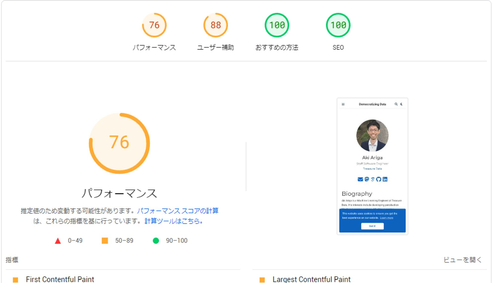
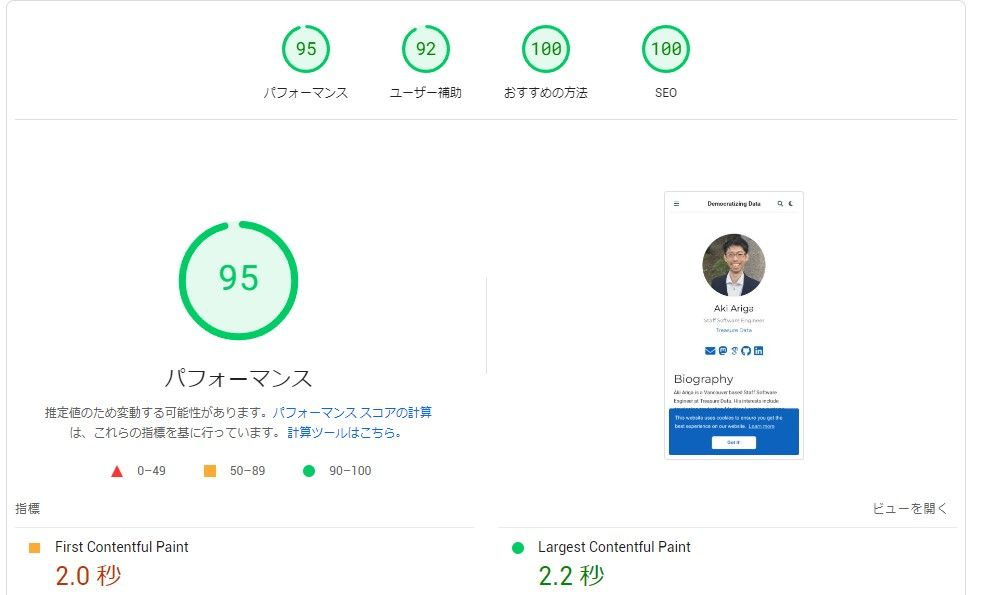

Netlify is a great service, but it is also known as slowness in Japan. I have been using Netlify for my blog hosting for a long time, but I decided to migrate to Cloudflare Pages to improve the speed of access to my blog from Japan.

The migration step from Netlify is pretty straight foward. I just need to follow this official guide: [Migrating from Netlify to Pages](https://developers.cloudflare.com/pages/migrations/migrating-from-netlify/).

My blog is built by Hugo and I use Hugoblox, f.k.a., Wowchemy, as a theme. And, I manage my blog content on GitHub, and just adding the Cloudflare Pages app to my GitHub repository, and it automatically detects the settings and builds the site.

The special consideration on build settings is that I need to set the environment variable `HUGO_VERSION` to the version of Hugo that I use. In my case, I use Hugo 0.88.1, so I set `HUGO_VERSION` to `0.101.0`. Also, I need to set `-b` URL option, it was `$URL` in Netlify, but it is `$CF_PAGES_URL` in Cloudflare Pages.

The build time is pretty fast, and the PageSpeed Insights score is also improved. I can feel faster access on my browser as well. I'm happy with the migration. Actually, the major reason of slowness was downloading fonts and using Font cache on Cloudflare solved the problem.

