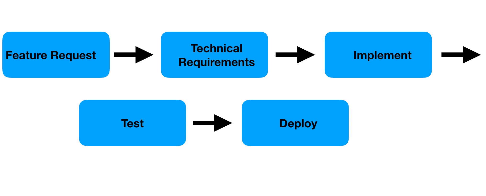
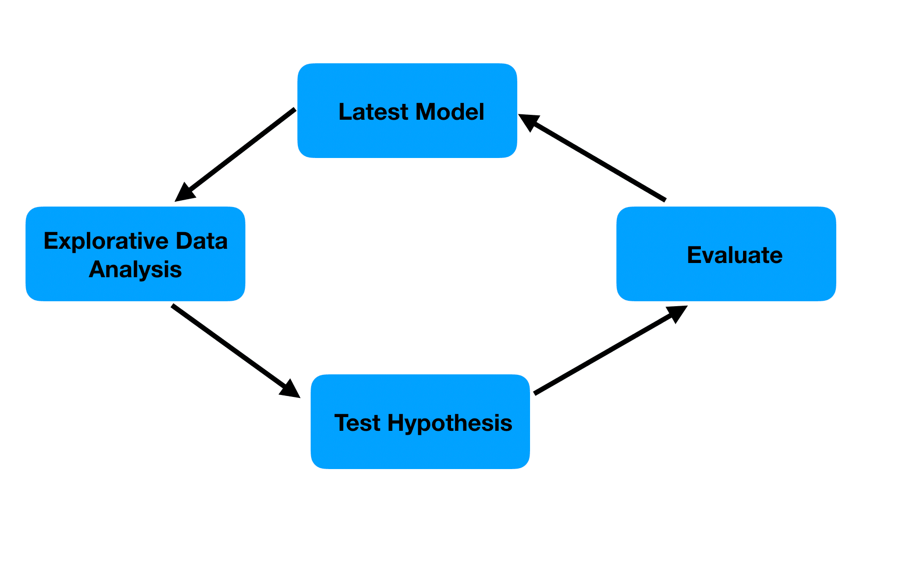

I've worked on several machine learning projects, and intuitively, I've felt that Scrum doesn't seem well-suited for machine learning. However, during an internal discussion, a colleague said, "If we use Technical Stories, we should be able to break down tasks to fit within two weeks for any tasks. And if we do that, we should be able to deliver value in two weeks for ML products." I couldn't properly counter this, so I'm writing this article to articulate my thoughts, including how others in the world are approaching this.

## Disclaimer

I have extensive experience in ML but is not particularly knowledgeable about Scrum, having only participated in a few projects as a development member.

## Research Method

- Brainstorming with Gemini 2.5 Pro (experimental)
  - [Chat Log (Japanese)](https://gemini.google.com/share/e761866427d0)
- Investigating experiences mainly on Reddit

## Anticipated Challenges

Iterative development invariably occurs in ML projects. This is especially true because exploratory phases (EDA and model development) are always involved, and these phases generally involve rework.

I've always felt a strong incompatibility between these high-probability rework for ML tasks and the "deliver customer value in two weeks" sprint.

## Using Technical Stories

What exactly are Technical Stories? I looked into it, and the example at the beginning of the following article resonated with me.

[Feature Injection and handling technical stories](https://lizkeogh.com/2008/09/10/feature-injection-and-handling-technical-stories/)

> As a developer,
> I want an automated build
> So that I can be sure my code works.

I've actually seen stories like this here and there.

However, the article above, when considering where the business benefit (which I understand to be synonymous with customer value) lies, argues for the following template to ensure business value and incorporate features:

> In order to <deliver some business benefit>
> <these people>
> will need <these features>.

Further refining this leads to:

> In order to <deliver some business benefit>
> As a <role> I want <some other role>
> to <do something, or use or be restricted by some feature>.

> In order to stop bots from spamming the site
> As a member of the commercial team, I want users
> to fill in a captcha box.

Happy ending? Really?

## Business Value in ML Projects

The business value in ML projects and ML products remains providing something that positively impacts customers.

Achieving a model with good accuracy doesn't immediately deliver customer value; it's only when the prediction results can be served in the actual production environment that value is delivered to the customer. Alternatively, it might involve summarizing analysis results based on predictions and presenting actionable proposals in a report.

Conversely, I find it quite difficult to deliver such customer value with tickets spanning a few days to two weeks. Often, when a model is being developed, the deployment environment might not even exist yet.

One direction, as Gemini suggests, is to consider "risk reduction and uncertainty reduction as sprint goals." While not direct customer value, there is certainly business value. Gaining insights like "this feature seems effective for prediction" or "this algorithm was unsuitable for this problem" is valuable in itself. That sounds reasonable.

However, by reading [Agile Data Science with R](https://edwinth.github.io/ADSwR/index.html), I got a hint for the question of "Why it's difficult to fit ML tasks into two weeks?".

## Differences in Task-Level Development Flow

[5.1 Linear and Circular Tasks](https://edwinth.github.io/ADSwR/a-methodology-for-agile-data-science.html#linear-and-circular-tasks) compares the task progression in typical software development versus ML development based on the following diagrams.

It states that while task progression is linear at the task level in traditional software development, tasks in ML projects are often cyclical. (The following diagrams are both quoted from [Agile Data Science with R](https://edwinth.github.io/ADSwR/index.html))

Linear tasks in traditional software development are also said to be "completion-oriented" tasks, where the goal is simply to complete the project.

Of course, ML projects also have linear tasks similar to traditional software development, such as data ingestion pipelines, basic preprocessing, developing demo applications with [streamlit](https://streamlit.io/), and developing prediction APIs.

On the other hand, exploratory and experimental tasks are cyclical processes that involve repeating data understanding, hypothesis formulation, and verification. What's difficult is that within a two-week sprint, there's no guarantee of improved prediction accuracy, so nothing can be committed.

## How to Implement Scrum in ML Projects

So, what should we do? Even so, some might be thinking, "Top-down, we've been told to do two-week sprints, so how do we implement it?"

Looking at several discussions on Reddit, I found the following two approaches:

### 1. Stop Using Scrum and Use Kanban

This might sound blunt, but adopting Scrum as the workflow isn't mandatory for agile development.

"Agile Data Science with R" points this out in [3.3 Scrum vs Kanban](https://edwinth.github.io/ADSwR/agile-methods.html#scrum-vs-kanban):

> Both methodologies are applied with great success and it’s important to keep in mind that they are a means to an end, not religions. The Agile values and principles should be the primary guideline and when selecting one of the workflows you do so because it is the best way to work in an Agile way because its the best fit for the given situation.

The point is that Scrum or Kanban isn't a matter of religions; what's important is for the team to choose the best option to achieve their goals and to monitor whether it remains the best fit.

The author's company initially adopted Scrum due to the many experienced Scrum practitioners, but it didn't work well for model development, and they eventually moved to Kanban ([12.3 Moving to Kanban](https://edwinth.github.io/ADSwR/case-study-building-the-valuecheck.html#moving-to-kanban)).

The reasons cited include that Scrum is too rigid and lacks flexibility for exploratory and experimental phases. Also, as mentioned earlier, it's impossible to commit to model prediction performance improvements without seeing the data. Therefore, there's a suggestion that time boxing is better than using story points.

> Scoping for data science is then not just estimating how long a task will take to complete, it is also time boxing. If used in this way, the scoping should be done in time units, not in a subjective measure such as story points. The data scientist should not take longer for the task than the team agreed upfront, wrapping up even when he does not feel completely finished.

Since Data Scientists tend to continue experimenting until they are satisfied, setting time limits rather than strict completion criteria is more rational in the research phase.

In practice, they seem to have adopted a Kanban board with the following six lanes. However, for some tasks, they ended up stopping after confirming that the model accuracy didn't improve during the hypothesis testing phase.

- to do
- test hypothesis
- code review hypothesis
- update model
- code review update model
- done

A very similar point (use Kanban, do time boxing) can be found on [Reddit](https://www.reddit.com/r/MachineLearning/comments/eqzdup/comment/ff07qkm/).

> Don’t confuse agility with solely scrum and its sprints, which are the root of the problem and work poorly in research mode.

This specific example is easy to understand:

> Example: build a PoC in a week. If AUC exceeds X then it’s promising and let’s spend another 3 months on further extensions (data, features, architecture, hyperopt) and putting all into production. If there was no AUC gain on the last week, we do not extend any further. Inside this 3 month time box - execute pure Kanban, task by task, which allows you to take different paths as needed (agility), not waiting till your sprint finishes in 3 days. You already know your new feature is poorly designed and you need to start on tweaking it right now.

In other words, time-box, test hypotheses within that time, and if successful, decide to continue further extensions.

Another key point the author of "Agile Data Science with R" proposes is to quickly create an MVM (Minimum Viable Model) instead of an MVP. For example, initially deploy a simple model like linear regression to a limited set of users as an MVM, then add features, and finally deploy a more complex model (Random Forest is mentioned in the text, but now a NN-based approach might also be considered).

This connects with the idea of time-boxing mentioned earlier. Using an MVM as a hook is a good idea as part of an effort to prune the numerous options and find a high-probability path.

### 2. Use Hypothesis Based Stories (Modifying Scrum)

Another [Reddit thread](https://www.reddit.com/r/datascience/comments/wwi7cs/comment/illoety/) discussed an approach that mixes Scrum and Kanban. They use Scrum for long-term projects and time boxing for research tasks.

Specifically, they seem to have made the following changes to Scrum:

- hypothesis based stories (instead of user based)
- foregoe stand ups, people keep their tickets as research logs and @ people when they need help. - Product owner can read the tickets if they want to know where we are
- monthly retro rather than per scrum, wider focus
- tickets largely written by the data scientists then priorities by product owner

Skip stand-ups and have people keep research logs in their tickets, mentioning others in the tickets when they need help. The Product Owner can proactively check the tickets for updates. Data scientists largely write the tickets, and the Product Owner prioritizes them. The goal is to allow DS/MLE to focus on their work.

Hypothesis Based Stories are particularly unique. If we recall the discussion about business value in Technical Stories, the business value in the hypothesis testing phase of ML can only be described as "reducing risk and uncertainty." Also, by making "formulating and testing a hypothesis" the goal of a ticket, it creates an awareness of the need to formulate proper hypotheses, and the outcome can be closed as "hypothesis was correct/incorrect."

> The point is that the exit criteria is provable and the delivery is typically the proof. Likewise, disapproving the hypothesis is still a success, we learned something.

Here are some examples of such stories:

> “We believe a fine tuned distilbert architectures will allow us to identify cases with a precision of greater than .95 and a recall of greater than .7.”

> “We believe it should be possible to transform a given article within our dataset to our standardised form without additional datasets or augmentation”

> “We believe x metric can best be explained to stakeholders using a combination of shap values and distribution charts”

## Aside: What Does a Product Owner Do in ML Projects?

As an aside, there's a detailed chapter on what a Product Owner does if they don't create tickets ([5.6 The Product Owner Role](https://edwinth.github.io/ADSwR/a-methodology-for-agile-data-science.html#the-product-owner-role)).

In summary:

- Takes on all communication with stakeholders, allowing DS/MLE to focus on tasks.
- Helps discuss and organize the tasks created by DS/MLE through scoping.
- Prioritizes the tasks created by DS/MLE.
- Points out business concerns that DS/MLE might not be aware of.

Reading this, I feel like the time of DS/MLE is considered more valuable than that of SWE.

## Conclusion

After a quick investigation, I've reached the following conclusions:

- Strict Scrum is not suitable for ML projects.
- If possible, separate workflows for research/exploration phases and development phases.
- In the research/exploration phase, use time limits instead of story points.
- In the research/exploration phase, proceed based on hypothesis testing (write Hypothesis Based Stories, use Kanban).

The idea of time boxing and progressing research tasks centered around hypothesis testing, while common sense in ML projects, is a very powerful support.

So, in response to the initial statement, "If we use Technical Stories, we should be able to break down tasks to fit within two weeks. And if we do that, we should be able to deliver value in two weeks," my reply would be:

- Understand business value as "reducing uncertainty."
- Use Hypothesis Based Stories instead of Technical Stories, or Kanban.
- Instead of setting concrete goals within a two-week timeframe, quickly iterate through possibilities by setting time limits.
