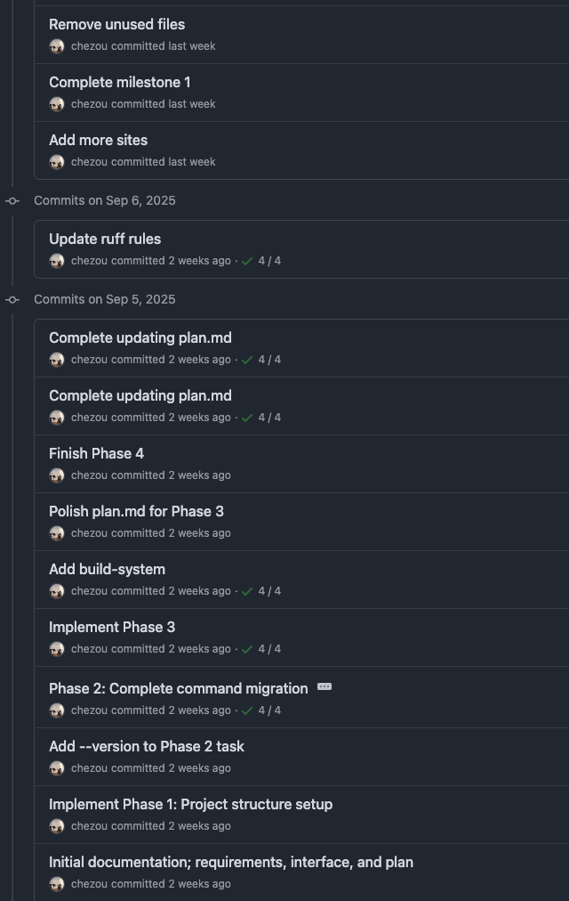

This year, the amount of time I spend on reviews has exploded. This applies to both code and documentation.
And the fatigue from this has also increased dramatically.

Of course, this is because the speed and volume of output have increased with the help of LLMs.
However, the quality hasn't necessarily improved; in fact, I feel my productivity is declined.

I'm going to do a brain dump to write down what the challenges are and how I'm dealing with them.

## Proxy Prompting Through Other Humans

I've been working as a tech lead on machine learning projects for a while now.
As part of my job, I often write technical documents like [Engineering Requirement Documents](https://sybridge.com/how-to-write-an-engineering-requirements-document/), but I also have many opportunities to review them.

The difficult thing about machine learning is that when a project changes and the problem to be solved shifts even slightly, a completely different set of knowledge becomes necessary, requiring you to read new research papers.

Imagine you've been building web applications with Rails for years. Then one day, someone hands you the specification document for a Ruby parser generator, saying, "It's Ruby, so it should be the same, right?" You can tell it was all generated by an AI, but how do you review it? How do you provide feedback to make it a sound specification?
You would probably start by reading implementations in other languages or research papers to build a mental index before you could even begin the review.

Having to review specifications in such a world is truly exhausting. It's a struggle just to get to a point where you have more knowledge than the generator. And after you've made the effort to provide appropriate comments, what awaits you are rebuttals made entirely by a generative AI, and the revisions are drastic, overwriting everything on a large scale without regard for the previous context.

I describe this situation as "prompting through others," and frankly, in most cases, it's faster for me to just read the papers and discuss them with an LLM myself.

Some readers might think, "Why not just have an LLM review the text generated by an LLM?" But this is fraught with a difficult problem: who guarantees the correctness of the LLM's review?
I often feel this even when I'm interacting with an LLM myself—"[LLMs are like Gacha games](https://tech.dentsusoken.com/entry/2025/08/27/%E5%AE%9F%E7%94%A8%E5%93%81%E3%82%92%E4%BD%9C%E3%81%A3%E3%81%A6%E6%8E%A2%E3%82%8B%E7%94%9F%E6%88%90AI%E3%82%92%E4%BD%BF%E3%81%A3%E3%81%9F%E3%82%BD%E3%83%95%E3%83%88%E3%82%A6%E3%82%A7%E3%82%A2%E9%96%8B#%E3%83%AA%E3%83%95%E3%82%A1%E3%82%AF%E3%82%BF%E3%83%AA%E3%83%B3%E3%82%B0%E5%9C%B0%E7%8D%84%E3%81%A8%E3%83%97%E3%83%AD%E3%82%BB%E3%82%B9%E6%95%B4%E5%82%99%E3%81%AE%E4%BA%8C%E9%80%B1%E7%9B%AE%E4%B8%89%E9%80%B1%E7%9B%AE)." ([Wikipedia: Gacha game](https://en.wikipedia.org/wiki/Gacha_game)) The output is inconsistent; if you ask the same question three times, you'll often get three different answers.

I believe that the limits of current LLMs and generative AI are defined entirely by the limits of human ability. If the person acting as a proxy continues to be just a proxy, they will become unnecessary. It's important to escalate this appropriately to a manager.

As a side note, text generated by LLMs can often be detected by the high frequency of certain words or the [sudden appearance of em dashes](https://www.reddit.com/r/ChatGPT/comments/1fx12q1/is_an_em_dash_proof_of_ai_manipulation/). But as a non-native English speakers, it's often given away by the presence or absence of quirks specific to a native speaker's language. So, I'm trying to be confident in the results I generate and pass them on to others as our own opinions.

## Lack of Self-Review, or the "Eyes Glazing Over" Problem

As I wrote in the previous section, it's often the case that people don't self-review what they've generated. This only breeds mistrust, so it's best to stop immediately.
However, the reality is that even with self-review, it's easy for your eyes to just glaze over the content.

I learned in a 1-on-1 with my manager that there's a tendency for people, even the same person, to be more lenient when reviewing code they generated themselves and stricter when reviewing code generated by others. I get it.

When I think about why this happens, it's because non-hand-crafted code often doesn't get stored in your brain's cache. Furthermore, when generating code with something like Claude Code, the user experience makes it tedious to look at every diff. So, you end up generating something that works in "auto-approval mode" and then reviewing it. But when there are massive changes, you can't keep up with the details. And you can't to resist to think, "Well, the unit tests are passing, so it can be okay."

## Big Bang Commit

Recently, I received a pull request which diff was `+10,000 -7,000` lines in a single commit. Yes, a big bang commit PR.

When you generate code with an LLM, especially in an auto-approval mode, the agent goes through a lot of trial and error. And a characteristic of agentic coding is that it overwrites large chunks of code aggressively. The existing design, which would have been respected if the same person were writing it by hand, was largely ignored in the PR generated by the LLM.

There's a research suggesting that [LLMs tend to generate complex code](https://arxiv.org/html/2501.16857v1#S4.F4). I read somewhere a paper that talked about how LLMs have an incentive to generate code that is difficult for humans to understand to avoid negative feedback. Yeah, that makes sense.

Also, LLMs don't automatically break down tasks into appropriate granularity while Claude Code and GitHub Copilot create a TODO list. It's quite difficult unless you give them careful instructions.

By the way, it remains an open question that making appropriately sized commits is a universal and very difficult problem, especially for exploratory implementations like in machine learning.

## The Difference in Incentive Structures Between the Generator and the Reviewer

Many leaderships want to claim that "using LLMs increases coding productivity," and I understand this is because many people strongly believe in AI-driven productivity improvements to proof its ROI, and there's a hype that should be true.

Now, I'm aware there are various debates about code generation throughput, but I think it's possible it will increase. However, the speed of the reviewer's side hasn't gotten any faster yet. It will probably take a little more time (at least a year?) before we can entrust all reviews to LLMs. Also, we can't avoid an extra step to review LLM generated code.

We end up with an increase in a large amount of code that has been generated with a lenient self-review because the creator's eyes glazed over.
In other words, the generator's goal is to maximize generation throughput, while the reviewer, regardless of that, must ensure quality.
This difference in incentive structures is likely the main cause of review fatigue.

## How to Approach Code Reviews Mostly Generated by LLM

So, what am I doing about it? Honestly, I haven't found a silver bullet yet, but I want to share the results of my various experiments.

### 1. The Generator Reviews Their Own Code as Someone Else's on GitHub

This comes from my own reflection on a time I made a rather large commit (+700 lines or so). Recently, in addition to reviewing and approving the code generated by the LLM in my local VSCode every time during implementation, I've also started reviewing the PR in a draft state on GitHub.

By doing this, my mindset switches to "reviewer mode," and I've been able to find various flaws.

It may seem obvious, but I think using a dedicated review view is good because it puts you in the same mental model as when you're reviewing someone else's code.

### 2. Document-Driven Development

In the story of developing a Java version manager called [Kopi](https://tech.dentsusoken.com/entry/2025/08/27/%E5%AE%9F%E7%94%A8%E5%93%81%E3%82%92%E4%BD%9C%E3%81%A3%E3%81%A6%E6%8E%A2%E3%82%8B%E7%94%9F%E6%88%90AI%E3%82%92%E4%BD%BF%E3%81%A3%E3%81%9F%E3%82%BD%E3%83%95%E3%83%88%E3%82%A6%E3%82%A7%E3%82%A2%E9%96%8B), several helpful initiatives were taken, so I tried them myself.

The three important points I learned from this article and the actual commits are:

- Always give the LLM a task size that a human can implement in about 30 minutes (to avoid context overflow).
- Follow a flow of requirements definition -> external design -> work plan.
- Furthermore, commit the above documents along with the code.

A very important point is that by committing the requirements document, external design document, work plan document, (and acceptance tests) as documentation along with the implementation, the intent becomes easier for humans to understand, even if the commit is somewhat large.
Also, by properly organizing the work plan, you can provide the LLM with a rein to develop and commit at an appropriate granularity.

I tried this method myself by open-sourcing a script I had written as an internal tool.

I can't show you the proper commits from when I was adjusting the internal code for open-sourcing, but the general workflow was as follows:
(GitHub Copilot + Sonnet 4)

1. First, discuss what I want to do with Sonnet 4 in Agent mode and organize it into [`docs/requirements.md`](https://github.com/chezou/petit-cli/blob/1d966199195d1fb02d97445e70d3e82d532dc095/docs/requirements.md), [`docs/interface.md`](https://github.com/chezou/petit-cli/blob/1d966199195d1fb02d97445e70d3e82d532dc095/docs/interface.md).
2. Have it create a TODO list with checkboxes for each phase of the implementation and save it as [`docs/plan.md`](https://github.com/chezou/petit-cli/blob/1d966199195d1fb02d97445e70d3e82d532dc095/docs/plan.md).
3. Have it create an [`AGENTS.md`](https://github.com/chezou/petit-cli/blob/1d966199195d1fb02d97445e70d3e82d532dc095/AGENTS.md) file containing these documents and development conventions, toolsets, etc.
4. Implement each phase and commit. At that time, check off the item in `plan.md` and commit.
5. When moving to the next phase, clear the agent's context and have it read `AGENTS.md` and `plan.md` to start the work.
6. When the planned phase is finished and it's time to move to the next milestone, create a folder like `docs/milestone1`, move `plan.md` there, and make `docs/plan.md` an empty file to start development on the new milestone.

The actual PR for the open-source project looks like this:

[PR Example: Milestone 2](https://github.com/chezou/petit-cli/pull/1)

Honestly, the commit granularity is large, and several features are committed together, but if I wanted to, I could easily make a commit for each checkbox because I'm managing the `plan.md` file.

In other words, the good thing is that you can understand if there are any major problems at the design level from the documents. If the design is flawed, you can go back and discuss it there without having to read the implementation, which I believe helps avoid pointless reviews.

## How to Approach Document Reviews Mostly Generated by LLM

Honestly, I have no answer yet. What a colleague said really resonates with me: "People who blindly accept and pass on LLM-generated text are no different from the types who believe something is true just because a TV host said it on a variety show."

Based on my experience, I'm discussing the feedback way and wording with Gemini. LLM supports creating the appropriate wording for a feedback/escalation and suggests escalation strategy as needed. (Gemini is a lonely Principal's mentor!) Have it enumerate the problematic data points and summarize them. Summarization is inherently a strong suit of LLMs, and models tuned by American companies so they are good at American style of feedback.

## I Can't Conclude

I've written about various challenges and what I've done about them, but honestly, I'm still feeling my way through this.
However, fundamentally, the limit of an LLM is the limit of the human using it. Therefore, it will still be necessary for humans to create workflows with a primary focus on how to maximize their own abilities.
