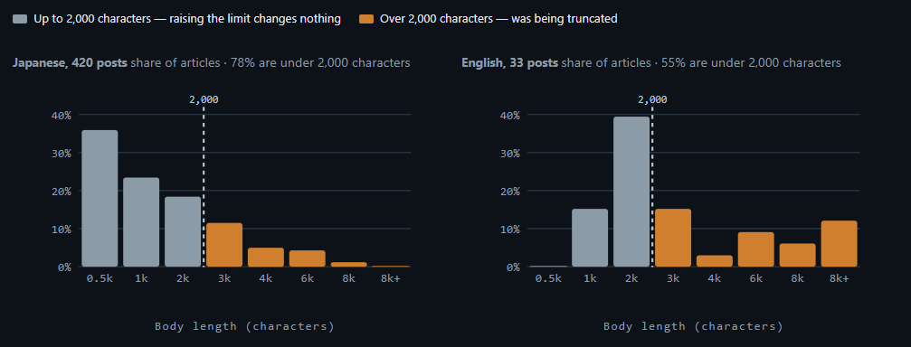
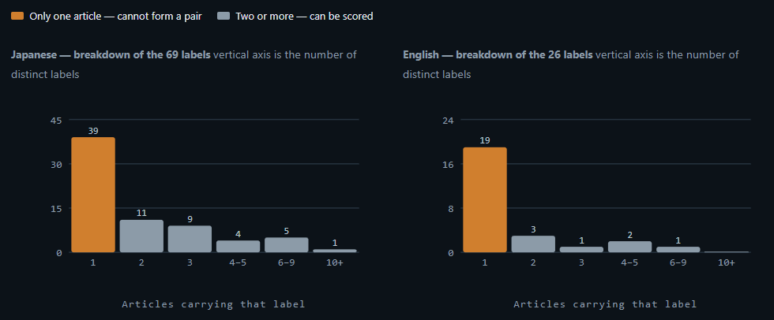
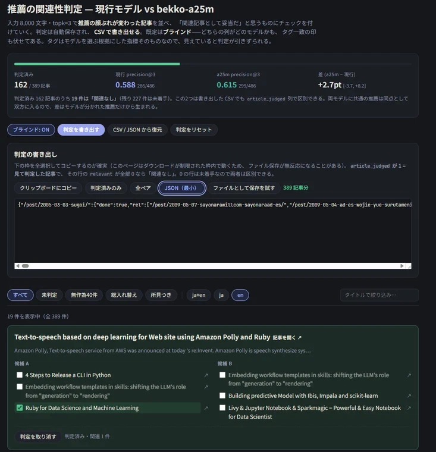

## Intro

This site's related-article recommendations run on a tool I built myself: [prelims-cli](https://chezo.uno/post/2022-01-25-hugo-content-based-recommendation/), a CLI wrapper around [prelims](https://github.com/takuti/prelims/), which enriches Hugo front matter with various metadata.

[prelims](https://github.com/takuti/prelims/) itself only computes related articles via TF-IDF keyword similarity, but prelims-cli adds embedding-based recommendation on top. It's built to run on GitHub Actions on every new post: no GPU, limited memory.

I'd been using [ruri-v3](https://huggingface.co/sirasagi62/ruri-v3-30m-ONNX) for Japanese and [granite](https://huggingface.co/onnx-community/granite-embedding-small-english-r2-ONNX) for English, the lightest models that still gave decent quality. Then [Bekko Embedding](https://arxiv.org/abs/2607.25180), a new small, lightweight embedding model, came out, and I tried it to see whether I could unify the Japanese and English models under one that also covers other languages.

The related articles on this site now run on Bekko a25m. This post covers how I got there, and in particular the trouble I ran into running the experiments with Claude.

## How to use it for embedding-based recommendation with prelims-cli

Since prelims-cli v0.0.11, you can use Bekko embedding by setting the `multilingual` option.

Write a file like the one below as `embedding.yaml`, and run `uvx --python 3.13 'prelims-cli[embedding]' --config embedding.yaml` from GitHub Actions.

```yaml
handlers:
  - target_path: "content/blog"
    processors:
      - permalink_base: "/post"
        type: embedding_recommender
        language: multilingual
        topk: 3
        cache_db: ".prelims_embedding_cache.db"
```

The story starts with a comparison of the old and new embedding models, done with Claude Opus 5.

## First attempt, and why I gave up

These are related articles on my own blog, so there's no ground truth to evaluate against. I asked Opus 5, and it proposed a proxy metric: tag/category agreement rate. The full definition is in the report below, but roughly: the denominator is the number of top-k recommended articles that carry any tags or categories, and the metric counts how many of those share a tag or category with the source article.

The result was noise-level: the metric's resolution was ±5–7pt, while the difference between models was only about 2pt. Raising the input length from 2,000 to 8,000 characters improved English quality more than switching models did.



Since this runs in GitHub Actions CI, download time is processing time. Switching to Bekko a25m bumps the model size to 199 MB, well above the 35 MB and 52 MB of the models I'd been using. I concluded the benefit wasn't worth the cost, and moved on.

## The metric was broken

That's when Opus 5 pointed out that the denominator |P| in the tag/category agreement rate isn't fixed. It moves with the recommendations themselves. Bekko happened to recommend tagged articles more often, which inflated its denominator and made its agreement rate look worse.

Opus 5 had been noting this growing denominator in the HTML report the whole time. Neither of us, human or LLM, had read it. That's the irony.

An LLM's evaluation looks plausible on the surface, but it will commit to a metric without checking the underlying data distribution first.

## Two ways to respond to a broken metric

I'd already half-suspected that a tag shared across more than one article was the exception rather than the rule. So I plotted the tag distribution to check.



Sure enough: in Japanese, 39 of 69 tags/categories appear on only a single article; in English, 19 of 26. Of the 4,465 possible pairs among the 95 tagged Japanese articles, only 212 (4.7%) share a label. There are barely any "correct answers" to measure against.

Tag/category agreement rate simply doesn't have the coverage to work as an overall metric.

I decided Opus 5 was stuck in a local optimum on this one, so I switched to Fable 5 and asked for a new metric. Fable 5 proposed fixed-pool precision@k, which fixes the denominator problem, plus pairwise AUC. It dropped tag agreement entirely.

But once I'd settled on that and moved back to Opus 5, it kept clinging to the metric it had originally proposed, still reporting agreement between tag agreement rate and the human evaluation I collected later.

## Being put to work by Claude

I remembered the advice you hear again and again when evaluating anything in an AI agent context: look at the real data. So I had Claude build me an annotation tool and did the evaluation by hand.

It struck me, working through the evaluation in the browser, how easily coding agents now throw together one-off annotation tools like this.



I stopped after annotating 162 of the 389 articles with recommendations: enough to confirm that all three top metrics favored the new model, with the difference staying non-negative even at the lower bound of the confidence interval.

Somewhere around then, complaining to Claude about how exhausting the annotation was, I found out it had quietly been running an active learning technique that only shows you the cases where the two models' recommendations differ. The AI had slipped in an efficient, demanding labeling method, and put me to work without my noticing.

## What the human labels actually showed

What I saw in that painful hand-annotation, combined with the LLM's own observations, tipped me toward adopting the new model.

The LLM's observations helped too.

> For a write-up of a new album by the Real Group (a Swedish jazz a cappella group), a25m surfaces two reviews of earlier albums by the same artist; the old model returned a live announcement for a different artist entirely.

> For a review of _Utsukushii Kodomo_ ("Beautiful Children") by Ira Ishida (a prolific Japanese novelist best known for the _Ikebukuro West Gate Park_ series and the 2003 Naoki Prize winner _4 TEEN_), a25m surfaces _Akihabara@DEEP_ and _Ai ga Inai Heya_ ("The Room Without Love"), both by the same author; the old model matched on author only once.

> For the report on Kawasaki Ruby Kaigi 01, a25m puts its sister event, Kanagawa Ruby Kaigi, at the top; the old model returned monthly meetup reports instead.

It worked out that Kanagawa Ruby Kaigi and Kawasaki Ruby Kaigi are sister events, which impressed me. It also picked up on overlapping authors and artists, which felt satisfying to see. The two models have different habits, but this one was good enough to adopt.

Going back through my own older posts, I noticed the early ones read like a diary and often ramble across several topics at once. That's a good reminder of just how hard it is to recommend related articles for posts like that.

## Making it work in CI

With Bekko embedding qualitatively confirmed as an improvement, I cleared the remaining technical blockers in parallel:

- Cached the model download from Hugging Face in GitHub Actions
- Optimized batching so embedding wouldn't hit the memory limit

With those in place, embedding all 452 articles takes 3 minutes 8 seconds including the model download, or 2 minutes 51 seconds with the cache warm: a realistic runtime. In practice, embeddings are computed incrementally as new articles are added, so it's even faster day to day.

That's how I ended up adopting Bekko a25m for related-article recommendation.

## Three takeaways

Three things came out of this.

1. An LLM's evaluation is surface-level. Go look at the data yourself.
2. Humans are creatures LLMs can put to work doing active learning.
3. Opus 5 tends to cling to whatever method it originally proposed, so for ambiguous, open-ended tasks, Fable 5 was the better fit.

1 and 3 weren't news to me, but 2 was a genuine surprise. I'd always assumed coding agents try to maximize how much they can get out of me as the human in the loop. I didn't expect one to quietly slip in such a demanding method.
