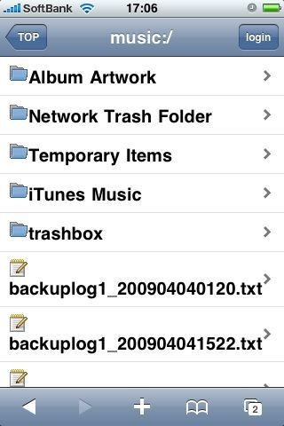

NASに蓄えてある音楽へどうやってiPhoneからアクセスするかを考えたときに、2つの方法があったので、検討してみた。(Simplify Music2はまだ試してないですが)

方法としては、

- BuffaloのNASに付いている機能であるLinkStationのWebアクセス機能
- Simplifi Music 2 というPC上のiTunesの楽曲を共有するアプリ
の二通りの方法が考えられる。  
ちなみに、我が家のNASは[LS-C1.0TL](http://buffalo.jp/products/catalog/storage/ls-cl/)という代物で、最初の発表の時にはiTunesの共有サーバ機能が告知されていたのに、買ったときには既にその機能は削られていたという代物。あれ？kogureさんところに情報乗ったときには、OKだって書いてあったから信じてたのに、、、(ちなみに、後継機である[LS-CH1.0TL](http://www.amazon.co.jp/BUFFALO-%E3%83%8D%E3%83%83%E3%83%88%E3%83%AF%E3%83%BC%E3%82%AF%E5%AF%BE%E5%BF%9CHDD-LinkStation-1-0TB-LS-CH1-0TL/dp/B0027FJVPQ)はiTunesサーバ機能が搭載されているのであった)

今回は、Webアクセス機能を試してみた。(ちなみに、Simplify Music2の情報はこちらでどうぞ。[iPhoneあっぷ使ってみた: Simplify Music 2 - 自宅の音楽をリモートで](http://www.apptoiphone.com/2009/05/simplify-music-2.html))  
色々調べているうちに、外から見なくて良いならBuffalo.comを経由してアクセスする必要ないんじゃね？と思っていたら、このサイトを発見した。

[LinkStation の Web アクセスを LAN に閉じる設定 - mallowlabsの備忘録](http://d.hatena.ne.jp/mallowlabs/20090215/lsshareconfig).  

まさしく、望んでいた情報だった。つまり、ローカルのNASにアクセスするのみであれば、Webアクセスの設定時に「NASのIPアドレス」を設定すれば良いだけだったのだ。通常は、Baffalo.comを使うという設定になるが、うちではUPnPも静的NATの設定も上手くいかなかったから、苦肉の策でもあった。そしたら、意外にもローカルで回す分にはこれで十分いけるみたい。しかも、外にポートを開放していないから外部にNASを晒すというリスクも減るでしょうしね。

Webアクセス機能の実際の使い勝手としては、イマイチだった。

- 大量の曲(50G以上)が存在しているときに、フォルダを開いてブラウジングして目的の曲を探すのは面倒。というかやる気にならない
- 一曲ずつしか再生できないので、BGMにしようという目的には全く向かない。というか不可能。
で、結局試してみた物の、お蔵入りになりそうな予感です。どちらかというと、この機能は遠隔地の人にファイルを提供するためのもの？なのかもしれません。iPhone用の画面も一応ありますが、、、おまけみたいなものですね。

今度は、Simplify Music2を試してみたいところ。ネックは、PCを起動させておかないと共有音楽にアクセスできないことかなぁ。

