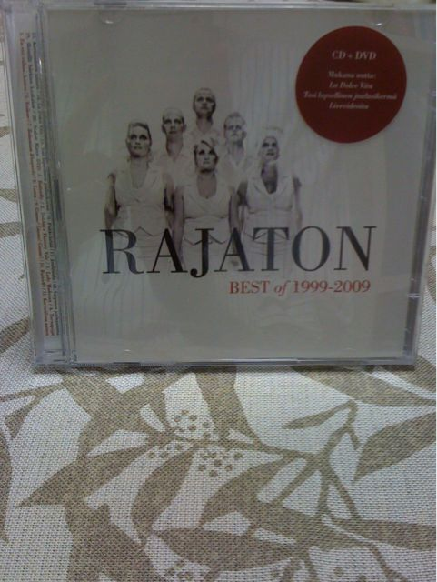

---
authors:
- aki
categories: null
date: '2009-11-10 13:56:43-08:00'
draft: false
featured: false
image:
  caption: ''
  focal_point: ''
  preview_only: false
keywords:
- dvd
- アルバム
- cd
- rajaton
- 前者
- butterfly
- live
- 映像
- 程度
- 魅了
lastmod: '2009-11-10 13:56:43-08:00'
projects: []
recommendations:
- /post/2009-11-26-the-real-album/
- /post/2008-09-28-bznoultra-treasuregayabasugiru/
- /post/2011-07-02-rajatonnole-pu-wori-ben-karamai-ufang-fa-sulasol-or-akaperacun-nocdwu-san/
subtitle: ''
summary: ''
tags: []
title: RAJATON BEST of 1999-2009がうちにきた
---

いつの間にか、Finlandのアカペラグループ[Rajaton](http://www.rajaton.net/main.site?set_language=eng)のベストアルバムが出ていたので購入してしまいました。(日本でのRajaton情報は[あかぺら村](http://acappellavillage.blog103.fc2.com/blog-category-15.html)さんが詳しいです。最近は[関心空間にも素敵なファンの方が](http://www.kanshin.com/keyword/1148201)いらっしゃるようです)

本当はThe Real Groupの一番新しいアルバムも買ったのですが、新メンバーお披露目、という印象程度で今日まで来てしまったので、いつか多分書きます。。。

で、CD自体はベストということで、今までのアルバム結構持ってるから知ってる曲ばっかりかなぁーと思ったら、CDにしていなかった曲も2曲納められていました。La Dolce VitaとTosi lapselinen joulusikermä, Liveですが、前者はYouTubeなどでTVの映像が良く出てくる歌謡曲みたいな曲です（映画の曲らしい？）。

それよりも、お目当てはDVDです。結構JouluというDVDと重複があるのですが、ButterflyのLive映像は以前のDVDにはありませんでしたし、LuntaとKertosäkeen nainenという曲が素敵です。前者は、雰囲気イケメン（笑）なPVで魅了してくれます。後者はメンバーが楽器を演奏（！？）しながら奏でる楽しげな曲です。このDVDのおかげで更にRajatonが好きになりました。ただ、PALなので日本ではPCでしか見られないと思います。

総括すると、CDは入門者にもおすすめな手堅い曲がきっちり入っていて、かつDVDも良い曲揃いですので、Rajatonに興味のある方は是非買いです！お値段も22ユーロ程度とお値打ちです。国内で入手する場合は、[あかぺら村のCD屋さん](http://acappellacd.cart.fc2.com/?sort=&ca=&word=&page=0)が手軽で良いのではないでしょうか。

やっぱりButterflyは名曲です！

追記：  
関心空間の素敵な記事を書いていた方も[このアルバムを手にされていました！](http://bluecross.seesaa.net/article/131456752.html)ヘルシンキで手に入れられたようで、羨ましい限りです。