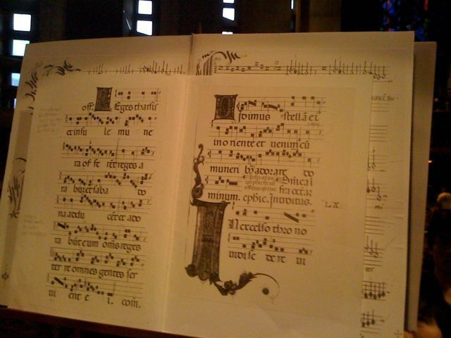
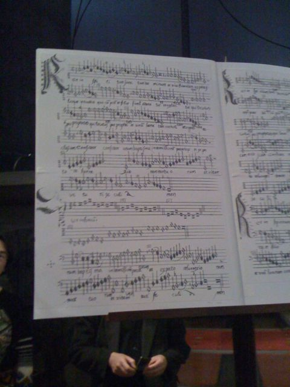

[ヴォーカル・アンサンブル・カペラ](http://www.cappellajp.com/)の演奏会に初めて行ってきました。  
曲目は、以下の通りです。

&gt; ジョスカン・デ・プレ　ミサ《フェラーラ公エルコレ》  
&gt; Josquin des Prez (ca.1450/55-1521), Missa Hercules dux Ferrariae  
&gt; ジョスカン・デ・プレ 「神よわたしを憐れんでください」（詩編51編）  
&gt; Josquin des Prez, &quot;Miserere mei Deus&quot; (Psalmus 50)  
&gt; グレゴリオ聖歌　ミサ固有唱 Gregorian chant, Proprium missae

ルネッサンスは専門外なのですが、非常に楽しめました。目黒の聖アンセルモ・カトリック目黒教会にて演奏を聴いてきました。天井の高い教会で、久しぶりに倍音がわんわんと鳴っているのを体感しました。また、演奏前に曲目の丁寧な解説がついていたため、本来楽譜を持っていないとわからないような曲の構成に対しても気づくことができ、一層楽しめました。Hercules dux Ferrariaeという文字列が、&quot;レドレドレファミレ&quot;という音型になるということは歌付きの解説があって初めてわかったものでした。

ちなみに、この楽譜たちは本番で皆さんがみていた楽譜たちです。人の胴体ぐらいの大きさがありました。

