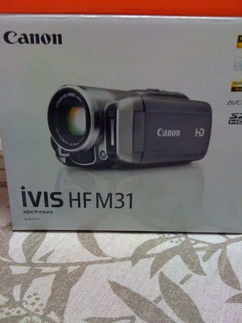
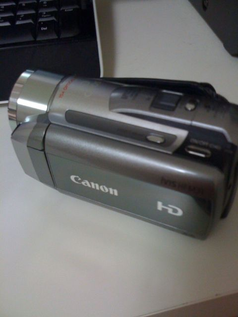

【追記】撮影した映像を[こちらの記事](http://wp.me/pvR30-ft)に投稿しました。

5/22まで5000円キャッシュバックキャンペーンと言うことで、買ってしまいました。

近所のビックカメラの方が安い説とか、注文したところが2chで評判悪いところだったとか、後から発覚した様々なネガティブ要因がありました。しかし、無事に届いて触っていたらひゃっほいと楽しくなるばかりです。

併せて後から買ったものとしては、  
[SANWA SUPPLY DG-LC27WDV 液晶保護フィルム(2.7型ワイドデジタルビデオカメラ用)](http://www.amazon.co.jp/gp/product/B00340I9RE/)

[プロテック HDMI-MiniHDMIケーブル ハイスピード Ver.1.3b規格カテゴリー2対応 PHD-AC15 31889](http://www.amazon.co.jp/gp/product/B002TKKQLC/)

[ELECOM デジタルビデオカメラケース/インナー/Sサイズ](http://www.amazon.co.jp/gp/product/B001Q9EF64)

を買いました。

保護フィルムはタッチパネルの汚れよけとしてですが、ちょうどというか少し足りないかもくらいな感じです。縁まで覆いたい人には向いていないかもしれません。僕にはちょうどでしたが。  
miniHDMI-HDMIケーブルは対応モニタがある人は必須ですね。実家とかでパッと見せるのにフルHDの動画をささっと見せられるのは魅力です。  
ケースに関しては、割とぴったりという印象です。予備バッテリを買ったら入るかどうかが心配なサイズです。逆に言えばコンパクトでぴったりとも言えます。

まだ買っていないもので、いずれ買おうと思っているのが、SDHCカード 32GB。よく分からないけど、Class6以上が良さそうな感じなのでしょうか。[この辺](http://www.amazon.co.jp/dp/B0021R5H4O/)かなぁと思っていますが、なかなか今時の事情が分からないんですよね。  
予備バッテリは純正品は高くて手が出ないので、互換バッテリで行こうと思います。で、[残量表示がされるけど容量が少ないとか微妙な評判のものか](http://www.amazon.co.jp/dp/B003BME032/)、[安いしRowaだからなんとなくマシかなと思うけど残量表示できないもの](http://www.amazon.co.jp/dp/B002G1N21U/)のどちらにしようか悩んでいます。前者が実働どれくらいなのかで変わってくるんですよねぇ。

ちなみに、画質は素人ですが満足。手ぶれもしっかり脇を締めていれば気にならない程度。録画したAVCHDのデータもYouTubeに簡単にフルHDで投稿できて、思いの外あっけない印象です。色々調べてみたんですが、結局.mtsファイルをYouTubeでアップロードすれば、後はよしなにしてもらえます。付属のツールも編集しないのならあんまりお世話にならなくてすむかも、という感じです。今は、YouTubeって知人だけにURLを公開する限定公開ができるので、(URLがばれなければ)実家の家族とかにも簡単に見てもらえて便利ですね。これから楽しみだー

