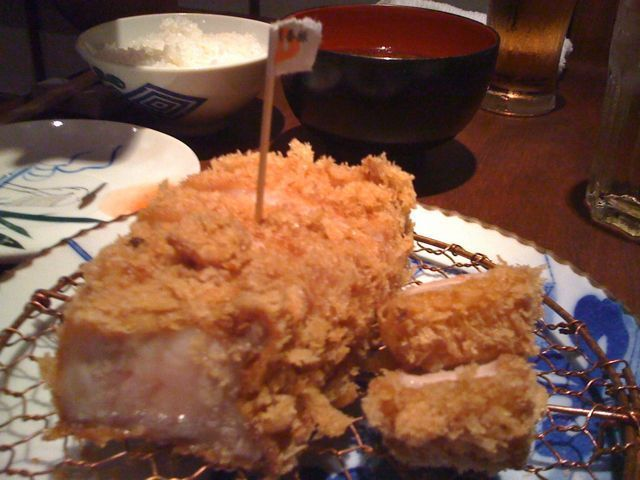
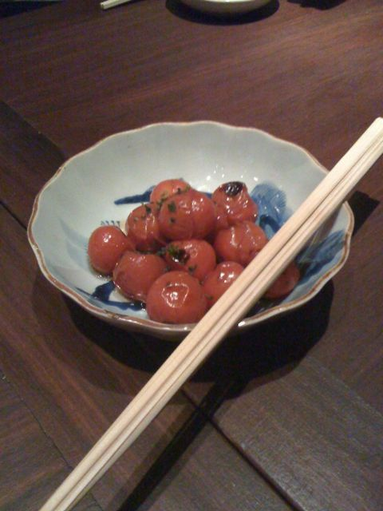
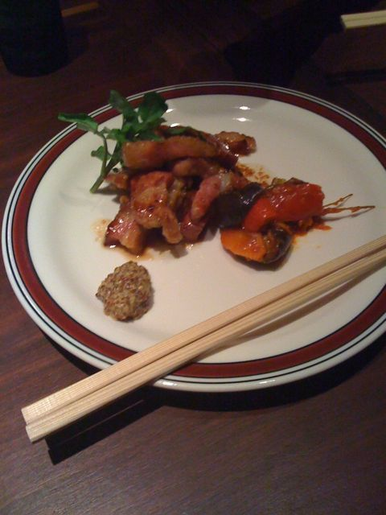
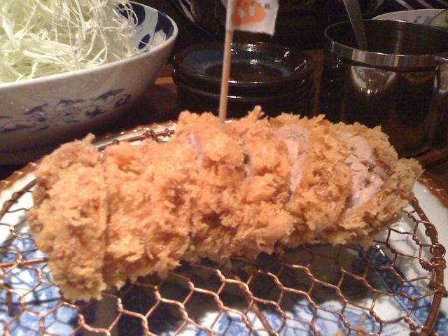
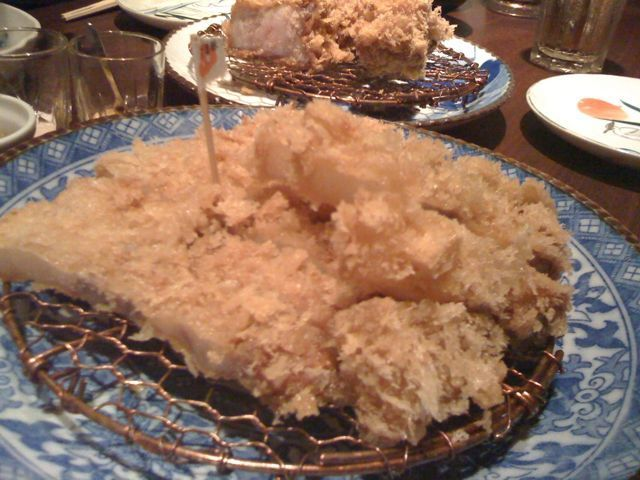

前々から噂には聞いていたのですが、一度も行っていなかった西麻布の[豚組](http://www.butagumi.com/nishiazabu/)に、[@sako0321](http://twitter.com/sako0321)さんに連れられて夫婦で行ってきました。

いやぁ、ご飯を食べて幸せな気持ちにさせてくれるお店というのは久々です。  
トップの写真の3cmの琉香豚も柔らかくて余裕でかみきれるし、ヒレカツも柔らかくてんまかったです。栄晶豚(一番下の写真)というほとんど白身の豚も食べたのですが、いやー脂身ってあそこまで美味しくなるんですね。そこまで重たくなくプルっプルでした。  
あと、なんでも、料理長が元々フレンチの方らしく、ラタトゥイユも出てきたのですがそれの味がよくしみていてたまりませんでした。  
お店の方々の気遣いもあたたかく、また、是非行きたいお店です。

