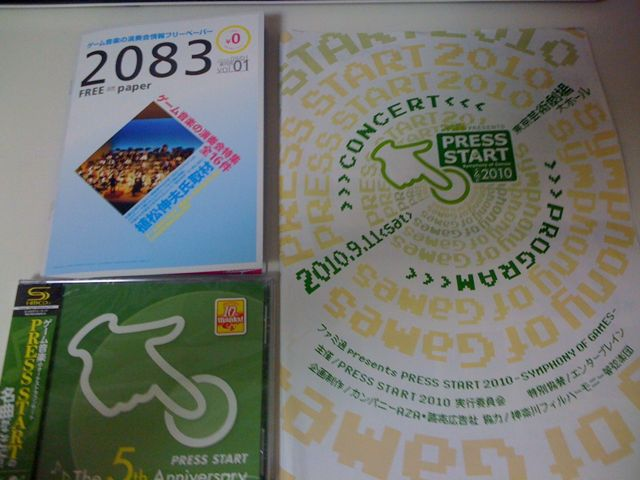

本日、[PRESS START2010 -SYMPHONY OF GAMES-@東京芸術劇場 大ホール](http://www.famitsu.com/famiweb/pressstart/)に行ってまいりました。  
(写真はプログラム、この演奏会にあわせて発売した[CD](http://ebten.jp/famitsu/p/4541993016235/?aid=prc)、フリーペーパー2083)  
**20100912追記**

CDはどうやら、そんなに数生産しないのでしょうか？欲しい方は早めに買った方がよいかもしれません。[こちらのサイト](http://ebten.jp/famitsu/p/4541993016235/?aid=prc)専売のようです。

一言で言うと非常に良かったです！素晴らしい演奏でした。

特に良かったのが、クロノ・トリガー/クロノ・クロスメドレー。去年も思いましたが、一曲目の気合いの入れ具合が違うのがこの演奏会の特徴なのでしょうか。カエルのテーマや魔王決戦とかは鳥肌ものでした。そして、トリガーとクロスでは若干パーカッションの編成が違うのか雰囲気も少し違っていて楽しめました。最後のChrono Cross-時の傷跡-でしめるあたりがわかってらっしゃる。トリガーのころのメロディを使って終えるわけですね。素晴らしい編曲！  
ちなみに、メドレーの詳細は次の通りでした。

> 予感/クロノ・トリガー/風の憧憬/カエルのテーマ/魔王決戦/エピローグ-親しき仲間へ-/  
> 凍てついた炎/マブーレホーム/Chrono Cross-時の傷跡-

後は、 **「ファミコンここまで出てるのにメドレー 初級者編」** が非常に楽しめました。やはり、にわかな僕にはタイトルしか知らないものも多かったのですが、ファイアーエムブレムとドクターマリオはメロディの第一音くらいからわかりました。基本的にメドレーと言いつつも、毎回切ってつなげているだけなので最初にパーカッションがリズムを整えるときのリズム感と、使用される楽器の編成で分かるんですよね。特にスネアで入ってきたファイアーエムブレムはこれしかない！と思っていました。もしかしたら、会場の方はゲーム大好き原曲大好きな方が多いけど、オケ編曲されるのには慣れていない方が多かったのかもしれませんね。でも、分かったら(分からなくても)手拍子してくださいね、というのは良いですね。盛り上がります。鬼ヶ島の反応の少なさは少し笑えましたが。

今年の演奏は神奈川フィルだったのでとても良かったです(昨年はゲームに対する愛が少なかったように感じたのですが)。ただ、アレンジャーの個性が強い曲がちらほら見受けられたかなー、という印象もありました。古代祐三氏のゼルダの伝説(スマブラ版は[こちら](http://www.nicovideo.jp/watch/sm2344763))は、当初3分の曲だと思って書いてしまった幻のバージョンを下敷きにされているそうで、とても楽しみにしていました。ですが一カ所、ゲームの2分版にはないメロディの調が変わって変奏するところの和音に違和感を感じてしまい、んーなんだかなーと思ってしまいました。原曲や色々なオケアレンジに慣れてしまったからかなぁ。  
あと、ロックマン2のワイリーステージ1のアレンジは、おっくせんまんの影響が強すぎたためか、Aメロの部分のメロディが弦であっさり背景的に流されてしまったのが物足りなかったです。

しかし、今回は **「ワイルドアームズ セカンドイグニッション」** のメドレーでまさかの「口笛ソロ」を聞いてしまいました。演奏していたのは[早川章弘](http://www.crazy-angel.com/members/hayakawa/index.htm)氏なのですが、どう考えても楽器です。ここまでビブラートや音色をコントロールできるんですもの。楽器です。それを駆使するなんてたまりませんでした。  


朧村正の三味線も楽しくてしかたありませんでした。弦とかと違ってリズムを刻んでいくのが、凄く全面に押し出されていてかっこよかったです。そして、尺八もあんなに近くで見られたのは感激でした。ビブラートするときは首を振るんですね。

そして、リズム天国の忍者は相変わらず大盛り上がり。特に今年も行った会場の人から選んでの対決は、桜井さんのまさかの素手宣言に驚かされたのもつかの間、さらに驚きの連続が。まさか、手だけでなく、足踏みや口笛、正拳付き＋かけ声、オス！のかけ声などやりたい放題(笑)そんなお茶目な桜井さんが大好きだー！

MOTHERメドレーは素晴らしいの一言です。やはり、元の曲が良いからなんでしょうね。ボーカルのメロディー・チューバックさんは、EIGHT MELODIESの歌詞をうっかりミスってしまって舌出していましたが(笑)杉並児童合唱団は安心の実力を発揮していただきました。ありがとう！

なお、アンコールはメロディー・チューバックさんによる[ロコロコのうた](http://www.youtube.com/watch?v=Tpuo34_WFoU)、[KORG M01](http://www.detune.co.jp/blog/?page_id=7)のデモ(クロノトリガーの世界変革の時/ロマサガ3の四魔貴族バトル1)、そしてRomancing SaGa -Minstrel Song-を演奏していました。特にロマサガはメインテーマが[イトケン](http://ja.wikipedia.org/wiki/%E4%BC%8A%E8%97%A4%E8%B3%A2%E6%B2%BB)本人によるピアノ演奏付きというサプライズも！いやぁ、堪能させていただきました。

というわけで、今年は非常に満喫させていただきました。流石5th Anniversaryですね。

ゲーム音楽の演奏会情報フリーペーパー2083なるものが一緒に付いていたのですが、そこに書かれていた演奏会情報は長くなってしまったので、[次のエントリー](http://chezou.wordpress.com/2010/09/11/press-start2010%E3%81%A7%E3%82%B2%E3%83%BC%E3%83%A0%E9%9F%B3%E6%A5%BD%E6%BC%94%E5%A5%8F%E4%BC%9A%E6%83%85%E5%A0%B1%E3%82%92%E3%82%B2%E3%83%83%E3%83%88%E3%81%97%E3%81%9F/)で書きたいと思います。

