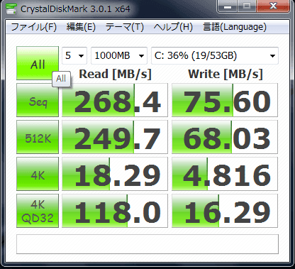

## ●せっかちな人のための結論
RealSSD C300いいよ！SATA2でも十分HDDに比べて恩恵感じられるよ！１万円なら全然あり！  
記事の内容としては、外付けDVDなしでリカバリしないでSSD(64GB)への移行する際のポイントを書いていきます。
## ●はじめに
ある日、メインで使っている第１世代の[Vaio TypeG](http://www.vaio.sony.co.jp/Products/G1/lineup.html)のCPU(CoreSolo!)が、昨今のAtomにすら負けているということを知り悔しくなって新しいマシンを手に入れることを模索し始めました。  
（誰だよ！「ノートPCにはDual Coreは要らない、敢えてCore Soloにしたんだ。」とか言ってたVaio開発者は！)  
でも、なかなか物入りの時期なのと、自分好みの軽量のマシン(1.3kgとか重くて持てない)が、手頃な値段のものがMacBook Airくらいしかなかったので、妻のために買ったけど音楽再生専用機になっていたAcer Aspire 1410 (いわゆるCULV)を接収することにしました。  
きっかけは、某巨大掲示板に「CULVノートはCore i5を狙うよりもSSDにした方が幸せになれるんじゃ」ということが書いてあったのが背中を押してくれました。
## 

●用意するもの

- RealSSD C300
- Acer Aspire1410
- SATA-USB変換ケーブル or 2.5inchケース

### ・SSD
今回購入したSSDは[RealSSD C300](http://kakaku.com/item/K0000123893/)の64GBのモデルです。早いのに1万円程度と手頃なのが魅力的です。SATA3で本来の実力を発揮できるらしく、Sandy BridgeのCPU買った人が一緒に買っているようです。なお、 **国内正規代理店のものは3年保証** 、 **並行輸入品は1年とか半年とかの保証** だったりするので、買う店は選んでください。  
内容物はSSDのみなので、バックアップツールやSATAをつなぐケーブル等は用意しないといけません。(当たり前ですよね)
### ・マシン
Acer Aspire1410はCeleron SU2300という安いながらDual Coreのなかなかできる子です。Windows7の64bitを積んでいるのでメモリを4Gまで増やしてあります。  
ただし、リカバリディスクを作成するのに外付けDVDドライブを購入する必要があります。今回は一応リカバリディスクは作成しましたが実質的には使いませんでした。  
ちなみに、購入したのはこちらの[ドライブ](http://kakaku.com/item/K0000049455/)(Buffalo DVSM-PS58U2-WH)。小さくないしちゃちいです。初期不良つかまされましたがTSUKUMOがさくっと交換してくれたので無事使えております。
### ・SATA-USBケーブル or 2.5inchケース
SSDにHDDの内容を移すために使いました。
## ●やり方

### 0.SSD交換のイメージをつかむ
[こちら](http://project-r.org/cgi-bin/diarypro/diary.cgi?date=20091025)の記事にある、[交換動画](http://www.twitvid.com/05C06)を見て交換の仕方をつかみます。  
っていうか、簡単です。開けてケーブル抜いてさすだけです。
### 1.SSDをSATA-USBケーブルで接続する
外付けドライブとしてSSDを認識させます。
### 2．HDDの中身をSSDにバックアップ
こちらのサイトを参考にさせていただきました。  
[AS1410のDtoD領域をバックアップ (玄箱＋Debianでwebサーバ)](http://www23.atpages.jp/ttomblog/2010/01/as1410.html)

簡単に言うと、リカバリディスクではリカバリ領域をバックアップできないので、[EASEUS Todo Backup](http://www.todo-backup.com/)を使ってHDDを丸ごとCloneしましょうということです。  
このソフトは、コピー元のドライブ(HDD)のサイズがコピー先(SSD)より大きくても、実際の使用量がコピー先のサイズを超えていなければ適当に調整してくれます。もちろん、自分でパーティションサイズを変えることも可能です。今回は元々のCドライブの領域以外は最小としました。  
詳細なやり方は[Gigazine](http://gigazine.net/news/20090811_easeus_todo_backup/)の記事などを参考にしてください。  
ちなみに、Partition Cloneは一つのパーティションしかコピーできず、Windows7はCドライブの領域以外にMBRに相当するパーティションが必要なため今回はあきらめました。

ドライブのcloneにはおよそ30分程度かかりました。

### 3.HDDをSSDに入れ替える。
先ほどの[交換動画](http://www.twitvid.com/05C06)の通り、裏蓋を開けてHDDをSSDに交換します。ドライバーは普通の＋ドライバーでOKです。
### 4.起動する
普通にWindows７が起動します。しかも、今までの設定のまま。
### 5.SSD向けに設定を調整する
通常、Windows7はSSDにインストールするとSSD用に最適な設定をしてくれるのですが、HDDのCloneのためいくつかの設定を変える必要があります。  
[ゆるゆる回す:Windows7 64bit版 インストール備忘録 - livedoor Blog（ブログ）](http://blog.livedoor.jp/inainao/archives/51327739.html)  
詳細はこちらのサイトを参考にしつつ、以下のことをしました。
- 自動デフラグの停止
- Prefetch/Superfetchの停止
- WebキャッシュをRamdiskに
Ramdiskは[Buffaloのユーティリティー](http://buffalo.jp/download/driver/memory/ramdisk.html)が楽ちんです。Firefoxのキャッシュもボタン一つで設定できます。
## ●ベンチマーク
こんな感じです。ランダムwriteがちと遅いですが、読み込みは速いです。

## ●ちなみに
リカバリ領域からのリカバリもばっちりできました。ただし、[オフセットのずれを解消してランダムwriteを改善させる](http://d.hatena.ne.jp/Lansen/20100724/1279973697)のはリカバリでは無理でした。当たり前か。

リカバリ後のベンチマーク結果はこちら。

## ●結論
**SSDいいよSSD。** 劇的に速くなるという感じではないけど、Windows7の起動後や休止状態からの復帰後の壁紙見えてから実際に安定して使えるまでの重い時間が皆無になりました。  
Windows7は休止から復帰が速くなったように見えて、実はログオン後に逐次読み込みしてるのが重くて嫌だったんですが、4Gのメモリでも素早く復帰します。  
1万円でこの効果は大きいですね。120GBの容量がほしかったり、ランダムwriteを気にする方はintelのssdにした方が幸せかもしれません。
