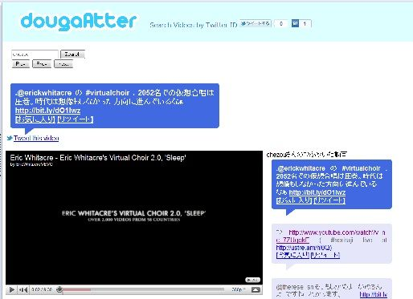

## 「あの人っていつも面白い動画をつぶやいてるんだよねー」
そう思うことありませんか？

「検索キーワードでわざわざ探すのは面倒だけど、あの人のツイートしてる動画が見たい」

「仕事してる時にツイートされた動画ってキャッチしづらいけど、帰ってからまとめてみたい」

そんな人のための、ツイート動画連続再生サービス「動画あったー」をはじめました。

**動画あったー**  
[http://tw2tube.appspot.com/](http://tw2tube.appspot.com/)

## 使い方
見たい人の **ツイッターIDを入れて検索するだけ。**  
そうすると、その人がツイートした動画が自動で連続再生されます。

たとえば、@YouTubeJapan のツイートしている動画を見たい場合は、[こちら](http://tw2tube.appspot.com/?user=YouTubeJapan)のような検索結果になります。

ただし、現在Firefoxでは上手く動かないです。。。ごめんなさい。  
Google ChromeとSafariがおすすめです。IEも8なら一応動かないことはないかも、って感じです。

後、 **1時間に15回くらいしか検索ができません** 。API制限があるので、使いすぎには気をつけてください！

まだまだ問題点もあるかと思いますが、試しに使ってみてください。

気になることは [@chezou](http://twitter.com/chezou) または公式Twitterアカウント [@dougaAtter](http://twitter.com/dougaAtter) までお願いします！

