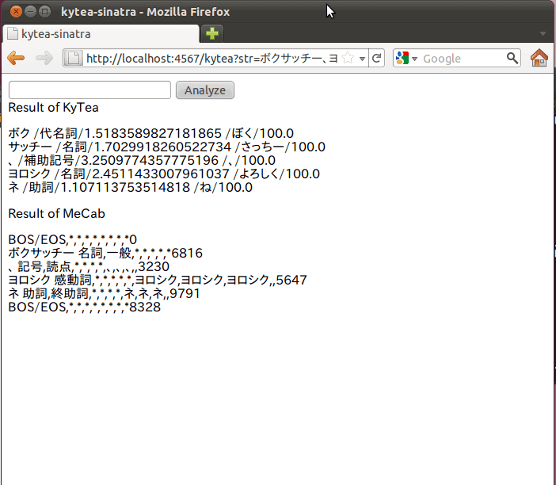

先日のエントリで書いたとおり[Mykytea-ruby](http://chezou.wordpress.com/2011/07/15/kytea%e3%82%92ruby-python%e3%81%8b%e3%82%89%e4%bd%bf%e3%81%88%e3%82%8bmykytea%e3%82%92%e4%bd%9c%e3%81%a3%e3%81%a6%e3%81%bf%e3%81%9f/ "KyTea:京都テキスト解析ツールキット をRuby, Pythonから使えるMykyteaを作ってみた")を使って、試しにブラウザから解析結果をみられるkytea-sinatraを作りました。



といっても、sinatraとhamlを使ってちょっと出力結果を見られるようにしたのシンプルなものです。  
イメージとしては、このような形でブラウザから簡単に解析結果が利用できると何か面白いことができないかなーと思っています。  
本当はどっかのサーバで動かして、jsonとかで気軽に解析結果を取得できるとかになればいいんですけどね。

ソースはgithubにあります。[**kytea\_sinatra@github**](https://github.com/chezou/kytea_sinatra)

KyTeaとMykytea-rubyをインストールした後、Mykytea.soをkytea-sinatraと同一のディレクトリに入れてから実行してください。

```
gem install sinatra haml bundler  
# (または、 gem install bundler; bundle install)

ruby kytea\_sinatra.rb
```

で、ブラウザで

> [http://localhost:4567/](http://localhost:4567/)

を開けばOK。  
なお、mecab-rubyも入っている場合は、下記のスクリプトを実行することで出力結果が比較できます。

> ruby kytea\_sinatra\_mecab.rb

出力結果は冒頭の感じです。

＃しかし、API修正されたその日のうちに [@seikichiさんが kytea-pythonを作られていて](http://twitter.com/seikichi/status/81095004558331904)、それで十分じゃんとか思ったのはここだけの話。  
＃全部叩けるようにするか、MeCabで言うところのparseToString, parseToNodeに絞ってアクセスできるようにしたかの違いだとは思う。  
＃@seikichiさんの.iの方がキレイだと思います。

参考URL

- [_Sinatra_: README (Japanese)](http://www.sinatrarb.com/intro-jp.html)
- [ウノウラボ by Zynga Japan: _Sinatra_気に入った](http://labs.unoh.net/2009/05/sinatra.html)
- [ウノウラボ by Zynga Japan: 5分で分かる_Haml_](http://labs.unoh.net/2009/05/5haml.html)
 
