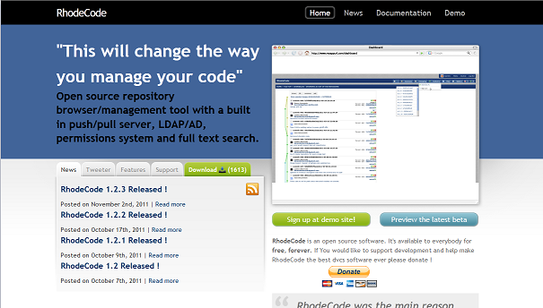

Mercurialと連動するブラウザベースのリポジトリ管理システム、[RhodeCode](http://rhodecode.org/)を導入したのでその際のメモを書き残します。  
一言で言うと、githubみたいなものを社内などで運用したいというニーズに応えるものです。  
gitlabとかも試してみましたが、ドツボにはまったので結局RhodeCodeに落ち着きました。

デモは[こちら](http://demo.rhodecode.org/)

### RhodeCodeの特徴

- ブラウザ上でリポジトリを作成できる(これ重要)
- diffやコミットログがブラウザ上で見られる
- ブランチも可視化してくれる
- プロジェクトをグループでまとめることもできる
- 意外と導入、運用は簡単だった
- そのうちgitにも対応する予定らしい
- あまり日本語で情報が少ないかも

### 

### Rhodecodeのインストール
基本的にオフィシャルに従う方針で行きました。  
ただし、virtualenvを使った方が環境を汚さないと思うので、そうすることにしました。

[http://packages.python.org/RhodeCode/installation.html](http://packages.python.org/RhodeCode/installation.html)

[http://packages.python.org/RhodeCode/setup.html](http://packages.python.org/RhodeCode/setup.html)  
ユーザは、適当にadduserで作ってください。  
今回はhgというユーザを作りました。

    adduser --system --home /home/hg/ --group --shell /bin/bash hg sudo mkdir  /var/www/rhodecode-venv sudo chown hg:hg /var/www/rhodecode-venv virtualenv --no-site-packages /var/www/rhodecode-venv # hgが一般権限で利用できるようにする必要がある source /var/www/rhodecode-venv/bin/activate sudo mkdir /var/www/rhodecode sudo chown hg:hg /var/www/rhodecode cd /var/www/rhodecode pip install rhodecode

#### RabbitMqの導入
一応入れました(結局使ってないかも？)

    sudo apt-get install rabbitmq-server

#### Rhodecodeの設定

    cd /var/www/rhodecode paster make-config RhodeCode production.ini paster setup-app production.ini

途中で、リポジトリの場所、adminユーザの名前、パスワード、メールアドレスが求められる  
実行する

    paster serve production.ini

#### 問題点
・UnicodeDecodeErrorが出る  
hgユーザの言語設定を下記で解決。  
日本語ja\_JP.UTF-8にしてMercurialをインストールすると、どうやらRhodeCodeがこける模様。

    export LC\_ALL=C

rhodecode-init.shを作成。

./rhodecode-init.sh

    #!/bin/bash export LC\_ALL=C source /var/www/rhodecode-venv/bin/activate cd /var/www/rhodecode paster serve production.ini

#### 実行方法
とりあえず、起動時にrhodecode-init.shを実行することで運用しています。  
本格的に動かすならinit.dなどに書いた方がいいかも。

    sudo -u hg ./rhodecode-init.sh

