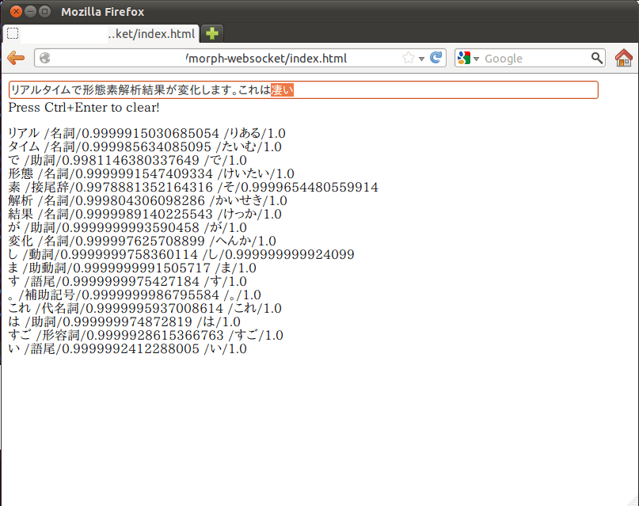

 morph-websocket画面

WebSocketを使ってリアルタイムに形態素解析結果を出力する、morph-websocketを作りました。

テキストボックスに入力すると、リアルタイムで形態素解析結果が出力されます。

ソースコードは、いつものようにgithubに置きました。

[https://github.com/chezou/morph-websocket](https://github.com/chezou/morph-websocket)

思いついたので、勢いで作りました。今まで、バッチ的にまとめて処理をしていたものに対して、リアルタイムで解析結果が変われば、何か見える世界が変わるかなーと思ったのですが、そんなに変わりませんでした。変わったのは寝る時間だけか。

最初はMeCabを使おうと思ったのですが、0.994のrubyバインディングがCreateModelできない現象にぶち当たって諦めました。なので、[Mykytea-ruby](https://chezo.uno/post/2011-07-15-kytea-jing-du-tekisutojie-xi-turukituto-woruby-pythonkarashi-erumykyteawozuo-tutemita/)とRuby使ってます。

あ、ついでにMykyteaがKyTea 0.4.2に対応しました。

参考URL:

- [Nihitok BLOG: rubyのgem「em-websocket」を使ったらいとも簡単にwebsocketを導入できた。](http://nihitok.blogspot.jp/2011/08/rubygemem-websocketwebsocket.html)
- [jQueryを使って テキストボックスに打ち込んだ文字を リアルタイムで取得する方法 | LogicA](http://nihitok.blogspot.jp/2011/08/rubygemem-websocketwebsocket.html)