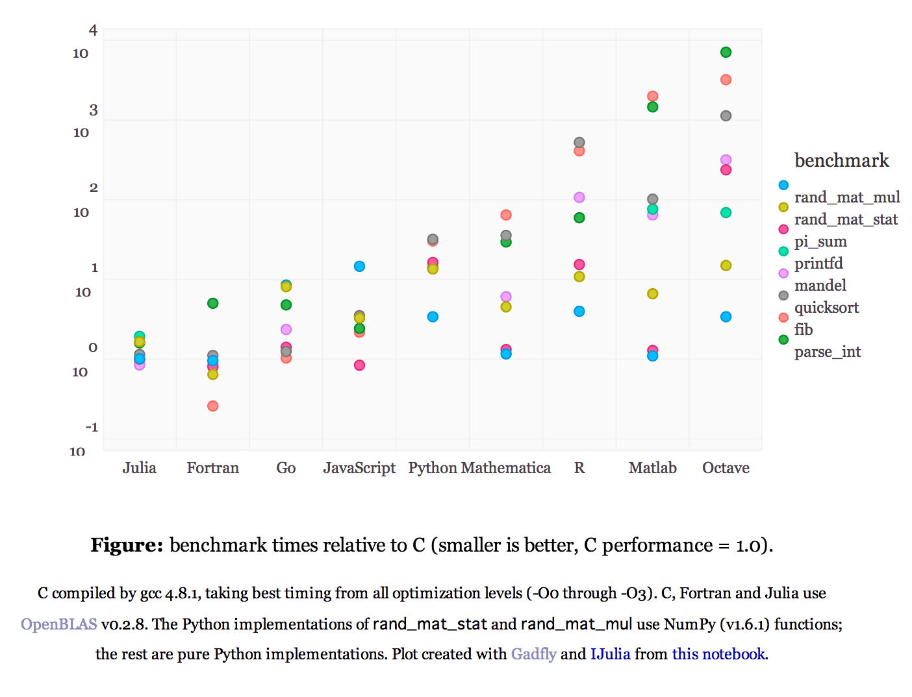

2014/1/22にkawasaki.rbの第8回ミートアップを開催しました。

togetterはこちら  
[http://togetter.com/li/620212](http://togetter.com/li/620212)

## パーフェクトRuby

パーフェクトRubyは、2.7.3シンボルまでやりました。  
ヒアドキュメントの様々なテクニックを学ぶことが出来ました。

ヒアドキュメントに、第2引数渡せたり、

[https://gist.github.com/chezou/8600203](https://gist.github.com/chezou/8600203)

バッククオートでくくると、ヒアドキュメントの実行結果が帰ってくるとか。

[https://gist.github.com/chezou/8600230](https://gist.github.com/chezou/8600230)

あと、`===`は`case...when`のためだけのもの、という感じだそうで、`=~`や`!~`のような左辺と右辺の対称性がないからハマるという話でした。 when節には、lamdaを渡せるのは初めて知りました。

[https://gist.github.com/chezou/8600244](https://gist.github.com/chezou/8600244)

いつ使うんだろう。。。

## chezou "なぜ科学計算にはPythonか？"

[http://www.slideshare.net/chezou/python-forsc](http://www.slideshare.net/chezou/python-forsc)

本当は、はじめてはてブでホッテントリ入りした、的な話をしながら、技術的な話の翻訳についての悩みなどアレコレを話そうと思ったのですが(実際、そっちのほうが資料は多くなった)、会場からの希望でこちらの話をしました。  
[merborne](https://twitter.com/merborne)さんの[英語圏のオープンソースプロジェクトに貢献する最も簡単な方法またはsinatra/README.jp.mdまたは彼はなぜ私を愛するようになったか | hp12c](http://melborne.github.io/2014/01/23/contribute-to-english-based-opensource-project-or-sinatra-japanese-readme/)という話にも通ずるところがあるのですが、技術的な話の翻訳って日本人同士で協力し合うことができないかなー、とか思ったりします。  
なので、この話も来月以降に翻訳の話はしたいと思います。

なんで、Rubyではダメなのか？という話やら、GPU屋さんはPythonの方が人気だねとか、昔「京でRを動かしたいんですが」とかいう話が...、4,5年前に科学計算がRubyの3番目位の注力事項になっていたのがmrubyに流れてしまった、など様々な話題が展開されました。

個人的には、一番重要なのはNumPy,Scipyのレイヤーをどうやって作り続けていくかということと、統計や機械学習のデファクトなgemができるといいのかなー、と思いました。

あと、Numpyのベンチマークを探していたら[Juliaのベンチマーク](http://julialang.org/benchmarks/)<a href="#fn-1716-bench" rel="footnote">1</a>に行き着いたのですが、実はGoが結構速いということに驚きました。(GoってOpenBLAS使えないですよね？)

  
[http://julialang.org/benchmarks/](http://julialang.org/benchmarks/) より引用

もしかすると、並行処理とも相性のいいGoでの科学計算ライブラリが充実する日が来るかもしれません。

Rubyのコミュニティなのに、Pythonの話をしていて、、、と思うのですが、次回はPythonistaな方の立場からお話を聞こうと思います。

  

* * *
  

1.   
「シングルスレッドでのベンチマークは、科学計算ではあまり価値がない」と[@drmaruyama](https://twitter.com/drmaruyama)さんの言葉↩  

