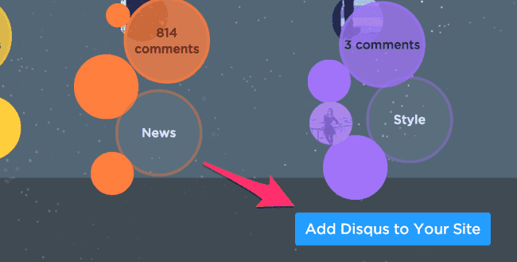

Doorkeeperはコミュニティなどのイベントを行うのに便利ですよね。  
そんなDoorkeeperですが、他のzusaarなどのサイトと比較してコメント欄がデフォルトでついていないので、  
Disqusと連携してコメント欄を追加する方法を書きます。

僕がやった時は日本語で情報が見つからなかったのですが、  
@yumu19ですらはまっていたので、結構挫折している人がいるのかも...、と思いブログに書くことにします。

# 1. Disqusのアカウントをとる

[http://disqus.com/](http://disqus.com/)

アカウントの取り方はメモを取っていないのですが、多分普通にメール認証すれば良いはず...。

# 2. "Add Disqus to Your Site"をクリック

ログインした後のtop右下の"Add Disqus to Your Site"をクリックする

# 3. 必要な情報を埋めていく

"Site name"はdescriptionなので適当に決めればOK。

"Choose your unique Disqus URL"で入力する情報が、後のDoorkeeperで入力する情報。  
"Category"も適宜入力すればOK

"Finish registration"を押せば、完了。

その後に出てくるscriptの生成画面はdoorkeeperには関係ないので、気にしなくて良い。

# 4. Doorkeeperのコミュニティ管理画面の"連携機能"を開く

"Disqus shortname"に、さっき作ったDisqus URLの`.disqus.com`の前の文字列を入れる。  
今回の例だと"kawasakirbtest"を入れて保存する

これで、冒頭のようなコメント欄がイベントページの下部にできます！

