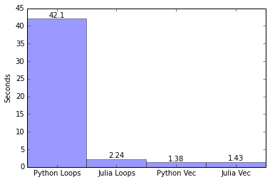

Justin Huang([@rawjustin](https://twitter.com/rawrjustin))さんのJuliaとPythonの比較記事(原題：[Julia vs. Python: Monte Carlo Simulations of Bitcoin Options](http://blog.rawrjustin.com/blog/2014/03/18/julia-vs-python-monte-carlo-simulations-of-bitcoin-options/))が非常に面白かったので、翻訳してみました。

Juliaは科学計算・数値計算向けの言語として高速さを売りにしている言語で、Rからの移行を進める人たちも増えているようです。

以前訳した[科学計算にPythonが適している](https://chezo.uno/post/2014-01-18-ke-xue-ji-suan-niokerujun-zhi-hua-aruihanazepythongazhao-shi-nita-yan-yu-nosieawoduo-tuteiruka/)という記事を読んでいた時に、そういえば、Juliaって言語があったな、と思って調べていました。([はじパタでもJuliaのLT](https://chezo.uno/post/2014-02-23-hazimetenopatanren-shi-du-shu-hui-nican-jia-simasita-number-hazipata/)しましたし、[kawasaki.rb 8回](https://chezo.uno/post/2014-01-24-kawasaki-dot-rb-number-008-wokai-cui-simasita-number-kwskrb/)で出てくるベンチマークも印象に残っています)

今回のJustinさんの指摘では、普通のプログラマーにとってPythonよりもJuliaの方が、特定の高速化を意識せずにコードを書けるため、プロトタイプに向いているのでは、という点が興味深い視点でした。

なお、元の文章とコードの権利はJustin氏に(いくつかのPythonのコードはDr. Hilpischに)帰属します。  
翻訳を快諾していただいたJustin氏に感謝します。

なお、翻訳の間違い等ありましたら、chezouまでご指摘ください。

[2014/05/07 15:30追記]  
[Hackers Newsのコメント](https://news.ycombinator.com/item?id=7450601)で vectorizeしないで4倍速くなるコードが紹介されています。

jwmerrill 氏曰く、

> In general, carefully written devectorized Julia will be faster than equivalent vectorized code because it is possible to avoid allocating containers at intermediate stages of the computation. This is surprising for people coming from e.g. Matlab, R, or Numpy, because vectorized code is often faster in those environments.

ということなので、Juliaは驚くべきことに、vectorizeしない方が高速になるようです。やばい

* * *

私は最近、HackerSchoolに参加した時にStefan Karpinskiに聞いた[Julia](http://julialang.org)を紹介した。  
Juliaはとても高速で高性能な科学計算言語をターゲットとしており、その速度はCのネイティブコードに近づきつつある。  
Python quants in NYCに参加した後、[Dr. Yves J. Hilpisch](http://www.hilpisch.com/)が金融分析におけるPythonの処理速度についてのプレゼンテーションを聞いた時に、JuliaとPython/numpy stackを比較することを決めた。

これはJuliaとPythonの対決ではなく、むしろ同じ問題を2つの言語で解いて比較をする練習である。  
ipython/ijuliaのコードを添付したので、よかったら試して欲しい。

# Monty Python Bitcoinとは

もしかすると、的はずれなことを言うかも知れないが、やろうとしていることを簡単に説明してみる。  
基本的に、古典的なオプション価格問題のモンテカルロシミュレーションをJuliaとPythonの両方で解き、2つの言語で取られているアプローチを比較する。

## モンテカルロ法

モンテカルロ・シミュレーションは、確率的なテクニックである。  
ランダムな確率分布を使いサンプリングを繰り返すことで、複雑なシステムをシミュレートする。典型的には精度のために極端に大きな数をサンプリングする。

シンプルで概念的な例としては、カジノでクラップ(私がお金を捨てるのに好む方法だ 訳注:[Wikipedia](http://ja.wikipedia.org/wiki/%E3%82%AF%E3%83%A9%E3%83%83%E3%83%97%E3%82%B9))を繰り返しプレイし結果を記録して、あるベットに対する特定のオッズを見つけることが挙げられる。

## ビットコイン オプション

私がビットコインオプションと言う時は、ヨーロッパのコールオプション形式の理論的なビットコインのストック・オプションを意味する。なぜなら、ビットコインに関するものはすべて興味深い(し、もっとクリックを稼げる)

## 幾何ブラウン運動

株価はランダムウォークに従い、予測できないという金融理論がある。  
この仮説に従い、モンテカルロシミュレーションによりビットコインのヨーロッパコール・オプションの評価したい。ビットコインの価格変動をランダムウォークでシミュレートする。(今回は、ランダムな連続値をシミュレートする架空の手法として幾何ブラウン運動を考える)

## 株価モデル

ビットコインの価格が[効率的市場仮説(Efficient Market Hypothesis)](http://en.wikipedia.org/wiki/Efficient-market_hypothesis)とマルコフ過程に従うと仮定する。

関連するパラメータ:

**`S0`** : 開始価格。ビットコインの現在の価値として扱う

**`r`** : 期待されるリターン、または成長率の平均。リスク中立な決済(例:米国債)で参照される

**`sigma`** : ボラティリティのパーセンテージ。 このケースで私は後述するbitstampの年刊の計算に基づく

**`z`** : ブラウン運動、つまり平均0の正規分布からランダムなサンプル

**`r`** と **`sigma`** は年度ベースで計測している。

これらのパラメータが与えられた時、ビットコインの株価をモデル化するために確率微分法を使う。

$latex dS\_t = r S\_t\,dt + \sigma S\_t\,dZ\_t$

このモデルに従い、 確立過程 `St` を幾何ブラウン運動として定義できる。  
いくつかの微積分とStに自然対数の導関数の後、Sをtで離散化した式に到達する:

$latex S\_t = S\_{t-\Delta t}e^{\left((r-\frac{\sigma^2}{2})\Delta t+\sigma \sqrt{\Delta t}z\_t )\right)}$

## ビットコインのボラティリティを算出する

ビットコインに対する一般的な論点はボラティリティである。  
今日ビットコインを買うことのリスクは、明日には半分の価値になっているかもしれないことだ。  
`r`に対する案を出すためには、ビットコインのボラティリティを計算する必要がある。  
Bitstampで交換されたビットコインの(分単位でリサンプリングした)価格変動の対数に対する標準偏差を利用した。2013/03/01以降の年率を算出した。

    import pandas as pdimport numpy as np# read in bitstamp USD trade data with columns time, price, volumebitstamp = pd.read\_csv("bitstampUSD.csv" , names=[&#039;time', 'price', 'volume'], index\_col=0)bitstamp.index = pd.to\_datetime((bitstamp.index.values[^1] e9).astype(int))# resample the csv data to minutely data for volume and pricevolume = bitstamp.volume.resample(&#039;1min', how='sum')value = bitstamp.prod(axis=1).resample(&#039;1min', how='sum')# obtain the volume weighted average pricevwap = value / volume# pad data with repeating values# then grab a years worth of data starting from 01 March 2013bitstamp\_pad = vwap.fillna(method=&#039;pad', limit=10)bitstamp\_year = bitstamp\_pad.ix[&#039;2013-03-01':'2014-03-01']# calculate the return and volatilityreturns = np.log(bitstamp\_year / bitstamp\_year.shift(1)) returns.std()\*np.sqrt(returns.size) \* 100## output: 260.70492740919627

残念ながら、Juliaのツールには時系列データに対するものが現状では全くない。  
[DataFrames.jl](https://github.com/JuliaStats/DataFrames.jl)と呼ばれる素晴らしいパッケージがあり、データフレームの処理と変換を行ってくれる。 例:

    using DataFrames bitstamp = readtable("bitstampUSD.csv", colnames = ["time", "price", "amount"])

残念ながら、これが生のJuliaコードで時間周期に対する`fillna`や`resample`のような関数を書かずにできる最大限のことである。

また、DataFrames.jlはpandasのパッケージよりCSVの読み込みは遅いし、インデキシングもサポートされていない。

## Pythonでのモンテカルロシミュレーション

_これ以降のほとんどのPythonコードはDr. Hilpischのもので彼にクレジットがあることを注意して欲しい。  
([ソース](http://www.hilpisch.com/YH_Derivatives_Analytics_with_Python.html))_

ここで、_sigma_と他のパラメータをPythonで書かれた単純なモンテカルロシミュレーションを実行することで得られる。  
ここでのコードでは基本的に、上述した数式で表されるビットコインの価格が取りうる経路の数`I`を生成している。

    ## Simulating Geometric Brownian Motion with Python#import mathfrom random import gauss# ParametersS0 = 600; # current bitcoin pricer = 0.02; # risk neutral payoff, assumed 2% for this exercise, in reality probably less.sigma = 2; # extremely high sigma due to spike in bitcoin prices late last yearT = 1.0; # 1 Time cycleM = 100; # 100 stepsdt = T / M # dt# Simulating I paths with M time stepsdef genS\_py(I): # initialize array to hold all of our paths S = [] # for each path i to Ifor i in range(I): path = [] # for each step t to M + 1for t in range(M + 1): if t == 0: # append S0, our starting value to the front of the path path.append(S0) else: # take a random normally distributed number z (mean = 0, std = 1)# and append it to our current path z = gauss(0.0, 1.0) St = path[t - 1] \* math.exp((r - 0.5 \* sigma \*\* 2) \* dt + sigma \* math.sqrt(dt) \* z) path.append(St) S.append(path) return S

これは、基本的なPython的な経路を作る方法である。10万経路をシミュレーションして、時間を計測するとこうなる:

    I = 100000%time S = genS\_py(I)# CPU times: user 40.8 s, sys: 887 ms, total: 41.7 s# Wall time: 42.1 s

くだらないミスがないか確認するために、matplotlibで簡単なグラフを描く。



もし、ビットコインの価値が凄い大きさになっていたり0になっていたら、間違いなく調べ直すべきだ。

## Juliaでのモンテカルロシミュレーション

今度は、Juliaでやってみよう

    # # Simulating Geometric Brownian Motion with Julia # # Parameters const S0 = 600; # current bitcoin price const r = 0.02; # risk neutral payoff, assumed 2% for this exercise, in reality probably less. const sigma = 2; # extremely high sigma due to spike in bitcoin prices late last year const T = 1.0; # 1 Time cycle const M = 100; # 100 steps const dt = T / M # dt # Simulating I paths with M time steps function genS\_jl(i::Int64) S = {} for i in 1:i path = Float32[] for t in 1:(M + 1) if t == 1 push!(path, S0) else z = randn() st = path[t - 1] \* exp((r - 0.5 \* ^(sigma,2)) \* dt + sigma \* sqrt(dt) \* z) push!(path, st) end end push!(S,path) end return S end

Juliaの文法はいくつかの注意すべき点を除いてほとんど同じだ:

- arrayのindexは1始まりである。Pythonは0始まりなのに対して
- `randn()`は平均0、標準偏差1の正規分布からランダムな数を生成する組み込み関数である。
- Juliaの `^()` vs Pythonの `**` や `push!()` vs `.append()`などの関数
- グローバル変数に対する定数宣言(10x倍速くなる)

    I = 100000 @elapsed S = genS\_jl(I) # 2.243841008

しかしながら、Juliaで書かれた全く同じコードが20倍も速いのだ！ これは、Juliaが勝ったことを意味するのだろうか？ このアルゴリズムの一実装に対する速度の面においては、Yesだ。しかし、実際にはそうではない。 これは、後述するようにもっとも効率的なモンテカルロシミュレーションのモデル化手法ではない。

## ビットコインのコールオプションの評価

さて、演習の一部としてビットコインの価格に対して、理論的なヨーロッパのコール・オプションの評価をしたい。  
満期になると、コール・オプションの価値は次式で表すことができる。

$latex max((S\_t - K), 0) $

ここで、Kはオプションの行使価格とする

オプションの行使価格を K = $1000 とすると、どちらの言語でも単純に計算できる

### python

    K = 1000.0C0 = math.exp(-r \* T) \* sum([max(path[-1] - K, 0) for path in S]) / Iround(C0, 3)# 361.203

### julia

    K = 1000.0 C0 = exp(-r \* T) \* sum([max(path[end] - K, 0) for path in S]) / I round(C0, 3) # 374.496

_注意：これらの2つの計算における値は、試行回数を増やすと361に収束する。_

ここでは、arrayの最後の要素にアクセスする方法(`[end]` vs `[-1]`)以外、言語による違いはほとんど無い。

## ベクトル化した数式の処理

しかしながら、ベクトル計算をすることでより高速に処理をすることができる。  
ベクトル化のテクニックを使うことで、乗算を1つの要素を何回もループで回すのではなくベクトルに対し一度で処理ができる。  
これは、コンパイラやハードウェアによる最適化の恩恵を受けやすく、かなり処理時間が速くなる。

PythonではNumPyというパッケージを使ってベクトル化できる。

    import numpy as npdef genS\_np(I): S = S0 \* np.exp(np.cumsum((r - 0.5 \* sigma \*\* 2) \* dt + sigma \* np.sqrt(dt) \* np.random.standard\_normal((M + 1, I)), axis=0)) S[0] = S0 return S %time S = genS\_np(I)# CPU times: user 1.07 s, sys: 147 ms, total: 1.22 s# Wall time: 1.38 s

おお、ベクトル化した計算で桁違いに処理が速くなった！ 先ほどと似た方法で、オプションの理論値を$1000の行使価格として計算ができる。

    C0 = math.exp(-r \* T) \* np.sum(np.maximum(S[-1] - K, 0)) / Iround(C0, 3)# 367.457

まったく同じベクトル化がJuliaでもできる。

    function genS\_jlvec(I) S = S0 \* exp(cumsum((r - 0.5 \* ^(sigma, 2)) \* dt + sigma \* sqrt(dt) \* randn((M + 1, I)), 1)) S[1,1:end] = S0 return S end @elapsed S = genS\_jlvec(I) # 1.430265529

JuliaのメリットとしてはNumPyのようなライブラリーが不要だということだ。 我々は素のJuliaを使っている。 驚くべきことに、Juliaのナイーブなloopでの実装は、ベクトル化された実装と同程度に速い！ これは、アルゴリズムの単純なプロトタイピングに非常に向いていることを示す。 ある種の計算でナイーブな実装を駆逐することで猛烈な高速化を期待する、Pythonが提案できない価値のある論点である。

最後に、Juliaでオプションの値を計算する文法はほとんど同じである:

    K = 1000.0 C0 = exp(-r \* T) \* sum(max(S[end, 1:end] - K, 0)) / I round(C0, 3) # 359.783

## 結論

Python Loops: **42.1 s**  
Julia Loops: **2.24 s**  
Python Vectorized: **1.38 s**  
Julia Vectorized: **1.43 s**

Juliaは、科学/数値計算にとってとても大きなポテンシャルを持っているように思える。  
ナイーブなループを使った、ビットコインの価格のモンテカルロの経路シミュレーションはPythonよりもかなり速く、ベクトル化して最適化された計算と同じオーダーの速度だった。  
つまり、今回の分析での重要な知見だと考えている：  
Juliaは計算的に困難な問題を効率的に解くにあたって、ベクトル化された処理を必要としない。

Juliaはベクトルや行列の計算にNumPyのような外部ライブラリを必要としない。  
他の化学計算言語が険しい学習曲線であるのとは異なり、Juliaは普通のプログラマーにとって極めて読みやすくなる。  
処理速度は前述のとおり明確に速い。

残念ながら、DataFrames.jlなどJuliaのデータ分析のためのツールは、Pythonのpandasと比較して性能面、機能面ともに成熟してるとも安定しているとも言いがたい。  
Juliaのコミュニティは若く成長している。  
だから、様々な人々が言語に対して貢献することで、私はこれらの点で多くの改善や成長がなされることを期待している。しかし、それまでは私はPythonとpandasの行く末を見ていく。

すべてを考慮した上で、メインストリームとして採用されることを約束はできないが、私はJuliaを試すことをおすすめする。  
私としてはJuliaのコミュニティに貢献したいと強く思っている。

## Files

[julia code](http://rawrjustin.github.io/downloads/2014-03-18-julia-vs-python-monte-carlo-simulations-of-bitcoin-options/julia.ipynb)  
[python code](http://rawrjustin.github.io/downloads/2014-03-18-julia-vs-python-monte-carlo-simulations-of-bitcoin-options/python.ipynb)  
[bitcoin code](http://rawrjustin.github.io/downloads/2014-03-18-julia-vs-python-monte-carlo-simulations-of-bitcoin-options/bitcoinvolatility.ipynb)

## Thanks

Dr. Yves J. Hilpisch (inspiration)  
Neeraj Wahi (options pricing)  
James J. Porter (Julia)

