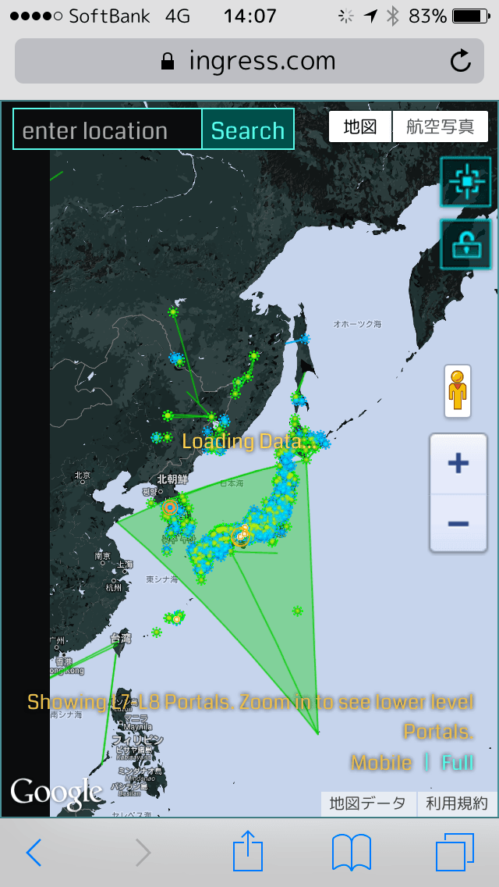
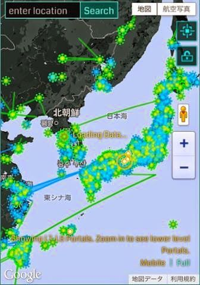

この記事は[Ingress Advent Calendar](http://www.adventar.org/calendars/375)の15日目の記事です。 昨日は[@kwappa](https://twitter.com/kwappa)さんの [#ingress のイベント #Darsana XM Anomaly Tokyo に参加してきたよ！ - かっぱラクガキ帳](http://kwappa.hatenablog.com/entry/2014/12/14/111225) でした。

# Darsana参加してきたよ



Darsana参加された皆さん、お疲れ様でした！ ResistanceのゆるふわA10[^1] なので負けて悔しい気持ちもありましたが、初めての公式イベントに参加できてとても楽しかったです。

特に最終戦はotsuneさんと戦うことができたので(そして人数的にもイーブンの中でポータルを死守できました！)、ぎりぎりの白熱した戦いを繰り広げることが出来てとてもよかったです。

現場では本州を囲む緑の巨大CFに囲まれたものの、「我々は局地戦を淡々と行うしかないんだ」とチームで話しながら、ポータルを死守し運良く4戦全勝できました。

(写真はbungaさんにご提供いただきました)

終了後にその裏側では熱い攻防が繰り広げられていたのを後から知り、さらに胸が熱くなっています。

(写真は\_かなこさんにご提供いただきました)

八丈島-台湾間、北海道-韓国間での緑のリンク、妨害のための九州-中国間のCFなど、両者の思惑が飛び交っています。そして、敵ながら本州を囲むCFが1回目の戦いの途中でできたのは天晴とも思いました。 また、そのCFが崩れたのも最後の戦いの終了2分前という、熱い戦いとしか言いようがありません。吹雪の中の襟裳まで行ったamacatさんの話は読み返しても胸にこみ上げるものがあります。

[Amacat Amacat - Google+](https://plus.google.com/u/0/114268229592428212666/posts)

# コミュニティの話は表に出づらい

Ingressはプレイ=活動領域が駄々漏れになるという特性上、BlogやTwitterやFacebookでその活動を報告するのは避けられる傾向にあります。(FBにクロスファクションのコミュニティもありますが、読む専門です...)

しかし、本来ゲーム内に用意されているチャットであるCOMMは、全体チャットによく誤爆する、iOS版では東京だとすぐに固まることから、ほとんど使われていません。そのため、大きな地域ごとに存在するGoogle+のコミュニティとHangoutなどのチャットアプリケーションが活用されています。(ちなみに、台湾ではLINEが活用されているとか)

今回のDarsanaの情報共有にもGoogle+のコミュニティが活用され、様々な活動が展開されていました。 また、我々のチームではHOの代わりにSlackを用いることで、Google Documentやpostへのリンク機能を活用して、情報へリーチしやすい状況を作って共有していました。 (ちなみに、HOはポジション的にはLINE的なメッセージングアプリの位置づけのためか、グループチャットとして100人までしか参加できないという悩みがあり、Slack[^2] の方にシフトしつつあります)

# コミュニティってだるくない？

世の中にはソロプレーヤーで活動されている人も多いと思います。 ですが、ジョンハンケ氏の「外に出て、人と交流を」という設計思想上、一人でプレイするには壁にぶつかると思っています[^3] 。

> Niantic Labsの創設者で、かつてGoogle Earthを開発したジョン・ハンケ氏（※本誌インタビュー記事、5月掲載）は、ユーザーに外出を促すことがコンセプトとしている。具体的には「世界が舞台」「動いて遊ぶ」「新しい視点で街を見る」「現実世界で友情を育む」という4つの要素で設計されているのだという。

<iframe src="https://hatenablog.com/embed?url=http%3A%2F%2Fk-tai.impress.co.jp%2Fdocs%2Fnews%2F20141117_676258.html" title="「Ingressで痩せる」は本当だった、ローソンともコラボ開始 - ケータイ Watch" class="embed-card embed-webcard" scrolling="no" frameborder="0" style="width: 100%; height: 155px; max-width: 500px; margin: 10px 0px;"><a href="http://k-tai.impress.co.jp/docs/news/20141117_676258.html">「Ingressで痩せる」は本当だった、ローソンともコラボ開始 - ケータイ Watch</a></iframe>

レベル7ポータルまでは近所に3人エージェントがいればできますが、レベル8は8人いないとできないです。プレーヤー密度が高まったとはいえ、自然発生的にP8に到達するのはちょっと大変だし、レベル8ができると壊しにくる敵も圧倒的に増えます[^4] 。

そこで、地域のコミュニティではFlash Farming[^5] を呼びかけて行ったりします。こうしたファーミングも地域コミュニティに呼びかけて、気ままに集まった人でやる、みたいなことが多く開催されます。

自分のいる地域のコミュニティは割と緩いつながり[^6] で、オンゲのチームチャット[^7] のような位置づけです。「どこどこ、P8リーチですねー」とか「今日は帰りに敵のファームよってきますー」「俺も俺も」とかわいわいやりながら盛り上がっています。

特にいいなーと思うのが、「どこどこのラーメンが旨い！」と飯テロ展開したり、「どこどこで飲んでる」とか「ここのドーナツは美味しい！」「今日はどこどこでお祭りですねー」など、長く住んでる地元民なら知っているけど別の地域から引っ越してきた人にはなかなか知りづらい地元情報がいっぱい知れて最高です。

# プロのフルタイムエージェントとの出会い

今年の夏の暑い日々、地元のコミュニティでは朝から晩まで活動しているエージェントの話題で持ちきりでした。我々の中では「絶対に爺ちゃんエージェントだ」「サイボーグなのでは？」と話をしていたのですが、「今日は自分のガーディアンが壊されたー！」「うひゃー、今日はうちだー」などと毎日阿鼻叫喚でした。 一番すごかったのが、猛暑日の朝6時から夕方5時までずっと活動し続けていた日があり、流石にCOMMから「熱射病には気をつけてー」等の声援をこちら陣営からも送ったりしていました。

その翌日、出勤前の時間に自分の地元のオーナーポータルを攻めている攻撃通知が来たので、文字通り朝ごはんもそっちのけでリアキャプ[^8] しにいきました。(当時の僕はまだまだひよっこだったので、攻撃通知を受けてはドキドキしたりムキーッとなっていました)。すると現れたのは、白髪のおじいちゃんがママチャリにまたがっているではありませんか。前日の一日プレイしていた時はまだ徒歩だったけど、今日リアル課金をして自転車をゲットしたので遠征しに来た、とのこと。話してみるととても気さくなおじいさんだったので、そこから仲良くなって何度か飲みに行かせていただいたりしました。

なんでも、「定年退職後暇だから家でずっとネットをしている毎日だったのが、Ingressをはじめてから毎日外で活動することになって、女房も喜んでいる」というではありませんか。これが、Ingressによって人生変わった人なのかー！と驚いたものの、「お互い碁敵みたいなものですよね。敵がいるから自分も楽しませてもらえている」という広い心に当時小物だった僕はいたく感銘をうけたのでした[^9] 。 本人の、「プロエージェントになったが、毎日が充実している」という楽しく語る姿が、とても印象深く焼き付いています。(ちなみに、その方は自分がゲームバランスを崩してしまう可能性があるのを理解した上で、実績稼ぎをすすめていらっしゃいました)

# さいごに

Ingressやってると、あれな人と絡まれたりすることもありますが、こういう新しい出会いが生まれるのは他ではない魅力なので、是非みなさんも楽しんでください

明日は[ruushu](https://twitter.com/ruushu)さんの「Ingressガチ勢への道」です。

[^1]: 膝に矢を受けてしばらく活動休止していた

[^2]: 余談ですが、我々のコミュニティでは結構年上の建設系のおっちゃんもSlackを使いこなしています

[^3]: 実際、レベル8になって一人でやるのがきつくなったという仲間が結構います

[^4]: うちの近くの駅ではすぐ近くに敵が密集している地帯なので、1日と持たない日々が続いています

[^5]: レベル8以上のエージェントが8人以上集まってレベル8ポータルを作ること

[^6]: 地域によっては厳しいところもあるという噂も聞きますが...

[^7]: といいつつちゃんとMMOやったことがない

[^8]: リアルキャプチャー。エージェントにリアルで会うこと

[^9]: その後攻撃通知を切った