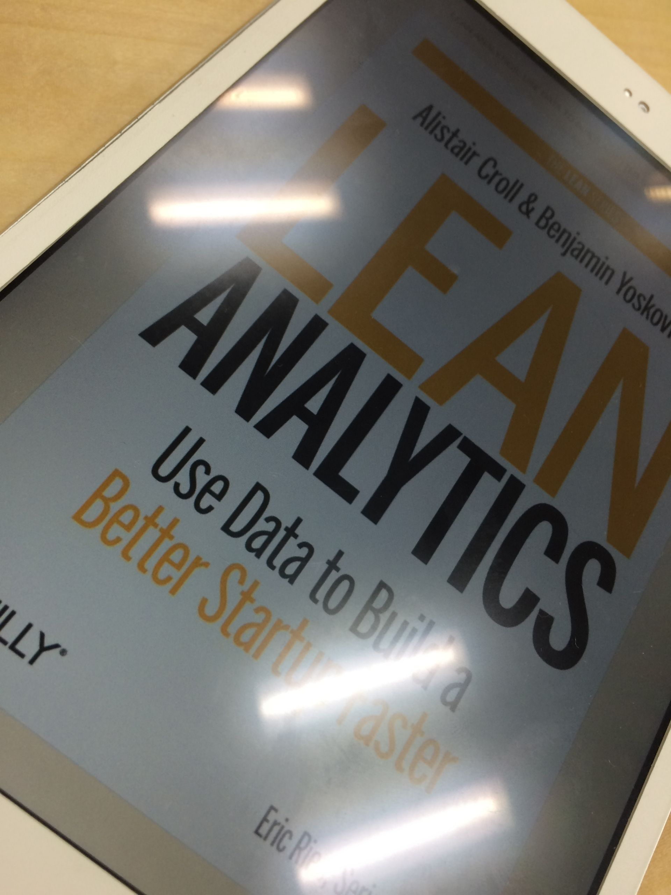

# 社内でLean Analytics読書会をやった

今年の4月末に、Lean Analyticsを読もうという話を [@ryo\_katsuma](https://twitter.com/ryo_katsuma)氏が社内ブログで言い出したことにより始まり、5月から12月まで毎週1章を読み進めていくペースで読んでいきました。(かつまさん、ありがとうございました！) 英語の本の読書会と言っても、翻訳をしてそれを読み合わせるというよりは、皆が事前に読んできて分からなかったこと、きになったコトを話したり、内容から広がった自分たちのサービス開発の上での経験談を話して盛り上がるという会でした。

このスタイルで得られることは多く、[英語の本は輪読すると続けやすいというmiyohideさんの言葉](http://miyohide.hatenablog.com/entry/2014/12/29/005054)だけではなく、社内外の様々な事例に突っ込んで議論できたのがとても良かったです。古参の人の持っている知識ってなかなか新参者には伝わる機会が少ないのですが、いい話がどんどん出てきたのが素晴らしいことでした。

# Yokohama.rbのLT大会で紹介した

本の中でも特に印象に残った話を[Yokohama.rb #50](http://yokohamarb.doorkeeper.jp/events/14212)のLT大会で話してきました。

<iframe src="//www.slideshare.net/slideshow/embed_code/41289101" width="425" height="355" frameborder="0" marginwidth="0" marginheight="0" scrolling="no" style="border:1px solid #CCC; border-width:1px; margin-bottom:5px; max-width: 100%;" allowfullscreen> </iframe>

  **[The book that changed me](//www.slideshare.net/chezou/the-book-which-i-chan "The book that changed me")** from **[Michiaki Ariga](//www.slideshare.net/chezou)** 

ここで紹介している話は、15章の"Emphathy"という章で、新規サービスで「顧客に届けるべき価値とは何か」を考える際に、

> 十分に厄介か、 たくさんの人々に関係するか、 既にそれを解決しようとしているか

という3つを考えろ、ということでした。特に、この3つ目のポイントが重要で「バラバラの靴下を履いてしまう現象は十分に厄介で多くの人を煩わせているが、それを解決しようとしている人はいるか？」という例が目からうろこでした。

# 自分や周りのディレクターの行動が変わった

一緒に仕事をしていたディレクター[^1] と話していて変わったよね、と言っているのが「施策を打つときに、サボらず必ず指標を考えそれを追いかけるようになった」ということでした。

本書では、"One Metric That Matters"という言葉が繰り返し出てくるように、指標を一つに絞れということがよく言われます。それは、PV[^2] のような「Vanity Metricsを避けろ」という意味でもあり、「指標はフェーズによって変わる」という意味でもあります。 何故、"One Metric That Matters"が大事なのかというのを、様々な会社での豊富な具体例とともに語られるため、施策の仮説を考えてそれを表現する指標は何か？その指標がどうなったときに、どういう行動を取るか？というのを必ず考える癖が身につきました。 指標は次の行動を起こすものでなければ意味が無い、というのはまさにその通りだと実感しています。

僕自身、機械学習やデータ分析が好きな人なのですが、そうした人にとっても得られるものは多くあると思うのでおすすめです。データは意志を決定するための道具であり、ビジネスはパッションとともに進めていくものである、というのは、ただの分析本には出てこないなぁと改めて思います。

# 翻訳レビューも参加した

> [@chezou](https://twitter.com/chezou) できるところだけでいいですよ
> 
> — 角征典 KADO Masanori (@kdmsnr) [2014, 4月 29](https://twitter.com/kdmsnr/status/461070893444116480)

人生で初めて本の翻訳レビューに参加させていただきました。[@harupong](https://twitter.com/harupong)さんのように猛烈なレビュー[^3] は出来ていませんが、jekyllのドキュメント翻訳から発展してこのような挑戦が出来たのはとても貴重な経験になりました。イディオムとか回りくどい言い回しとかは、日本語にする時大変なのを改めて学びました...。

[1月にオライリーより日本語版が発売する](http://www.oreilly.co.jp/catalog/soon.html)ので、是非読むことをおすすめします。

<iframe src="https://rcm-fe.amazon-adsystem.com/e/cm?lt1=_blank&amp;bc1=000000&amp;IS2=1&amp;bg1=FFFFFF&amp;fc1=000000&amp;lc1=0000FF&amp;t=chezou-22&amp;o=9&amp;p=8&amp;l=as4&amp;m=amazon&amp;f=ifr&amp;ref=ss_til&amp;asins=B00AG66LTM" style="width:120px;height:240px;" scrolling="no" marginwidth="0" marginheight="0" frameborder="0"></iframe>

[^1]: 数字が苦手で本書を読むまで指標を追うのが嫌いだったそうです

[^2]: 本文中では一時期2ページに1回くらい、意味のない指標だと否定されている

[^3]: 一時期harupong砲がgmailの通知を爆発させていた
