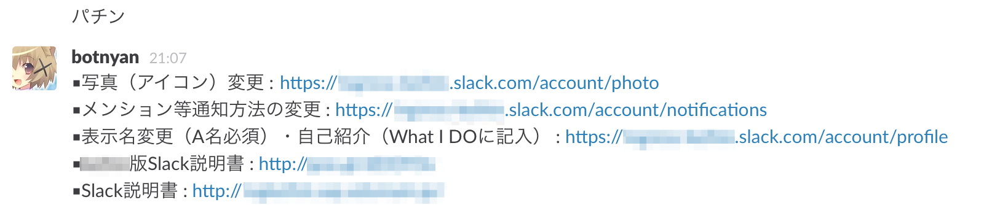

普通の人達[^1] の集まりである、Ingressの地域コミュニティでSlackを導入してそろそろ3ヶ月になったので、知見を書こうと思います。

# Ingress内でのコミュニケーション

Ingressではゲーム内のチャットはcommと呼ばれるものがありますが、ほとんど使われていません。

その理由は主に2つあります。

- commは行動ログが流れる中でメンションができるというスタイルをとっているため、特に関東圏では流れるデータ量が多すぎてiOS版のcommはフリーズの原因として嫌われている
- 全体公開のチャットと自陣内のチャットとがタブ一つ隣り合わせのため、うっかりチームチャットを公開してしまう事故が多発する

そこで、多くの場合はGoogleアカウントとの親和性の高いGoogle+での広い地域のコミュニティ[^2] と、地元の地域チャットとしてHangoutの組み合わせで使われてきました。 これは、どうも国内だけの話ではなく、台湾ではLINEが使われるなど別のチャットサービスが使われることで、ゲーム内チャットの代替を果たしてきました。

特にHangoutでのチャットはゲームに対するモチベーションの向上に大きく寄与しており、一人だとめげそうでも仲間と一緒に活動を報告しあうことで継続してプレイをする気が増します。

これらのことから、Ingressは[Google+やHangoutの普及に一役買ったとも言われています](http://ingress.blog.jp/archives/20637917.html)。

# Hangout to Slack

日本のIngress人口は、iPhone版の登場と同時に爆発的な人口増加をすることとなります[^3] 。2014/12に開催された公式イベントDarsana Tokyoでは5000人を超える参加者が参加したと言われています。

しかし、プレイヤー人口が増えるとHangoutでのチャットが辛くなるのです。 もともとHangoutはLINEなどと似たような指向のメッセージングアプリのため、グループチャットが100人以上参加できないという制約があります。 従来、Hangoutの人数の上限に達したらどうしてきたかというと、地域を細かく分割して再配分をするという方法で対処してきたのですが、その周期がどんどん短くなってきていました。

そこで、職場の人たちと使っていたSlackの導入を提案してみました[^4] 。

昨今では[Ingress界隈で急速に普及している](http://b.hatena.ne.jp/entry/238278144/comment/muchonov)と言われるSlackですが、実はあのTim Brayも、Ingressの地域コミュニティのツールをHangoutからSlackに移行していたようです。

[ongoing by Tim Bray · Hangouts to Slack](https://www.tbray.org/ongoing/When/201x/2014/07/17/Slacking-off-Hangouts)

先ほどのTim Brayの記事にもありますが、Hangoutは以下の様な辛さがありました

- 100人以上のチームを作れない
- エージェント名(ゲーム内の名前)とGoogle+の名前の対応付けが困難
- PCからの利用が辛い
- 大人数のチームに複数所属していると、アプリがしょっちゅうクラッシュする
- iOSにはデフォルトで入っておらず、招待の許可を緩めないと招待されたことに気づかない
- 参加者をbanできない
- APIを使うのがハードルが高い
- ビデオ通話を誤爆する

# Slackの強み

SlackはIRCの系統の色が強く、チャットをするためのツールです。なので、SlackではHangoutと比較して以下のようなことができます。

- エージェント名を表示名にできる
- ユーザに対するメンション
- メッセージの編集、削除ができる！
- チャンネル毎に自分の未読まで戻りやすい
- 通知の制御(HangoutだとチームごとにON/OFFしかできないが、all/mentionのみ/なし、がチャンネル単位で選べる)
- botやIFTTTなどとのインテグレーションが簡単にできる
- 検索が便利
- チーム内のチャンネル(部屋)の移動コストが低いので、チャンネルを気軽に作れる
- PC側のアプリ/Webアプリが優秀

特にチャンネルの作成/捨てるコストが低いので、皆思い思いのチャンネルを作っています。特に人気なのは飯テロチャンネルで、地元の人達がおすすめのご飯やさん情報や🍶情報が、写真とともに流れてきてとても便利です。

Slackは無料だと保持・検索できるメッセージ数が1万件まで、インテグレーションの数が5つまで、という制限があります[^5] が、普通に使うぶんには特に問題は感じていません。

# 非エンジニアの人へ普及するために

私達のようなソフトウェアでご飯を食べているようなエンジニアにとっては、こういった新しいツールはあればほっといてもどんどん使って行きます。 逆に、そうでない人も多く参加するのがIngressの面白いところです。高校生から[60歳過ぎたおじいさん](https://chezou.hatenablog.com/entry/2014/12/15/152000)まで幅広い層がいたりします。

そうした人の中には、Hangoutの使い方もよくわからないという人も結構います。また、英語のソフトは全くダメ！という人も多くいます。 そう、Slackはすべて英語なのです。

PCのブラウザだと丁寧なチュートリアルがあるのでだいぶ楽ですが、モバイルアプリだと写真の設定のために、ブラウザの設定画面開かないといけないなど結構不親切です。

こうした問題をクリアするために、有志が丁寧なスクリーンショット付きのマニュアルを作り共有することで、敷居を下げる努力をしてくれています。

余談ですが、変化の激しいWebサービスのマニュアルを更新し続けることはかなりしんどいです。 自分も普段はWebサービスの提供側なので、ドキュメントを追従し続けるのは結構辛いのはわかっていますが、丁寧にマニュアルを作ってくれたコミュニティの仲間には頭が上がりません。

このドキュメントは、同陣営の他のSlackへも利用してもらえるように横展開しています。

# さらに便利にするための工夫

## Welocomeメッセージのような定型文bot

slackにはslackbotという、キーワードに対して定型文を返すbotがいるため、新規参加者に対するテンプレなんかをこれで提示するようにしています。 最近では、slackbotは改行した文を出力できないため、Google Driveの特定のドキュメントを取得して、welcomeメッセージを出すbotも出現しています。

## Google Driveの共有フォルダ

Google Driveのフォルダに対して、Google groupに権限を付与するとそこに参加しているgroup全員が読み書きできるようにしています。 そうすることで、ファイルやディレクトリ単位での権限を人単位でコントロールすることが無くてかなり楽です。

ちなみに、当初はesa.ioでドキュメント共有をしており評判も上々だったのですが、ゲームのコミュニティではお金を捻出できないため諦めました。

## 参加申請処理のための部屋

我々は、参加申請のためのGoogleフォームを用意して、そのメールをIFTTTで特定のprivate groupに通知するようにしています。 こうすることで、特定の人だけが参加申請処理をすることなく負荷分散を図っています。

## 気軽にいいねをするために

[hubot-scorekeeper](https://www.npmjs.com/package/hubot-scorekeeper)というのを入れています。

<iframe src="https://hatenablog.com/embed?url=http%3A%2F%2Fyoshiori.github.io%2Fblog%2F2014%2F07%2F10%2Freleased-scorekeeper%2F" title="気軽なポジティブ・フィードバック好き - yoshiori.github.io" class="embed-card embed-webcard" scrolling="no" frameborder="0" style="width: 100%; height: 155px; max-width: 500px; margin: 10px 0px;"><a href="http://yoshiori.github.io/blog/2014/07/10/released-scorekeeper/">気軽なポジティブ・フィードバック好き - yoshiori.github.io</a></iframe>

[気軽なポジティブ・フィードバック好き - yoshiori.github.io](http://yoshiori.github.io/blog/2014/07/10/released-scorekeeper/)

    chezou++

みたいな感じで書くとスコアが加算され、誰かを簡単に褒めることができて便利です。

# Ingressコミュニティでの多様性と化学反応

普段自分がいるのは会社や勉強会だとRuby界隈の人が多いのですが、Ingressという軸で集まっていると、様々なスキルセットの人が集まってきます。 自宅に24Uのラック設置している人もいたり、普段なかなか会えない感じの面白い人がいます。 言語的にもPHP、Java、Python、JSなどいろんな人達が自分の得意な言語でサクッとbotやウェブアプリケーションを実装しています。[^6] 

趣味のプログラミングは、自分の作りたいもの、やりたい事をいかに見つけるかが大事だと思うのですが、こういうゲームコミュニティでのツールやアプリづくりも直接的なユーザーの顔を想像しながら開発ができるので楽しいです。 また、普段あまり触らない言語でも共同で作業するためにさわってみようかなーという気になるので、新鮮な気持ちで色々作ることが出来ます。

# コミュニティの形成

コミュニティの人数が増えてくるということは、盛り上がる反面、トラブルが起こったりすることも増えるかもしれません。

ちょうど、Team Geekを読んでいた時に、このHRTの考え方はゲームのコミュニティでも十分生きるなと思っていました。 以下にしてIngressに集中できる環境を作るかが、コミュニティ形成で大事なことになります。仲間内でのつまらないいざこざは、時間とエネルギーの無駄になるので、スムーズなコミュニケーションが出来る場を作れるようになっていきたいです。

Art of Communityもコミュニティ運営に非常に役に立つと [@shiumachi](https://twitter.com/shiumachi) さんから勧められているので、読んでみようと思っています。



[Team Geek ―Googleのギークたちはいかにしてチームを作るのか](http://www.amazon.co.jp/exec/obidos/ASIN/4873116309/chezou-22/)

- 作者: Brian W. Fitzpatrick,Ben Collins-Sussman,角征典
- 出版社/メーカー: オライリージャパン
- 発売日: 2013/07/20
- メディア: 単行本（ソフトカバー）
- [この商品を含むブログ (19件) を見る](http://d.hatena.ne.jp/asin/4873116309/chezou-22)



[アート・オブ・コミュニティ ―「貢献したい気持ち」を繋げて成果を導くには (THEORY/IN/PRACTICE)](http://www.amazon.co.jp/exec/obidos/ASIN/4873114950/chezou-22/)

- 作者: Jono Bacon,渋川よしき
- 出版社/メーカー: オライリージャパン
- 発売日: 2011/05/26
- メディア: 大型本
- 購入: 38人 クリック: 1,022回
- [この商品を含むブログ (29件) を見る](http://d.hatena.ne.jp/asin/4873114950/chezou-22)

# 追記

> [非エンジニアのコミュニティにSlackを導入した話 #ingress - once upon a time,](http://b.hatena.ne.jp/entry/239248183/comment/tunacook)
> - [[slack](/search/tag?q=slack)]
>   
> 
> slackについてはよく知ってるので、それよりも非エンジニアの人から見た感想がきになる
> 
> [2015/01/16 08:59](http://b.hatena.ne.jp/tunacook/20150116#bookmark-239248183)

[slackについてはよく知ってるので、それよりも非エンジニアの人から見た感想がきになる - tunacook のコメント / はてなブックマーク](http://b.hatena.ne.jp/entry/239248183/comment/tunacook)

[id:tunacook](http://blog.hatena.ne.jp/tunacook/) さんからコメントいただいたので、少しメンバーに聞いてみました。ざっくりとした感想というよりは、良い/悪いを聞いてしまったのでもしかすると気になっている所とずれているかもしれません。

女性の方

> slackのここが良い→英語だけど、画面を見るだけで大体の機能がわかる。分かりやすい 。
> 
> ここが辛い→スマホからだと@名前と入力し辛い(予測変換で名前が出ないので長い名前だと打ち間違える)、連続して違う発言をすると文章が前後でくっ付いてひとつになって読みにくい とかでしょうか
> 
> チャットはHOのようなセリフのコマ画面？が出る、出ない、というので話しやすさが違うなーとは感じますが、慣れました（笑）

(この方は、半角スペースを入れないと補完されないということに気づいていないようでした)

男性の方

> slackのここが良い→チャンネル設定や出入りが自由にできる。
> 
> ここが辛い→スマホアプリだとハングアウトの絵文字が使えない

男性のWebデザイナー

> 絵文字追加できるのが良い
> 
> 発言の削除・編集ができるので事故が減った
> 
> スマホでは絵文字の名前がわからないと呼び出せないのが辛い。
> 
> スマホでは参加チームが多くなった時の切り替えが多少面倒臭い。
> 
> LINEのようなスタンプが無いｗ
> 
> 画像投稿の画像を拡大したい時、スマホではワンクッション入るのが面倒。

男性の方

> slackはandroidからだと絵文字が小さくて何なのか見えない。あとやっぱ一般的に英語なのがたぶん壁(一番高い)。
> 
> 検索できるけど、すぐなくなる
> 
> アイコン画像を拡大したい衝動にこたえてくれない

HO=Hangoutです。 結構Hangoutに慣れている人が多く回答してくれているっぽくて比較が多いようですが、英語だけど苦にならないという人と、英語だから辛いという意見が割れているのが興味深いです。 逆に言うと、それ以外の点では複数チーム切り替えとかの難点を除けば受け入れられているという印象です。 我々はMacアプリを前提に考えてしまうのですが、モバイル・アプリのみの人やWindowsの人もいるため、そこら辺もケアしながら進めるのが大事ですね。特にAndroidアプリはiOSに比べて足りない要素が多いので、今後に期待です。

[^1]: プレイスタイルが廃人な人たちもいるけど、そういう意味とは違う

[^2]: 例えば[レジスタンスの東京圏のコミュニティ](http://join.resist.tokyo/)

[^3]: 私自身もiPhoneで始めた口ですが

[^4]: どうも聞いてる感じだと日本のIngressコミュニティの中でも、最初期にSlackを導入したのかもしれません

[^5]: 2015/01/15現在

[^6]: 個人的にはPHPの人とこんなところで共同作業するとは思っていなかった
