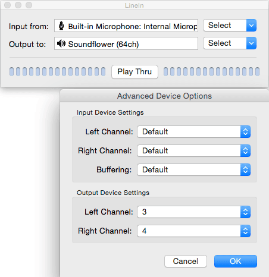
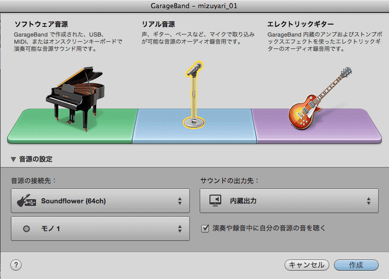

最近、rebuild.fmやwada.fmを聞いていると、自分もpodcastをはじめてみたいという気持ちが強くなってきました。

試験的にskype経由でpodcast向けの録音をしてみたのですが、skypeのゲストと自分の声が別々の方が後々の編集作業が楽になるぞ、ということで以下のサイトを参考にやってみました。というか、ほとんどこの記事の日本語版という内容になっています。

[Record a Google+ Hangout with Garageband - SoLoMo Show](http://solomoshow.com/record-a-google-hangout-with-garageband/)

## 用意するもの

- [LineIn](http://www.rogueamoeba.com/freebies/)
- [Soundflower](https://code.google.com/p/soundflower/)
- [Skype](http://www.skype.com/ja/)
- [Garageband](http://www.apple.com/mac/garageband/)

## 設定

- 経路1
  - Skype -\> Soundflower (2ch) -\> Soundflower (16ch)の1,2ch
- 経路2
  - マイク -\> Soundflower (16ch)の3,4ch

ざっくり全体の設定を示す画像を先にはっておきます。

### LineIn

LineInは音をroutingするためのものです。

LineInはアプリ自体をコピーして2つ開きます。

1つめのLineInでは、Inputを自分のマイク(写真では内蔵マイク)、Outputを`Soundflower (64ch)`にします。さらに、`Advanced...`を開いてOutputのLeft channelを3に、right channelを4にします。

2つめのLineInでは、Inputを`Soundflower (2ch)`、Outputを`Soundflower (64ch)`にします。 さらに`Advanced...`を開いて、Output Left channelを1, Right channelを2にします。

設定が終わったら、`Play Thru`を押します。

### Skype

入力を、自分のマイク(今回は`内蔵マイク`)、呼び出し音を自分の出力(今回は`内蔵出力`)、スピーカーを`Soundflower (2ch)`にします。

こうすると、Skypeの出力が`Soundflower (2ch)`を経由して`Soundflower (16ch)`の3,4chに出ます。

### SoundflowerBed

SoundflowerはMac用の仮想サウンドデバイスです。

`Soundflower (2ch)`を`Build-In Output`にします。 こうすることでSkypeの音を自分のヘッドホンなどに出力します。

なお、64chの方はnoneのままにすることで、自分の音が遅延して聞こえる嫌な体験をしなくてすみます。

## Garageband

基本的に、トラックを全部削除して、新規トラックを作成するときにSoundflower(64ch)の1/2と3/4を分けて追加します。

まず、`トラック→新規トラック`でSkype側を録音するためのトラックを追加します。 その際に、リアル音源を選んで`音源の設定`を押した後、`モノ1`(あるいは`ステレオ1/2`)を選びます。

同様に、自分のマイク用のトラックを追加します。 先ほどと同様にして、最後の入力を`モノ3`(あるいは`ステレオ3/4`)にします。

バージョン古いですが、こちらの動画も参考になります。



## ちなみに

最近のiPadのマイクはそこそこ良いので、とりあえず相手が機材を持っていないのであれば、iPadかiPhoneのskypeから参戦するのも良さそうです。

[Githubにmp3を置くという方法](http://kozyty.com/blog/2014/10/nanapod/)で配信できるということがわかったので、最初のPodcastはJekyll(octopress)をGithub pagesで使って無料で構築することにしました。

ゆくゆくはIDCクラウドフロンティアもクーポンがあるので、そっちも試してみたいです。