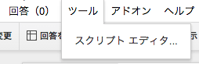
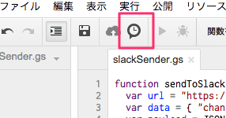
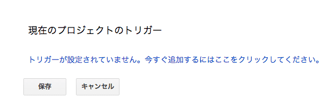
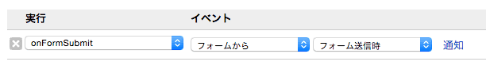

Slackは連絡先を知っている人が参加することが多いですが、ゲームのコミュニティ等相手の連絡先がわからない場合もあると思います。(IngressとかIngressとかIngressとか)

そういう時のために申請フォームを作って、Slackに通知をするための方法をまとめます。

## 1. SlackのIncoming Webhookを設定する

Slackの[Incoming Webhook](https://my.slack.com/services/new/incoming-webhook)を新規作成する。 デフォルトの部屋は適当に選べば良い。

`Webhook URL`のURLを記録しておく。

## 2. Googleフォームを作る

今回想定している項目は、以下の4点

- 紹介者名
- 名前
- あなたのG+プロフィールページ
- メールアドレス

## 3. Slack通知用のスクリプトを作成する

フォームの`ツール -> スクリプト エディタ`を開く

通知するためのコードを書く。 以下の例では、public channel(`#public_notify`)にメールアドレス以外の情報を、private group(`private`)にすべての情報を通知しています。

urlのところには先ほど取得した`Webhook URL`を設定します。

    function sendToSlack(body, channel) { var url = "https://hooks.slack.com/services/XXXXXXXXXXXXXXXXXXXXXXXXXXXXXXXXXX"; var data = { "channel" : channel, "username" : "invitation bot", "text" : body, "icon\_emoji" : ":gohst:" }; var payload = JSON.stringify(data); var options = { "method" : "POST", "contentType" : "application/json", "payload" : payload }; var response = UrlFetchApp.fetch(url, options); } function test() { sendToSlack("It's a test message", "#public\_notify") } function onFormSubmit(e){ var body = "公開版申請が来たよ\n"; var introducer = ""; var applicant = ""; var plusUrl = ""; var itemResponse = e.response.getItemResponses(); for (var j = 0; j \< itemResponse.length; j++){ var formData = itemResponse[j]; var title = formData.getItem().getTitle(); var response = formData.getResponse(); body += "【" + title + "】\n"; body += response + "\n\n"; switch (title) { case "紹介者名": introducer = response; break; case "名前": applicant = response; break; case "あなたのG+プロフィールページ": plusUrl = response; break; default: break; } } var bodyPublic = "@" + introducer + "さ〜ん\n" + applicant + "さんがお呼びよ！\n"; bodyPublic += "確認したら「" + applicant + "さん確認しました！」と発言してね\n【Google+】" + plusUrl; sendToSlack(bodyPublic, "#public\_notify"); sendToSlack(body, "private"); }

Slackへの通知が動くかどうかは、`test()`を実行してみると良い。

最後に、フォームが送信された時にこのスクリプトが動くように`onFormSubmit()`のトリガーを設定します。

このとき、スクリプトからドキュメントへのアクセス権限を求められるので承認します。(これがないと、設定できない)

なお、デバッグの時は最後の`通知`に`今すぐ`という設定を追加するとエラーが分かりやすくなってよいです。

うまくいけば、こういう通知がでることになります。

## 参考URL

- [gas - スプレッドシートで作ったtodoリストでステータスを変更するとslackに流す - Qiita](http://qiita.com/mito_log/items/6457dc110b3478e3e530)