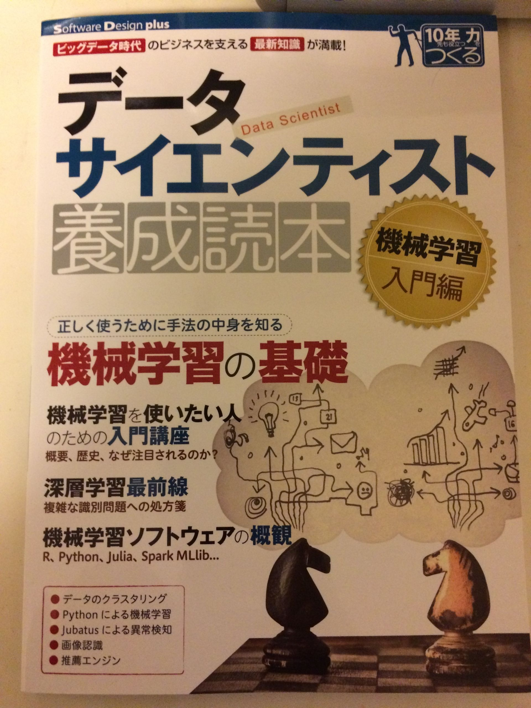

明日発売の「データサイエンティスト養成読本 機械学習入門編」を著者の一人の福島さん([@sfchaos](https://twitter.com/sfchos))にいただきました。 きっかけは、福島さんが「機械学習ソフトウェアの外観」という特集でJuliaの紹介をしていただいたからでした。



[データサイエンティスト養成読本 機械学習入門編 (Software Design plus)](http://www.amazon.co.jp/exec/obidos/ASIN/4774176311/chezou-22/)

- 作者: 比戸将平,馬場雪乃,里洋平,戸嶋龍哉,得居誠也,福島真太朗,加藤公一,関喜史,阿部厳,熊崎宏樹
- 出版社/メーカー: 技術評論社
- 発売日: 2015/09/10
- メディア: 大型本
- [この商品を含むブログを見る](http://d.hatena.ne.jp/asin/4774176311/chezou-22)

この本は著者のPFI比戸さんが自身のブログでも描かれているのですが、

[機械学習の入門本を書きました（データサイエンティスト養成読本） - 随所に主と作れば、立処皆真なり](http://sla.hatenablog.com/entry/gihyo_mlbook)

> 一般向けに機械学習を応用面から説明する記事・書籍は増えています。しかし、そこで興味を持って実際に使い始めようとすると、大学講義の教科書として用意された学部生・院生向けの機械学習入門書で理論の基礎を学ぶ以外の選択肢、具体的には手を動かすところから始める日本語の書籍が（特にR言語周辺以外では）少ないように思えました。

とあるように、対象としては最初の入門として、オライリーの「[入門 機械学習](http://d.hatena.ne.jp/asin/4873115949/chezou-22)」を読んだけど、もっと詳しく知りたいがきっかけが掴めない、という人にぴったりなんじゃないかと思います。

以下に目次を書きます。ご存じの方は分かる通りとても豪華な執筆陣です。データサイエンティスト養成読本シリーズの中でも、過去最高に充実してるといえるでしょう。（そして、おそらく過去最高の厚さ！）

> 第1部 しくみと概要を学ぼう！
> 
> 特集1 機械学習を使いたい人のための入門講座…… 比戸将平
> 
> 特集2 機械学習の基礎知識…… 馬場雪乃
> 
> 特集3 ビジネスに導入する機械学習…… 里 洋平・戸嶋龍哉
> 
> 特集4 深層学習最前線…… 得居誠也
> 
> 第2部 手を動かして学ぼう！
> 
> 特集1 機械学習ソフトウェアの概観…… 福島真太朗
> 
> 特集2 Pythonによる機械学習入門…… 加藤公一
> 
> 特集3 推薦システム入門…… 関 喜史
> 
> 特集4 Pythonで画像認識にチャレンジ…… 阿部 厳
> 
> 特集5 Jubatusによる異常検知…… 熊崎宏樹

個人的に特におすすめなのが、第1部比戸さんの特集1「機械学習を使いたい人のための入門講座」と馬場先生の特集2「機械学習の基礎知識」、第2部福島さんの特集1「機械学習ソフトウェアの概観」です。 この3つの特集を読むと、機械学習の歴史的な流れから基礎的な概念、そしてどのようなライブラリが存在するかがコンパクトにつかむことができるでしょう。

ただし、特集2は大学の学部生が読むのにちょうどよい感じの数式が出てくるので、数式が苦手な方は豊富な図とそのイメージをつかむ程度で、まずは良いかもしれません。

この3特集を読んだ上で、他の好きな特集をつまみ食いする、というのが読むのに楽かなぁと思いました。

この本の内容自体は、僕自身は知っていることも多かったのですが、普段あまりscikit-learnを使わずにRや素のlibsvmなど他のフレームワークで機械学習をしている人にとっても、「今どきの機械学習のフレームワークが交差検定やグリッドサーチなど何を標準で提供しているのか」、そして「今どれを選ぶのが良いのか」、ということを見つめなおす材料としてとても良くまとまっていると思います。

また、いきなり流行りに乗ろうとして「[深層学習 (機械学習プロフェッショナルシリーズ)](http://d.hatena.ne.jp/asin/4061529021/chezou-22)」や「[オンライン機械学習 (機械学習プロフェッショナルシリーズ)](http://d.hatena.ne.jp/asin/406152903X/chezou-22)」を買ってしまって積んでしまった人にはこちらの本で入門するのが良いと思います。 初級者から中級者に向けて書かれた良書だと思います。本書が機械学習入門の羅針盤となることでしょう。