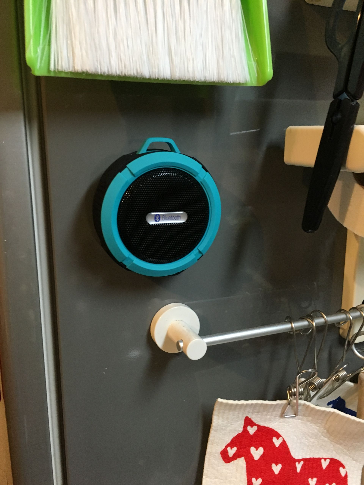

前々からBluetoothのお風呂ラジオをほしいなーと思っていたのですが、昔に比べるとかなり安くなっていたので買いました。



[Patech　Bluetooth 3.0　ワイヤレススピーカー　内蔵マイク付　吸盤式対応　防水仕様　（ブルー）](http://www.amazon.co.jp/exec/obidos/ASIN/B00NFGTRNC/chezou-22/)

- 出版社/メーカー: Patech
- メディア: エレクトロニクス
- [この商品を含むブログを見る](http://d.hatena.ne.jp/asin/B00NFGTRNC/chezou-22)

Amazonで2000円を切っているので勢い余って買ってしまったのですが、非常に重宝しています。 お風呂では鏡につければ安定しますし、音量もそれなりに大きいです。

この商品を選んだ決め手は、「ロードバイクのトップチューブにもつきます」って書いてあったからなのですが、 よくよく読んでみると大分無茶してる使い方でした...。[^1]

一番嬉しいのが、冷蔵庫にくっつくということ。

食器を洗ったり料理をしながらPodcastを聞くことが多いのですが、iPhoneのスピーカーだと水の音などに負けて聞き取れないことが多々有りました。しかし、このスピーカーにしてからはそういう問題がなくなって安定しています。

特にOvercastでsmart speedを使っていると、sやtなどの子音がほとんど聞こえなくなってしまうため、日本語が聞き取りにくくなりがちなのですが、そういった問題もクリアできます。

肝心の音は、モノラルだけど値段に比べると少しマシかなという印象です。普通にpopsとか流しても昔のラジオっぽい雰囲気がでてよいです。

[^1]: カラビナついてるから、どこかにぶら下げるのは良いかも
