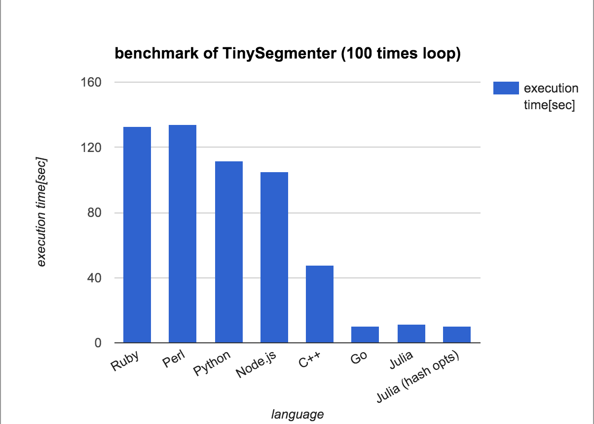

先日、[TinySegmenter.jlの話](https://chezo.uno/post/2015-10-21-tinysegmenterwojuliayi-zhi-sitaramitnoxian-sheng-nizhi-dao-sitemoraetahua
)を書いたら各方面から反響を頂きました。

<iframe src="//hatenablog-parts.com/embed?url=http%3A%2F%2Frepeatedly.github.io%2Fja%2F2015%2F10%2Ftinysegmenter-benchmark-and-d%2F" title="TinySegmenterのベンチマーク + D言語版 - Go ahead!" class="embed-card embed-webcard" scrolling="no" frameborder="0" style="display: block; width: 100%; height: 155px; max-width: 500px; margin: 10px 0px;"></iframe><cite class="hatena-citation"><a href="http://repeatedly.github.io/ja/2015/10/tinysegmenter-benchmark-and-d/">repeatedly.github.io</a></cite>

[http://woxtu.tumblr.com/post/132337169740/rust-tinysegmenter](http://woxtu.tumblr.com/post/132337169740/rust-tinysegmenter)
<cite class="hatena-citation"><a href="http://woxtu.tumblr.com/post/132337169740/rust-tinysegmenter">woxtu.tumblr.com</a></cite>

<iframe src="//hatenablog-parts.com/embed?url=http%3A%2F%2Fqiita.com%2Fikasamt%2Fitems%2F471bfae96ce590a4fe82" title="ベンチマーク - TinySegmenterをCrystalで書いてみた。雑だけど。 - Qiita" class="embed-card embed-webcard" scrolling="no" frameborder="0" style="display: block; width: 100%; height: 155px; max-width: 500px; margin: 10px 0px;"></iframe><cite class="hatena-citation"><a href="http://qiita.com/ikasamt/items/471bfae96ce590a4fe82">qiita.com</a></cite>

そんな中で、ikawahaさんがGoでも同様の最適化を実装していました。

<iframe src="https://ikawaha.hateblo.jp/embed/2015/10/23/161351" title="TinySegmenter.jl の高速化手法を追っかけてみた - 押してダメならふて寝しろ" class="embed-card embed-blogcard" scrolling="no" frameborder="0" style="display: block; width: 100%; height: 190px; max-width: 500px; margin: 10px 0px;"></iframe><cite class="hatena-citation"><a href="https://ikawaha.hateblo.jp/entry/2015/10/23/161351">ikawaha.hateblo.jp</a></cite>

それと比較するために、とりあえず[Julia templateをPR](https://github.com/shogo82148/TinySegmenterMaker/pull/10)して比較しました。

| Ruby | Perl | Python | Node.js | C++ | Go | Julia | Julia (hash optimized) |
| --- | --- | --- | --- | --- | --- | --- | --- |
| 132.98 | 134 | 111.85 | 105.31 | 48 | 10.50 | 11.70 | 10.35 |

実はTinySegmenterMakerのshogo82148さんが一部のhashのkeyをordしたIntで表現するというさらなる最適化を進めていたので、 ちょっと負けてしまったのですがJuliaのDictを生成するときのhash計算が遅いということを[bicycle1885さんが特定してくれた](https://gist.github.com/bicycle1885/918a0fee5dbb3d68f05a)ので、Julia本体の最適化が進めば同じくらいにはなりそうだね、ということがわかりました(表のhash optimized)。

ちなみに、SGJ先生は「実は言語間の比較ではなくて最適化の比較になっていたんだけどね（てへぺろ）」[みたいなこと](https://github.com/chezou/TinySegmenter.jl/issues/8#issuecomment-154558591)を告白しており、ikawahaさんの目の付け所は正しかったようです。

そういう意味では、Stringとしても処理できるし頑張れば最適化できるJuliaは楽しいですね、という気持ちになりました。今時のコンパイル型の言語だと突き詰めれば似たような性能になるんでしょうね。
