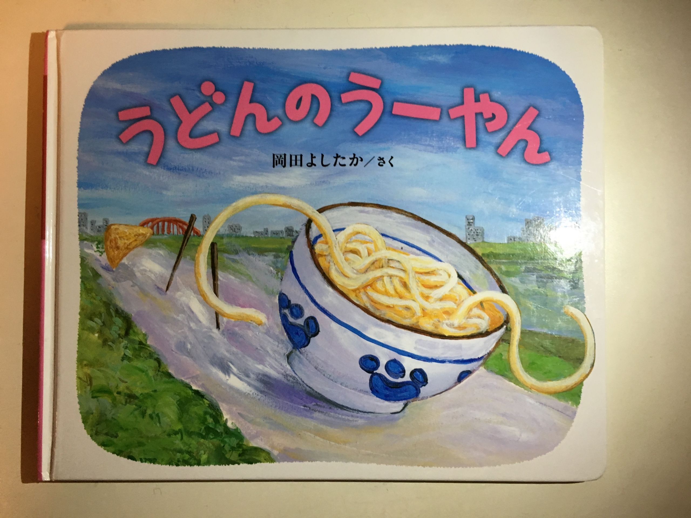
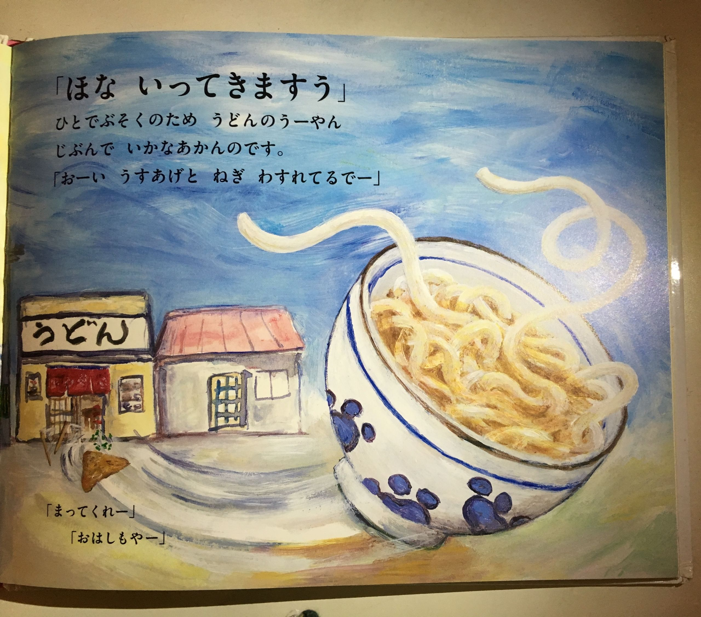
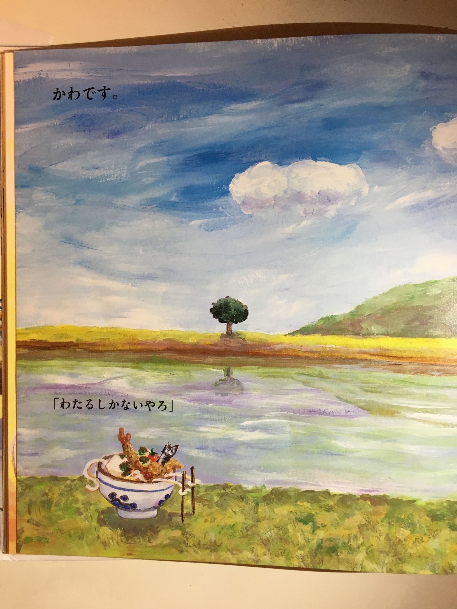
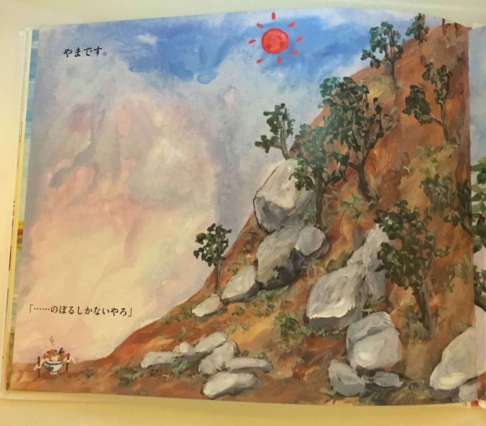

このエントリは、[お子さん、どんな本読んでる？ Advent Calendar 2015 - Adventar](http://www.adventar.org/calendars/773) の6日目です。

# 「うーやん」とは？

うどんです。

本の正式名称は「うどんのうーやん」です。

# 「うーやん」とは？

働き者のうどんです。

人手不足の煽りを受けて、自分自身で配達に行きます。  
世が世なら、世界中の仕事が人工知能によって奪われて「うーやん」は自ら配達に行く必要は無かったのかもしれません。

# 「うーやん」とは？

哲学です。

そこに川があるから渡り、

そこに山があるから登ります。

さらに、食べてしまおうと迫り来る鳥との戦いでは、唐辛子さんとの熱い友情も見ることが出来ます。 子供の情操教育にぴったりですね。 さらに、前編関西弁で記述されているため、関東地方に住む子供にとっては方言を通じて「地域によって言葉が違う」という多様性を学ぶことができます。[^1] 

# 「うーやん」を広める唯一の方法

ここからは僕が取った方法なので、再現性が高いかわかりませんが、5歳未満の子持ちの同僚がそこそこ居る会社に所属されている方なら通用すると思います。

1. Wishlistに子供向けのものを入れている人（子供の誕生日とかだとなお良し）に、 **頼まれてもいないのにもう一品うーやんを追加して** 送りつける
2. 届いた子供が気に入ったという話題が出るので、社内でとても面白いという評判を広める
3. 次々とお子さんを持っている同僚が買いはじめ、お子さんがいない同僚にも広まる

こうして、普段自分の子供の話すらしたことがない同僚からも「うーやん見てみたいんですけど」と言われるまでになります。

2歳位のお子さんをお持ちの同僚と話をしていると、思った以上に「どういう絵本を読めばいいのかわからない」と困っている人が多いように感じました。[2013年のAdvent Calendar](https://chezo.uno/post/2013-12-08-yu-gan-yarizumugale-siihatutosuruhui-ben-3ce)でも紹介した、[メルヘンハウスのブッククラブ](https://bookclub.meruhenhouse.co.jp/)のように、 おまかせで毎月届けてくれるサービスを使うのも良いかもしれません。

小さいお子さんをお持ちで、まだうーやんを持っていない方は是非一度手にとって見るとよいでしょう。



[うどんのうーやん](http://www.amazon.co.jp/exec/obidos/ASIN/4893095501/chezou-22/)

- 作者: 岡田よしたか
- 出版社/メーカー: ブロンズ新社
- 発売日: 2012/08
- メディア: 単行本
- 購入: 1人 クリック: 75回
- [この商品を含むブログ (11件) を見る](http://d.hatena.ne.jp/asin/4893095501/chezou-22)

明日は、ohesotoriさんの記事です。

# あわせて読みたい





[^1]: なお、私は似非関西弁を話すと刺される名古屋文化圏で育ったため、できるだけ妻に読んでもらっています