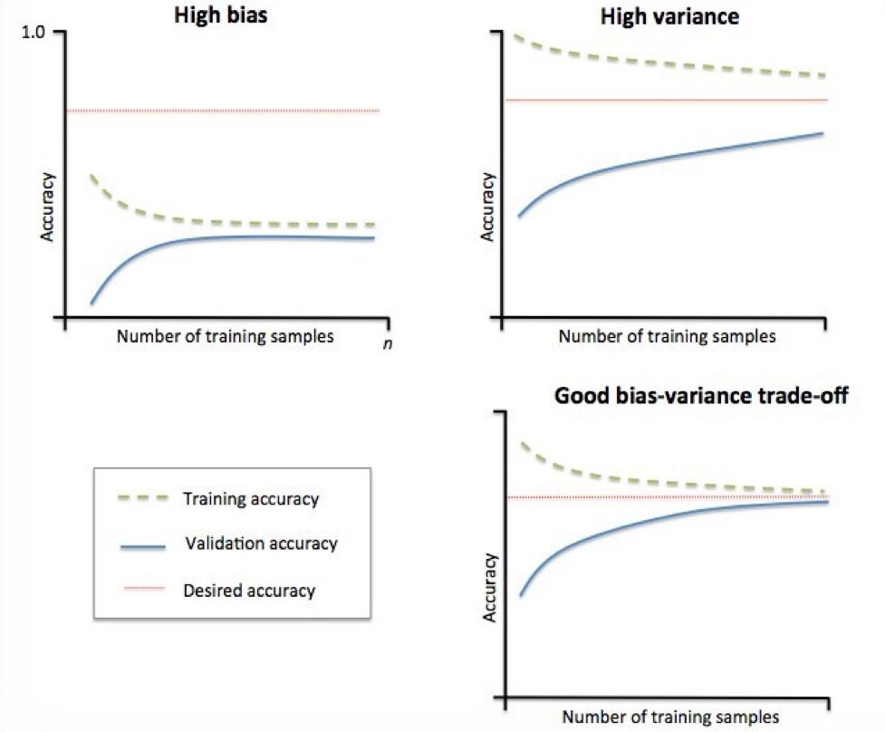
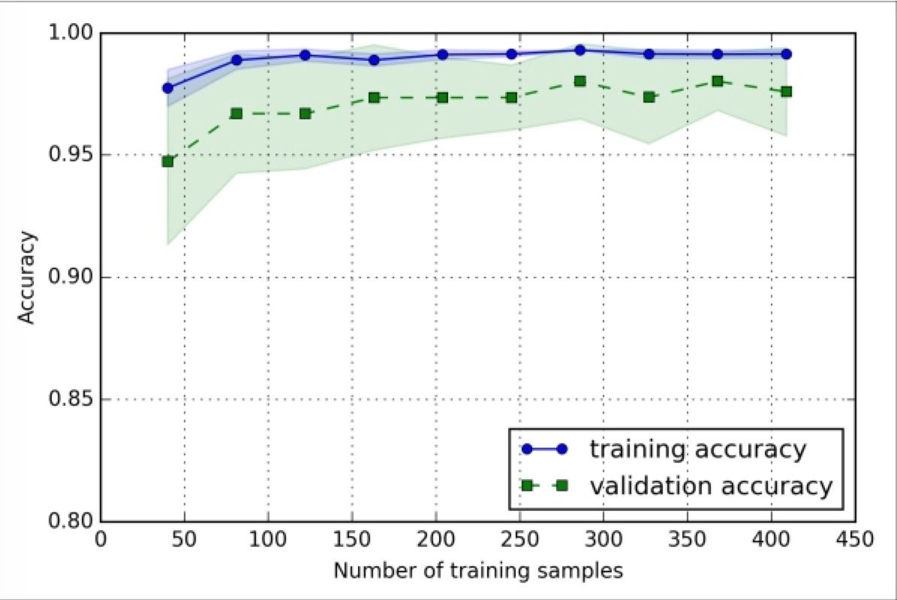
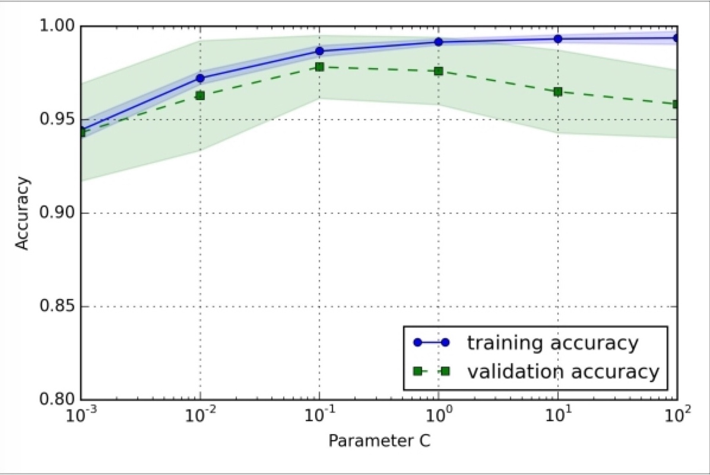

# Q: うわっ...ワタシのモデル過学習してる…？

機械学習をしていると、「やったほぼ100％の性能でました！」みたいな話がちょこちょこでて、その度に「あー、はいはい過学習乙」とか「[leakageじゃね？](http://tjo.hatenablog.com/entry/2016/01/27/235620)」とかいう話になると思います。

過学習というのは、とても雑に言うと「学習に使ったデータに対してはバッチリ正解できるけど、知らないデータに対しては全然当たらない」というモデルのことを指します。 昔センター試験の英語を受けた年に突如出題傾向が変わったのですが、塾でバッチリ対策をしていた人々が「うわー、今年傾向変わって全然解けなかったー。きっと他の人も解けなかったよね」という話をしていたのですが、今思うとこれもある意味過学習ですね。

この辺は、PRMLなんかから伝統的に説明される、回帰モデルに対して高次のモデルをフィットさせていくと、やり過ぎになるよねみたいな話が書いてあります。



[パターン認識と機械学習 上](http://www.amazon.co.jp/exec/obidos/ASIN/4621061224/chezou-22/)

- 作者: C.M.ビショップ,元田浩,栗田多喜夫,樋口知之,松本裕治,村田昇
- 出版社/メーカー: 丸善出版
- 発売日: 2012/04/05
- メディア: 単行本（ソフトカバー）
- 購入: 6人 クリック: 33回
- [この商品を含むブログ (19件) を見る](http://d.hatena.ne.jp/asin/4621061224/chezou-22)

では、どういう時に過学習が起こるかというと、これもざっくり言うと以下の時に起こります。

- データが少ない時
- モデル[^1] が、問題に対して複雑すぎる時

書いていて表裏一体な気がしましたが、「じゃあこれどうやって気づけばいいの？」ということを思うと思います。 その答えが、今度日本語版が出る"Python Machine Learning"に分かりやすく書いてありました。日本語版も6月に出るので楽しみですね！



[Python Machine Learning](http://www.amazon.co.jp/exec/obidos/ASIN/B00YSILNL0/chezou-22/)

- 作者: Sebastian Raschka
- 出版社/メーカー: Packt Publishing
- 発売日: 2015/09/23
- メディア: Kindle版
- [この商品を含むブログを見る](http://d.hatena.ne.jp/asin/B00YSILNL0/chezou-22)



[Python機械学習プログラミング 達人データサイエンティストによる理論と実践 (impress top gear)](http://www.amazon.co.jp/exec/obidos/ASIN/4844380605/chezou-22/)

- 作者: Sebastian Raschka,株式会社クイープ,福島真太朗
- 出版社/メーカー: インプレス
- 発売日: 2016/06/30
- メディア: 単行本（ソフトカバー）
- [この商品を含むブログ (4件) を見る](http://d.hatena.ne.jp/asin/4844380605/chezou-22)

# A: learning curveとvalidation curveを見よう

（以降の図は"Python Machine Learning"英語版の本より引用です）

この図は、わりと有名なbias-variance tradeoffの図です。 bias-varianceのトレードオフは[こちらのquoraのArjunさんの回答](https://www.quora.com/How-would-you-explain-the-bias-variance-tradeoff-to-a-five-year-old)を見るとわかりやすいのですが、とても端折って書くとHigh varianceの状態が過学習（overfitting）で、High biasの状態が未学習（underfitting）です。

これだけだと、ナンノコッチャって感じなので言葉で説明すると、横軸をデータサイズとした時に、過学習（High Variance (+ Low bias)）の時は訓練データに対する精度( 図中のtraining accuracy。なお、ここでの精度とは？という話は詳しく言及しないですが、詳しくは[朱鷺の杜の記事](http://ibisforest.org/index.php?F%E5%80%A4)参照。個人的には、accuracyでもprecisionでも指標はケースバイケースで良いと思います)がとても高く、検証データに対する精度(図中のvalidation accuracy)は低いです。なお、訓練データは学習に使ったデータ、検証データは元のデータから訓練データを除いておいた検証用のデータと思ってください。

それに対して未学習(High bias (+Low variance))の時は、データサイズを増やしても訓練データと検証データに対する精度が共に低い状況です。[^2] 

ポイントとなるのは

- desired accuracy、つまり求める精度に対して低すぎないか
- 訓練データの性能だけ高すぎないか

ということです。

## learning curveを描く

では、どうやってこれらの状況に気づけば良いのでしょうか？もう既に少し書いていますが、learning curve（学習曲線）とvalidation curve[^3] を書けば良いのです。

これは、learning curveの例です。先ほど少し簡単に説明を書いてしまいましたが、横軸をデータサイズとして持っているデータをサンプリングして増やした時に、どのように訓練データと検証データの精度が推移するかを描いたグラフです。幅があるのはCross Validationした際の精度の最大値と最小値です。learning curveを描いた時に、訓練データに対する精度だけ高かった場合は過学習を疑いましょう。（この例は、原著では少し過学習の気があるけど、訓練データと検証データの精度の差が小さいので許容範囲だよね、って書いてあります） 対処法としては、データ量を増やすかモデルが複雑すぎるのでもっと簡単なものを使うかのいずれかです。（もちろん、正則化を入れるというのもありです）

また、データサイズを増やしても精度があがらなければ（accuracyが0.3らへんでさまようとか）、未学習と思えばよいでしょう。この場合は、モデルをもっと複雑なものを使うのが良いでしょう。

[追記]なお、ニューラルネットワークのように、SGDを使い何度もepochを繰り返して損失が計算できる場合は、損失を用いてlearning curveを書きます。[/追記]

## validation curveを描く

もう一つの方法としては、validation curveを描きます。以下はその例です。

この例は、ロジスティック回帰の正則化項の逆比であるCパラメータを横軸にとっています。右に行けば行くほど正則化項の意味が弱くなり（つまり過学習しやすくなり）、左に行けば行くほど正則化項が強くなり（遊びが強くなりすぎる）ます。

このように、パラメータに対するfitting具合を見るのがvalidation curveです。これを描くことで、適切なパラメータを見つけることができるでしょう。

# まとめみたいなもの

以上のように、learning curveやvalidation curveを描くことで、そのモデルが過学習しているか未学習なのかを判別できます。

いろいろ書きましたが、解決方法としては、cross validationするとか、[正則化を使って遊びを持たせる](http://tjo.hatenablog.com/entry/2015/03/03/190000)とか色々あります。それについてはさまざまな書籍やブログで記述されていると思うので今回は書きませんでした。

また、この辺の話はPython Machine Learningに丁寧にコードとともに書かれているので、是非発売されたら買うといいと思います。訳の監督もsfchaosさんなので期待が高まりますね！

[^1]: 学習アルゴリズムと読み替えてもOK

[^2]: 以前、AI学会の研究会で[@shima\_\_shima](https://twitter.com/shima__shima/)先生が「それは未学習なのでは？」というツッコミをしていたのが、意外と未学習を気にしないのではという思いに至った端緒です

[^3]: 訳語わからない⇨検証曲線と訳しているそうです

