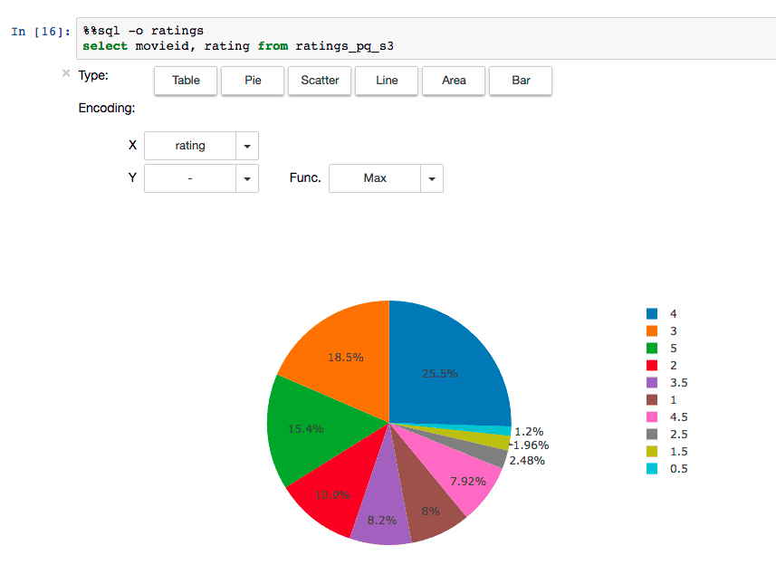

Spark Summit 2016でもトークがあったSparkのREST serverであるlivyですが、[MicrosoftがHDInsight](https://azure.microsoft.com/en-us/documentation/articles/hdinsight-apache-spark-jupyter-notebook-kernels/)上のSpark clusterとJupyterをlivyを使って繋げられるようにしたと聞いて、早速試してみました。

Jupyterって何？という方は簡単に言うと、ブラウザで各種言語のREPLが動くものと思ってもらえばいいです。 詳細は過去に書いた以下の記事を読んでみてください。

<iframe src="https://techlife.cookpad.com/embed/write-once-share-anywhare" title="現代のエンジニアのための強力なメモ帳 Jupyter notebookのすゝめ - クックパッド開発者ブログ" class="embed-card embed-blogcard" scrolling="no" frameborder="0" style="display: block; width: 100%; height: 190px; max-width: 500px; margin: 10px 0px;"></iframe><cite class="hatena-citation"><a href="https://techlife.cookpad.com/entry/write-once-share-anywhare">techlife.cookpad.com</a></cite>

# livyとは

[livy](http://livy.io/)はSpark clusterをコントロールするためのREST Serverです。 Microsoftはこれとjupyter notebookの[sparkmagic](https://github.com/jupyter-incubator/sparkmagic)を使ってHDInsightとjupyterをつなげるようにしているそうです。

MSの取り組みはSpark Summit 2016のトークがわかりやすいです。[Livy: A REST Web Service For Apache Spark | Schedule | Spark Summit 2016](https://spark-summit.org/2016/events/livy-a-rest-web-service-for-apache-spark/)

このsparkmagicの構成図がわかりやすいですね。

[https://github.com/jupyter-incubator/sparkmagic/raw/master/screenshots/diagram.png](https://github.com/jupyter-incubator/sparkmagic/raw/master/screenshots/diagram.png)

## なぜlivyがいるのか？

Sparkは通常gatewayにつないで処理をするが、ユーザー管理は通常のHadoopと同じ形になります。つまり、localにsparkユーザーみたいなのが必要とかになってちょっと面倒。 とはいえ、jupyter server立ててそこのユーザーと同期するというのも面倒くさい。 livyを使えばREST server経由でSparkの処理を行うことが可能になります。

[livyのサイトで言われている利点](http://livy.io/overview.html)としては以下のとおりです。

- 複数のSpark job、複数のクライアントから使える長時間動くSparkContextを持てる
- cacheしたRDDやDataFramesを複数のジョブやクライアントで共有できる
- 複数のSparkContextを同時に管理でき、YARN/Mesosで動くクラスターがLivy Serverの代わりにfault toleranceとconcurrencyを実現する
- Jobはprecompileされたjarやコードスニペット、Java/Scala client API経由でsubmitされる
- Apache Licenseで100% オープンソース

それだけだと僕にはあまり嬉しさがわかりにくかったのですが、手元で管理したJupyterと繋げられるようになるというのが個人的には最大のヒットでした。 Jupyterは[cookpadのblogにも書きましたが](https://techlife.cookpad.com/entry/write-once-share-anywhare)、データエンジニアリングや機械学習系の取り組みをメモして共有するのにはとても便利なので、クラスターのSparkがあたかもlocalにあるように操作できるのはとてもありがたいですね。

# 予め用意するもの

- Hadoopクラスター
  - 今回は[Cloudera Director 2.1](http://www.cloudera.com/downloads/director/2-1-0.html)で作ったCDH 5.7を使った。お手軽にSparkクラスターを用意出来て便利
  - Cent OS 7で用意
  - git, mavenを入れておく
- jupyter環境

# 準備

重要なレポジトリは以下の2つ。

- [cloudera/livy: Livy is an open source REST interface for interacting with Apache Spark from anywhere](https://github.com/cloudera/livy)
- [jupyter-incubator/sparkmagic: Jupyter magics and kernels for working with remote Spark clusters](https://github.com/jupyter-incubator/sparkmagic)

まずはlivyからいれていきます。

## Rをインストールする

requirementsに書かれているので一応用意しました。

    $ sudo yum install -y epel-release $ sudo yum install -y R

## livyをbuildする

    $ git clone git@github.com:cloudera/livy.git $ cd livy $ mvn -Dspark.version=1.6.0 -DskipTests clean package

今回試した時はtestがこけたので、`-DskipTests`をつけました

## livyを起動する

今回はCloudera Manager経由でsparkを入れたので、環境変数をこんな感じでセットします。

    $ export SPARK\_HOME=/opt/cloudera/parcels/CDH-5.7.1-1.cdh5.7.1.p0.11/lib/spark $ export HADOOP\_CONF\_DIR=/etc/hadoop/conf

livy.confに以下の1行を追加しないとYARN modeで起動しない

    livy.server.session.factory = yarn

ここまでできたら、livy serverを起動します

    $ ./bin/livy-server

別のterminalで動作確認をする

    $ curl localhost:8998/sessions{"from":0,"total":0,"sessions":[]}

デフォルトで8998番のportが使われるので、必要に応じてportを開けるなりsshでport forwardingしてください。

## jupyter側のsparkmagicの準備

[sparkmagic](https://github.com/jupyter-incubator/sparkmagic)にあるとおりにinstallします。

    $ pip install sparkmagic $ jupyter nbextension enable --py --sys-prefix widgetsnbextension 

wrapper kernelを入れます。`pip show sparkmagic`のLocation以下で実行します。以下の場合だと `/Users/ariga/.virtualenvs/ibis/lib/python3.5/site-packages` になります。

    $ pip show sparkmagic --- Metadata-Version: 2.0 Name: sparkmagic Version: 0.2.3 Summary: SparkMagic: Spark execution via Livy Home-page: https://github.com/jupyter-incubator/sparkmagic/sparkmagic Author: Jupyter Development Team Author-email: jupyter@googlegroups.org Installer: pip License: BSD 3-clause Location: /Users/ariga/.virtualenvs/ibis/lib/python3.5/site-packages Requires: ipywidgets, pandas, ipython, requests, mock, autovizwidget, numpy, nose, ipykernel, notebook, hdijupyterutils Classifiers: Development Status :: 4 - Beta Environment :: Console Intended Audience :: Science/Research License :: OSI Approved :: BSD License Natural Language :: English Programming Language :: Python :: 2.6 Programming Language :: Python :: 2.7 Programming Language :: Python :: 3.3 Programming Language :: Python :: 3.4 $ cd /Users/ariga/.virtualenvs/ibis/lib/python3.5/site-packages $ jupyter-kernelspec install sparkmagic/kernels/sparkkernel $ jupyter-kernelspec install sparkmagic/kernels/pysparkkernel

`~/.sparkmagic/config.json`を[example](https://github.com/jupyter-incubator/sparkmagic/blob/master/sparkmagic/example_config.json)をもとに入れます。

## jupyter notebookの起動

起動する前に、curlでlocalからlivyに通信できるか確認しましょう。

    $ curl YOUR\_HOSTNAME:8998/sessions

`jupyter notebook`でいつもどおり起動をして`PySpark`を選べばOK

notebookの例はこちら

<cite class="hatena-citation"><a href="https://gist.github.com/chezou/88568ce2bb620107cfdbdd20f0c966ae">gist.github.com</a></cite>

gistには出てませんが、こんな感じでSparkに対してSQLで処理した結果を簡単にvisualiseできます。sparkmagicすごい！

`%%local`でlocalのcontextに行ったりするのがまだなれないですが、magic commandの `%%sql`で実行した結果をDataFrameで受け取れたりと、いろいろ便利そうです。

## 参考URL

- [Livy, an Open Source REST Service for Apache Spark](http://livy.io/)
- [cloudera/livy: Livy is an open source REST interface for interacting with Apache Spark from anywhere](https://github.com/cloudera/livy)
- [jupyter-incubator/sparkmagic: Jupyter magics and kernels for working with remote Spark clusters](https://github.com/jupyter-incubator/sparkmagic)
- [How to use the Livy Spark REST Job Server API for doing some interactive Spark with curl | Hue - Hadoop User Experience - The Apache Hadoop UI](http://gethue.com/how-to-use-the-livy-spark-rest-job-server-for-interactive-spark-2-2/)