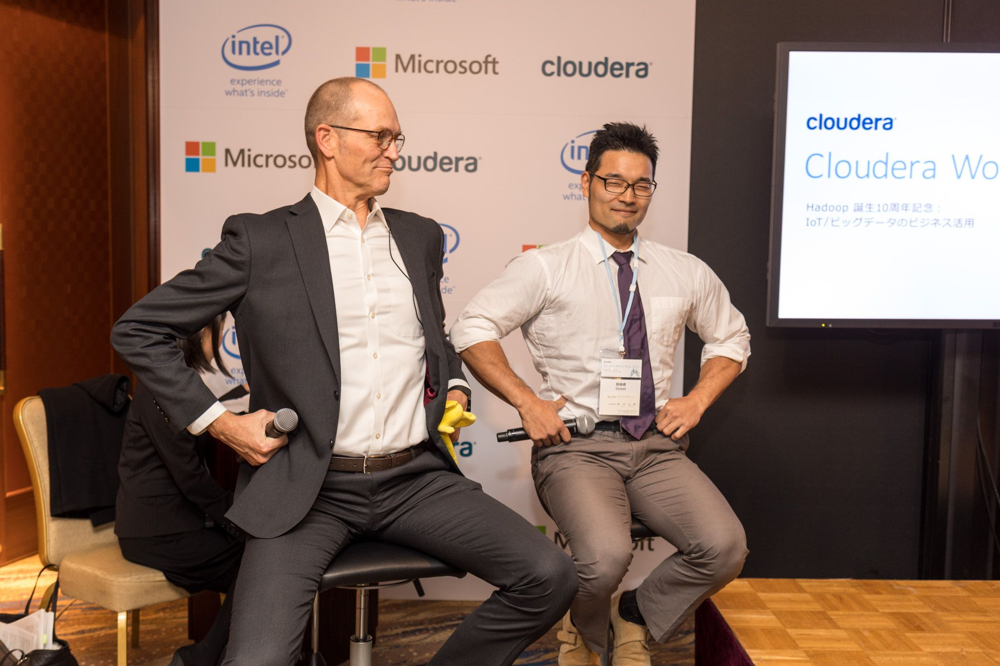

---
authors:
- aki
categories: null
date: '2016-11-14 15:05:21-08:00'
draft: false
featured: false
image:
  caption: ''
  focal_point: ''
  preview_only: false
keywords:
- cwt
- データ
- cloud
- '2016'
- native
- データサイエンス
- cloudera
- 機械学習
- hadoop
- データ分析
lastmod: '2016-11-14 15:05:21-08:00'
projects: []
recommendations:
- /post/2016-05-05-detawo-ge-suo-niji-merukotodedetahuo-yong-nomin-zhu-hua-gajin-ndahua/
- /post/2016-03-30-zhuan-zhi-simasita/
- /post/2015-12-21-machine-learning-casual-talks-number-4-wokai-cui-simasita-number-mlct/
subtitle: ''
summary: ''
tags: []
title: 'Cloudera World Tokyo 2016で機械学習プロダクトの作り方を話しました #cwt2016'
---

さる11/8に、自社の主催する[Cloudera World Tokyo 2016](http://www.clouderaworldtokyo.com/)で、機械学習プロダクトの作り方について話をしました。

図: Hadoopの生みの親 Doug ([@cutting](https://twitter.com/cutting))と握力王新沼さん ([@hiroki_niinuma](https://twitter.com/hiroki_niinuma)) の対談イベントの様子

<iframe src="https://www.slideshare.net/slideshow/embed_code/key/B8ylsXGU1Awlts" width="427" height="356" frameborder="0" marginwidth="0"; marginheight="0" scrolling="n" style="border:1px solid #CCC; border-width:1px; margin-bottom:5px; max-width: 100%;" allowfullscreen> </iframe>

  **[大規模データに対するデータサイエンスの進め方 #CWT2016](https://www.slideshare.net/Cloudera_jp/data-science-toward-big-data-cwt2016 "大規模データに対するデータサイエンスの進め方 #CWT2016")** from **[Cloudera Japan](http://www.slideshare.net/Cloudera_jp)** 
<cite class="hatena-citation"><a href="http://www.slideshare.net/Cloudera_jp/data-science-toward-big-data-cwt2016">www.slideshare.net</a></cite>

データの民主化の話、データサイエンティストとデータエンジニアの役割分担とチーム構成、機械学習の業務フロー、Cloud Nativeなデータサイエンスといった盛りだくさんの話をしました[^1] 。

話の中で特に言いたかったことは2つ、P.16のリスクを取ってくれる責任者を捕まえようという話と、P.29の機械学習込みのプロダクトは改善をし続けないと死ぬという話です。 あとは、できるだけ機械学習をしないで、サンクコストが生まれる開始前に撤退ラインを決めておこうということも言いました。

個人的には、今回 Cloudera のエンジニアリングチームと共に[プロダクトの品質を測定](http://www.clouderaworldtokyo.com/session-download/B2-Measuring%20Software%20Quality-%20v2.pdf)しているJuliet([@j\_houg](https://twitter.com/j_houg))の話や、[@tokoroten](https://twitter.com/tokoroten)さんの話も、自分からお願いをしたのですがお互い相補的な話でとても良かったと思います。

<iframe src="https://www.slideshare.net/slideshow/embed_code/key/ypsEOVchFn6g4u" width="427" height="356" frameborder="0" marginwidth="0" marginheight="0" scrolling="no" style="border:1px solid #CCC; border-width:1px; margin-bottom:5px; max-width: 100%;" allowfullscreen> </iframe>

  **[データ分析グループの組織編制とその課題 マーケティングにおけるKPI設計の失敗例 ABテストの活用と、機械学習の導入 #CWT2016](https://www.slideshare.net/TokorotenNakayama/kpi-ab-cwt2016 "データ分析グループの組織編制とその課題 マーケティングにおけるKPI設計の失敗例 ABテストの活用と、機械学習の導入 #CWT2016")** from **[Shinta Nakayama](http://www.slideshare.net/TokorotenNakayama)** 
<cite class="hatena-citation"><a href="http://www.slideshare.net/TokorotenNakayama/kpi-ab-cwt2016">www.slideshare.net</a></cite>

特にtokorotenさんの話は、データ分析チームのアンチパターンが並んでいます。どれも耳が痛い話です。また、A/Bテストから機械学習にアップリフトモデリングを通じてどうつなげていくかという話もとても面白いです。

3人の話を総合すると、データサイエンティストとデータエンジニアという区分では、こういった人たちが求められているのかなと思っています。

- ビジネスの意思決定をデータから支援する人
- プロダクトの改善を予測モデル含めてデータドリブンで行う人
- データ基盤を作るデータエンジニア

### Cloud Native な話

Cloud Nativeのデータサイエンスの話は、時間の関係でちょっと話足りなかったのですが、同僚の[@tsuyokb](https://twitter.com/tsuyokb)の話を見ていただけると良いと思います。

<iframe src="https://www.slideshare.net/slideshow/embed_code/key/cnkUJMqWQx34c2" width="427" height="356" frameborder="0" marginwidth="0" marginheight="0" scrolling="no" style="border:1px solid #CCC; border-width:1px; margin-bottom:5px; max-width: 100%;" allowfullscreen> </iframe>

  **[Cloud Native Hadoop #cwt2016](https://www.slideshare.net/Cloudera_jp/cloud-native-hadoop "Cloud Native Hadoop #cwt2016")** from **[Cloudera Japan](http://www.slideshare.net/Cloudera_jp)** 
<cite class="hatena-citation"><a href="http://www.slideshare.net/Cloudera_jp/cloud-native-hadoop">www.slideshare.net</a></cite>

機械学習やデータ分析の文脈で言うと、今までImpalaとかHive on SparkとかはHadoopクラスタを持っている人の持ち物というイメージしかなかったんですが、昨今S3を始めとしたオブジェクトストレージに置かれたデータを直接処理できるようになったのが大きな変化だと思っています。

特に、HiveやImpalaのテーブルさえ作っておけば、S3に直接SQLを投げられるようになったというのは大きな変化かなと思います。[Cloudera Director](http://www.cloudera.com/downloads/director/2-2-0.html)を使うと、一時的なクラスタを上げ下げ増減が簡単にできて、永続化層をS3にするだけという感じになります。 そうすることで、必要なときに必要な量のクラスタを立ち上げて対話的に分析をし、ワークロード決まったらバッチ用に組み替える、なんてことも容易になってきます。

少しずつではありますが、RedshiftやBigQueryに対する第3の選択肢になってくることを期待しています。

[^1]: 思い返してみると、この手のあるある...辛い...って話MLCTでよくやっていたのであった