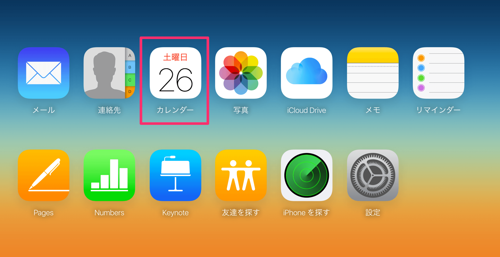
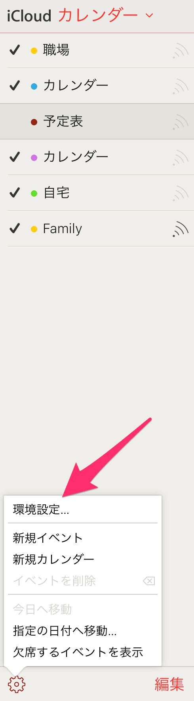
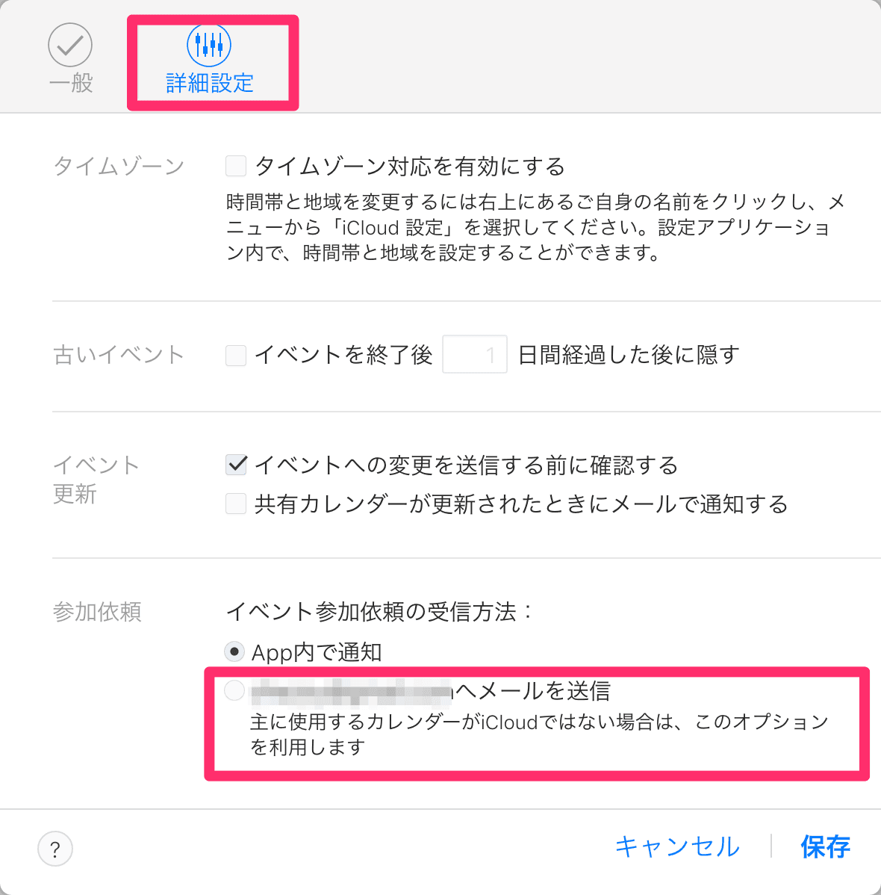
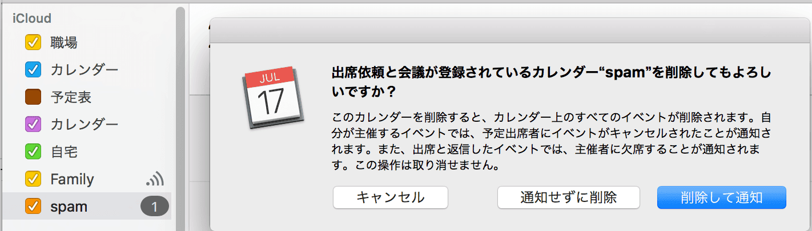

最近、めちゃくちゃicloudのカレンダーにレイバンのスパムが来るようになってうざいので、通知されないように回避するためのicloudの設定方法を書いておく。

# 1. PCのブラウザでiCloud.com へ行きカレンダーを開く

# 2. 左下の歯車から環境設定を開く

# 3. 「詳細設定」の「イベント参加依頼の受信方法」の設定を「xxxx@yyyy.comへメールを送信」にする

この設定にすると、設定したメールアドレスに通知が来るのでメールを削除するだけになる。

# 補足

追加された予定を通知しないように削除するには、icloudに新規カレンダーを追加してそちらに移動してから、カレンダーごと削除すると招待した輩に通知をすることなく消せる

## 参考サイト

[Many iCloud users receiving spam Calendar &amp; Photo Sharing invitations, here’s how to fix](https://9to5mac.com/2016/11/09/icloud-photo-sharing-and-calendar-spam)
[Preventing Spam iCloud Calendar Invites](https://astralbodi.es/2016/11/25/preventing-spam-icloud-calendar-invites/)
[iPhone、MacのiCloudカレンダーに大量のスパム招待が来たときの対処法 - だがそれがいい](http://www.dagasorega-e.net/entry/iphone-mac-spam-calender">www.dagasorega-e.net)