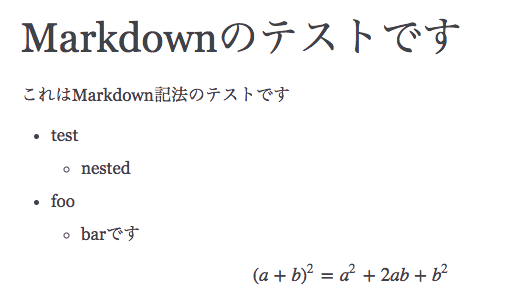

Sphinxでmarkdown拡張を扱うためのrecommonmarkというライブラリがあります。 これを使うとreSTではなく、markdownを書いてhtmlやPDFが吐けるようになります。

詳細は以下のエントリにやり方がまとまっています。

<iframe src="https://sky-y.hatenablog.jp/embed/2015/12/02/023732" title="MarkdownでSphinxできるようになったので試してみた（後編） - 意識の高いLISPマシン" class="embed-card embed-blogcard" scrolling="no" frameborder="0" style="display: block; width: 100%; height: 190px; max-width: 500px; margin: 10px 0px;"></iframe><cite class="hatena-citation"><a href="https://sky-y.hatenablog.jp/entry/2015/12/02/023732">tech.3rd-p-zombie.net</a></cite>

実は、このrecommonmarkはconfigに設定を書くだけで、数式をmarkdownの中に埋め込めるのでした。

conf.pyの上の方に以下をimportし、

```py
import recommonmark from recommonmark.parser
import CommonMarkParser from recommonmark.transform
import AutoStructify
```

`source_suffix`の修正、`source_parsers`の追加

```py
source_suffix = [".rst", ".md"]
#source_suffix = ".rst"
source_parsers = { ".md" : "recommonmark.parser.CommonMarkParser" }
```

最後尾に以下を追加します。

```py
def setup(app):
    app.add_config_value(
        "recommonmark_config",
        { "enable_math": True, "enable_inline_math": True, },
        True)
    app.add_transform(AutoStructify)
```

すると、

$$
(a + b)^2 = a^2 + 2ab + b^2
$$

とかくと、以下の数式の部分のようになります。([document](http://recommonmark.readthedocs.io/en/latest/auto_structify.html?highlight=language#math-formula))



また、inlineの数式も以下のように書けます。 ([document](http://recommonmark.readthedocs.io/en/latest/auto_structify.html?highlight=language#inline-math))

```rst
This formula `$ y=\sum_{i=1}^n g(x_i) $`
```

ただ、残念ながら式番号を出す方法はわかりませんでした。

[追記]



conf.pyに`math_number_all = True`を足せば数式がでました。ですが、参照はできないと思うので参照が必要な場合はreSTで書く必要があると思います。



[/追記]

```sh
$ make latexpdfja
```

とすれば、PDFが、

```sh
$ make html
```

とすればhtmlが生成されます。

さくっと書くときにはmarkdownで行けるのはありがたいですね。

Sphinxとlatex環境を用意するのが面倒な人向けに、docker imageも作りましたので活用してみてください。

[https://hub.docker.com/r/chezou/sphinx-recommonmark/](https://hub.docker.com/r/chezou/sphinx-recommonmark/)

### 参考

- [MoreCat Web](http://morec.at/blog/2015/02/24/sphinx-on-docker)
