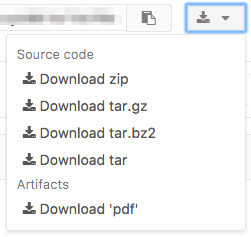

gitlab.comは自前でDocker image登録できたり、CI持っていたりと便利ですね。しかも、privateレポジトリもお金かからないという太っ腹。 技術書典2に向けたレポジトリはgitlab.comで管理しています。

今回は共著者にPython使いが多いためSphinxを使って書いているんですが、Sphinxはcommon markでも書けるのでmarkdownでも文章を書くことが出来ます。

前回の記事では、数式入りのmarkdownからPDFを生成するDocker imageを作りましたが、それを使うと簡単にGitlab-CIでPDFが生成できます。

やり方は簡単、あなたのSphinxのプロジェクトに、以下のような`.gitlab-ci.yml`を書くだけ。もちろん、必要に応じてpathsは変更してください。

    image: chezou/sphinx-recommonmark:latest pdf: script: - make latexpdfja artifacts: paths: - build/latex/techbookfest02.pdf only: - master

こうすると、masterにpushしてCIが成功する度に、PDFが生成されてダウンロードできます。

めっちゃ簡単。お試しあれ。