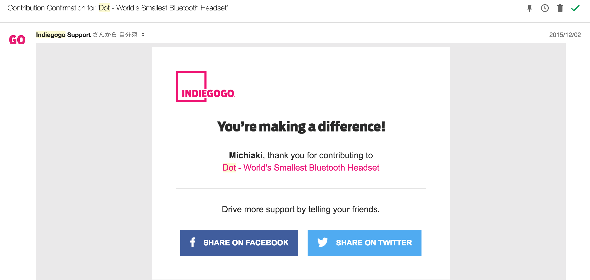

最近のbackspace.fm でdotが「来る来る詐欺」でAir podsに完全に飲み込まれたという話が出ていたので、きちんとレビューしてなかったのを思い出したのでレビューします。

dotは一言で言うと、AirPodsみたいな小さいBluetoothイヤホンです。

## はじめての Indigogo

僕がバックしたのは、miyagawaさんがdotみたいなイヤホンをinstagramか何かで買ったというのを見て、これかな？と勘違いしたからだったんですが、2015年12月にindigogoでバックしてたみたいです。ステレオで$79+$29のシッピングコストです。最初の申込みから少し遅れていたのですが、当時は2016年4月に届く予定と言っていて、結局届いたのは2016年の10月でした。

はじめてのIndigogoで学んだのは、バックしたときが欲しい気持ちの最大値になっていて、届く頃には類似品が出てきて市場が開拓されていて切ない気持ちになること。こなれたものを手に入れたいなら待っていたほうがいいのかもなーと思いました。

## dot レビュー

<iframe src="//www.instagram.com/p/BLXPs3Uhk5W/embed/" data-entry-image="http://www.instagram.com/p/BLXPs3Uhk5W/media/?size=l" class="instagram-iframe" frameborder="0" scrolling="no" allowtransparency></iframe><cite class="hatena-citation"><a href="https://www.instagram.com/p/BLXPs3Uhk5W/">www.instagram.com</a></cite>

箱はこんな感じでおしゃれ。

<iframe src="//www.instagram.com/p/BLXQDBnhbSx/embed/" data-entry-image="http://www.instagram.com/p/BLXQDBnhbSx/media/?size=l" class="instagram-iframe" frameborder="0" scrolling="no" allowtransparency></iframe><cite class="hatena-citation"><a href="https://www.instagram.com/p/BLXQDBnhbSx/?taken-by=c.hezou&amp;hl=ja">www.instagram.com</a></cite>

中身もきちんとオシャレに梱包されています。

<iframe src="//www.instagram.com/p/BLXQWDGh-oH/embed/" data-entry-image="http://www.instagram.com/p/BLXQWDGh-oH/media/?size=l" class="instagram-iframe" frameborder="0" scrolling="no" allowtransparency></iframe><cite class="hatena-citation"><a href="https://www.instagram.com/p/BLXQWDGh-oH/?taken-by=c.hezou&amp;hl=ja">www.instagram.com</a></cite>

充電器兼ケースは、イヤホンがそれぞれマグネットでひっついて充電されます。 重さもたいしてないので、ポケットの中に充電ケースを常に入れておいて、オフィスや家についたら充電するような感じにしています。

ケースの充電はケースを2つに割って真ん中にある穴にmicro USBで刺すのですが、真ん中で別れるところもマグネットでひっつくため、バラバラでどっか行ってしまうということはありません。ただ、ケースを充電しながら給電できるのは、片方だけなので注意が必要です。 また、モノラル二個としても使えるので、片方充電してもう片方は聞き続けるという使い方も可能です。 公称値で3時間持つと言っている電池ですが、backspace.fmや最近のrebuildは通しで聞けるかどうかはわかりませんが、充電器を忘れて往復2時間弱の通勤で充電しないでも再生し続けられたので、なんとかなるかもしれません。

<iframe src="//www.instagram.com/p/BLXP-8thiAr/embed/" data-entry-image="http://www.instagram.com/p/BLXP-8thiAr/media/?size=l" class="instagram-iframe" frameborder="0" scrolling="no" allowtransparency></iframe><cite class="hatena-citation"><a href="https://www.instagram.com/p/BLXP-8thiAr/?taken-by=c.hezou&amp;hl=ja">www.instagram.com</a></cite>

大きさは小さめの腕時計よりも更に小さい感じ。AnkerのIE20と比べて見ても小さいのがわかります。

Bluetoothのペアリングは、JabraよりはいいけどAnkerのIE20と同じくらいかなという印象です。めちゃくちゃ安定はしてなくて、街なかでちょこちょこ切れる感じだけど、我慢できる範囲です。最近のiOSのアップグレードで接続は安定してきましたが、一度ペアリングが切れかけると片方ずつ接続が復帰するので同期するまでに少し時間がかかります。[^1]

音については、個人的にはIE20の方がクリアで好きかなという印象です。個人的には、こもった感じがしてそんなにいい音だとは思いませんでした。遮音性に関してはIE20よりもよく、うっかりすると周りの音を聞き逃す感じです。

操作は、最初に同時に長押ししてペアリングをして、その後iPhoneなどとペアリングするという流れです。一度Dot同士をペアリングしてしまえば、後は気楽に使えます。 電源オンは両方のスイッチを3秒くらい長押しする感じです。タイミングずれててもいいですが、どっちが右か左かはまぁ音がでるのでそれを聞いて間違っていたら入れ替えています。 電源オフはどちらかのスイッチを3秒くらい長押しすると両方消せて、1秒長押しするとSiriが起動する感じなのは今時の感じですね。 マイクの拾いはそんなに良くないかな、と思うので、あまりメインで使うのには向いていないのかもしれません。

軽くて小型なので、カジュアルに持ち運びができてポケットにとりあえず突っ込んでおくという運用ができるので気に入っています。

今となってはAirPodsが安定していると評判なので、そちらのほうが良いかもしれませんが、$100で手に入ったということではいい買い物をしたな、と思っています。

[^1]: 前のiOSのときはブチブチ切れていて本当に辛かったけど、最近は良い
