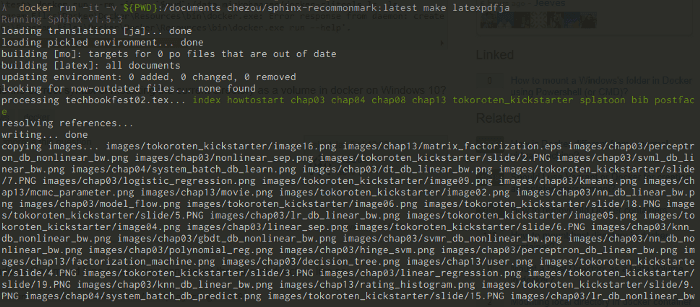

---
aliases:
- /post/2017-07-08_mbp-thinkpad-x1-carbon-2017-46c374167b79/
authors:
- aki
categories: []
date: '2017-07-07 20:14:24-07:00'
description: joker1007さんも煽っていることもあり、MacBook Pro Retina(2015) 15インチが重すぎてしんどいので、Thinkpad
  X1…
keywords:
- macbook
- ime
- alt
- pip
- デュアルブート
- 辞書
- install
- キーボード
- windows
- '36'
recommendations:
- /post/2017-07-10_thinkpad-x1-carbon--2017--windows-10-ubuntu-17-04-----------9f73d89073c3/
- /post/2019-03-10_business-trip-goods/
- /post/2018-12-01_windows-64bit-mecab--kytea-------2018-b283b6c7b33c/
title: MBPからThinkpad X1 Carbon(2017)に移行した
---

joker1007さんも[煽っている](http://d.hatena.ne.jp/joker1007/20170202/1486056211)こともあり、MacBook Pro Retina(2015) 15インチが重すぎてしんどいので、[Thinkpad X1 Carbon(2017)](http://www3.lenovo.com/jp/ja/notebooks/thinkpad/x-series/X1-Carbon-5th-Generation/p/22TP2TXX15G)を買いました。2.04kgから1.13kgへと大幅軽量化しました。外での打ち合わせや出張も結構増えてきて、Macは電源も含めると辛い重さになるので思いきって買いました。背中と腰が死にそうなので軽さは正義です。([msfmさん](https://twitter.com/msfm)色々ご相談に乗っていただきありがとうございました！）

選定のポイントは

*   1.3kg以下
*   英語キーボード
*   メモリ16GB
*   15万円くらいまで

という条件で選んだのですが、最後まで残ったのはDell XPS13とX1 Carbonだけでした。最初は値段の安さと軽さに惹かれてZenbook 3をメインに機能と値段の比較表を書いていたんですが、途中で店頭でキーボード触ってみて、日本語キーボードだとホームポジションのままでエンターを打てない体になっていることに気づいたため、急遽USキーボードの条件を追加しました。最終的には、i7/512GB SSD(NVMe)/16GB RAMとモリモリになったため、17万くらいにはなったのですが、同じ構成をmacで組もうとしても20万は軽く超えるし重いので(macbookは軽いけどAirより遅いらしいし、MBP 13インチも1.37kgで26万で2コアi7だし)、良い選択をしたと思っています。_\[追記\]ちなみに、1.3kg以下のマシンになると4コアは無理で、どちらかというとCore mとかYシリーズをどうしたら避けられるかという戦いになります。なので、はなから4コアは捨てています。\[/追記\]_

### 合わせて買ったもの

[**TechRise金メッキ高速1080P HDMI オス to VGAメスビデオ変換アダプタケーブル オーディオとマイクロUSBケーブル付き**  
_HDMIポートを通じてNoteBook、Macbook、Chromebook、Raspberry Pi等機器をプロジェクター、ディスプレイ、LCD、テレビ、モニタなど機器のVGA端子につなぎ、高画質映像、大画面視聴をお楽しみいただけます…_amzn.to](http://amzn.to/2u32bdx "http://amzn.to/2u32bdx")

HDMIはついているので、プレゼン用にVGA変換コネクタを買いました。問題なく動いています。

[**Plugable USB 3.1 Type C （USB-C） - DisplayPort 変換ケーブル - 1.8m、MacBook 12" Retina 2015/2016、MacBook…**  
_オンライン通販のAmazon公式サイトなら、Plugable USB 3.1 Type C （USB-C） - DisplayPort 変換ケーブル - 1.8m、MacBook 12" Retina 2015/2016、MacBook…_amzn.to](http://amzn.to/2sY2LUT "http://amzn.to/2sY2LUT")

職場のモニターがDisplayPortじゃないと最大解像度が出なかったので買いました。自宅のフィリップスの4kモニタはHDMIで4k出ています。

[**サンワサプライ 電源コード(2P・L型コネクタ) 0.2m KB-DM2L-02**  
_サンワサプライ 電源コード(2P・L型コネクタ) 0.2m KB-DM2L-02がパソコン・周辺機器ストアでいつでもお買い得。当日お急ぎ便対象商品は、当日お届け可能です。アマゾン配送商品は、通常配送無料（一部除く）。_amzn.to](http://amzn.to/2tswiJY "http://amzn.to/2tswiJY")

付属のケーブルが長いため、短くするために購入しました。

[**Nintendo Switch ACアダプター**  
_オンライン通販のAmazon公式サイトなら、Nintendo Switch ACアダプターを ゲームストアで、いつでもお安く。当日お急ぎ便対象商品は、当日お届け可能です。アマゾン配送商品は、通常送料無料。_amzn.to](http://amzn.to/2uBTMuQ "http://amzn.to/2uBTMuQ")

なお、モバイル用のACアダプタとしてSwitchの充電器を買ったのですが、W数が足りなくスリープ時にしか充電しませんでした。

### macOSからWindows 10/Ubuntuデュアルブートへ

512GBのSSD積んでいるのでWindows 10とUbuntuのデュアルブートにしています。会社の業務でOfficeとWebexへ依存しており、両方共Linuxでは厳しいということもあり、デュアルブートにしています。とはいえ、VMでもいいじゃないのという話もあるのでおいおい構成は見ていきたいと思っています。社内のエンジニアでLinuxメインでGoogle SlideとWebex on VMの人もいるみたいですが、様子見中です。

Ubuntuのデュアルブートはちょこっとハマりどころはあったのですが、また別途詳細を書こうと思います。

_\[追記\]書きました_ [https://chezo.uno/post/2017-07-10_thinkpad-x1-carbon-2017-windows-10-ubuntu-17-04-9f73d89073c3/]()_\[/追記\]_

### Windowsの開発環境周りの設定

基本的にはymotongpooさんのまとまった記事を参考にしました。

<iframe src="https://hatenablog-parts.com/embed?url=https%3A%2F%2Fymotongpoo.hatenablog.com%2Fentry%2F2017%2F01%2F05%2F101233" style="top: 0; left: 0; width: 100%; height: 100%; position: absolute; border: 0;" allowfullscreen scrolling="no"></iframe>

Powershellをベースに、以下のものをいれました。

*   [Cmder](http://cmder.net/)
*   [chocolatey](https://chocolatey.org/)
*   [posh-git](https://github.com/dahlbyk/posh-git)
*   [Git Credential manager for Windows](https://github.com/Microsoft/Git-Credential-Manager-for-Windows)
*   Python 3

Cmderの代わりにbabunも試しましたが、chocolateyでemacsもpython3も入らずに諦めまいした。

choco install poshgit  
choco isntall python3

#### Cmderのフォント

特にこだわりはなかったので、RictyDiminishedを使いました。

#### Python 3とjupyter環境の導入

chocolateyでpython3を入れれば、 `python` で起動します。簡単ですね。

でも、numpyやscipy、pandasやjupyterはAnaconda使わないと簡単に入らないんじゃないの？と思う方もいると思いますが、Python 3ではwheel形式のバイナリでインストールすれば詰まることなく入れることができます。

今回は、下記のブログを参考に導入を勧めていきました。

<iframe src="https://hatenablog-parts.com/embed?url=https%3A%2F%2Frinor.hatenablog.com%2Fentry%2F2015%2F07%2F11%2F105210" style="top: 0; left: 0; width: 100%; height: 100%; position: absolute; border: 0;" allowfullscreen scrolling="no"></iframe>

といっても、厄介なのは様々な事情でscipyが `pip install scipy` では入らないので、[こちら](http://www.lfd.uci.edu/~gohlke/pythonlibs/)からWindows用のwhlをダウンロードしてきて、pipで入れます。ついでに、numpyもmkl最適化されたものを入れます。（なお、良い子はvenv使って仮想環境activateしてから使いましょう）

pip install --upgrade pip  
pip install numpy‑1.13.1+mkl‑cp36‑cp36m‑win\_amd64.whl  
pip install scipy‑0.19.1‑cp36‑cp36m‑win\_amd64.whl  
pip install jupyter notebook

これで、いつもどおりjupyterを起動できます。

jupyter notebook



#### irubyのインストール

chocolateyからRubyをインストールしたんですが、MSYSへの依存があるからダメだ！みたいなことを怒られたので、Ruby InstallerからRubyを入れ直しました。

後は以下の方法を使いiRubyを入れました。

が、後から調べてみると、[ZeroMQも手動で入れる必要はないという話](http://qiita.com/kozo2/items/4bfbc9524b302b06710b)もあるみたいです。まぁ、今回はいいか。

#### Sphinxでの執筆環境

以前blogにも書いたとおり、Dockerベースでやっています。

注意しないといけないのが、current directoryの指定のしかたが、 `$(pwd)` から `${PWD}` にPowerShellだと変わることくらいです。

docker run -it -v ${PWD}:/documents chezou/sphinx-recommonmark:latest make latexpdfja

なお、エディターはVisual Studio Codeを使っています。

#### Emacsライクなキーバインドの設定

しばらくmacを使っていたので、ctrl+f/b/p/n/a/eなどで移動がしないとテキストを書くときの生産性が下がってしまいます。ここは、keyhacとfakeymacsを使って、対応しました。

ただ、そこまでEmacsの制約強い環境が必要というわけでもないゆるふわなので、結構fakeymacsよりはゆるくしています。config.pyは[こちら](https://gist.github.com/chezou/b8a45f57c3ec08e0d232dbf7d9a23bee)です。

Ctrl-Capsはお好みの方法で入れ替えてください。僕は普通にレジストリで入れ替えてしまいました。

#### 右AltでIME on、左AltでIME off

macのときもUSキーボードで右cmdでIME on、左cmdでIME offにしていたのですが、これはalt-ime-ahkを使っています。（人間はIMEの状態を覚えたくない）

本当はkeyhac一つでやろうと思ったんですが、alt空打ちの設定をすると、他のAltと同時押し全パターンを記述しないといけない臭いがしたので諦めました。

#### 日英/英日/英英辞書/シソーラス

ここが完全に鬼門で、macOSの辞書.appはチートであることを改めて思い知らされています。仕事柄英語の読み書きは非常に多いのですが、良い解が見つかっていません。昨今、英辞郎の辞書も暗号化がかかったみたいで、串刺し検索できる質の良い辞書がない感じです。

今は、アプリとしては[Lingoes](http://lingoes.net/)を使いつつ、[Dictionary](https://www.microsoft.com/en-us/store/p/dictionary/9wzdncrfj1z0)を併用しています。

また、DMM英会話用にはChrome Extensionで以下の2つを使っています。Google Dictionaryの方は日本語を出すことで、ダブルクリックで選択すると英日と英英が同時に出ます。記事を読みながらの辞書引きには良いです。

[**English dictionary translate pronunciation**  
_Best free online chrome app english dictionaries for translation selected word pronunciation loud language pronounce…_chrome.google.com](https://chrome.google.com/webstore/detail/english-dictionary-transl/neomigpibafpboiknmijddgnncengfnm "https://chrome.google.com/webstore/detail/english-dictionary-transl/neomigpibafpboiknmijddgnncengfnm")

なお、英文を書くときには文法をチェックしてくれるGrammarlyにもお世話になっています。Grammarlyは同僚のスコットランド人も使っていると聞いて有料会員になっていますが、海外のカンファレンスのproposalを書くときも、Businessの固めのチェックモードに切り替えることで対応ができて良いです。

#### メモアプリ

macOSではQuiverを使っていたんですが、Quiverはmacでしか使えないので、Google Keepを試してみています。最終的に、ConfluenceのWikiにコピペするのが辛いのですが、Windows/Linuxまたいだメモはなかなか良いのがないので悩み中です。

### Apple Wireless Keyboard/Trackpadはどうしたか

結論から言うと使わないことにしました。キーボードは[有償のソフト](http://www.trinityworks.co.jp/downloads/)を買えば行けるのですが、これを買うのにもう少し足すとThinkpadのキーボードが買えるため、そっちに合わせることにしました。特に、Chromeのタブ移動がCtrl+page up/downなので、fn押しながら矢印がきつくなったのが主因です。

トラックパッドも頑張って有償のソフト入れてもスクロールと右クリックができるようになるだけなので、ちょっと辛いなと思って切ることにしました。

### まとめ

マシンが軽量になり、性能は高くなり、総じて満足しています。Windowsも昔に比べると、そこまで問題を感じないですし、だめならLinuxメインで行けばいいかなと思っています。

Ubuntu周りの話はまた別の機会があれば書こうと思います。