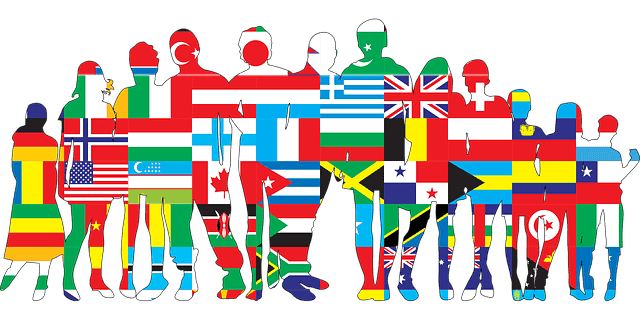

同僚の [Daisuke Kobayashi](https://medium.com/u/aad6cf2e3329) から勧められて、エリン・メイヤーの「異文化理解力」を読んだ。グローバル企業で働く人間として非常に示唆に富んだ良い本だった。

[**異文化理解力 ― 相手と自分の真意がわかる ビジネスパーソン必須の教養**  
_Amazonでエリン・メイヤー, 田岡恵, 樋口武志の{ProductTitle}。アマゾンならポイント還元本が多数。一度購入いただいた電子書籍は、KindleおよびFire端末、スマートフォンやタブレットなど、様々な端末でもお楽しみい…_amzn.to](http://amzn.to/2hdMNpj "http://amzn.to/2hdMNpj")

よく「日本は」「海外は」という議論が巻き起こることがあるが、これはそもそもナンセンスだなとぼんやりと思っていたことを明確にしてくれた。それは、文化は国によって相対的なのだ、ということである。

無論、こう書くと「自分は日本人の中でも特殊だ」とかいう国の中での分散はもちろんあるのだが、それが当たり前と生まれ育ってきたものは何が特殊なのかは相対化しないと認識できない。本書の中では、「[デンマークの赤ちゃんは氷点下でも外で昼寝をさせる](http://www.excite.co.jp/News/bit/E1344938120839.html)」ということに対して、デンマーク人は特に違和感なく話しているという例が出ている。

これは、ただ国ごとにステレオタイプを列挙しているというよりのではなく、メイヤーは多くの国のビジネスをするマネージャーなどに対して調査をした。その結果、以下の8つの指標について、国ごとに相対的に比較をすることで、カルチャーマップというものを記述している。

1.  コミュニケーションは「ローコンテクスト」？「ハイコンテクスト」？
2.  評価の際のネガティブ・フィードバックは「直接的」？「間接的」？
3.  説得方法は「原理優先」？「応用優先」？
4.  リーダーシップは「平等主義」？「階層主義」？
5.  決断のステップは「合意志向」？「トップダウン式」？
6.  信頼はの構築は「タスクベース」？「関係ベース」？
7.  見解の相違の解消は「対立型」？「対立回避型」？
8.  スケジューリングは「直線的な時間」？「柔軟な時間」？

具体的には、下記の記事にフランス、ドイツ、中国、日本でのカルチャーマップの例があるので見てみると良いだろう。（なお、記事のグラフでは点で記述されているが、実際には正規分布のような分散の平均が点で結ばれていると思ってほしい、と書籍には書いてある）

[**日本人に必要な「異文化理解力」という教養**  
_「照れ屋で発言しない」「時間を厳守する」。日本人は海外で、このように評されることが多い。しかし、こうしたステレオタイプと、文化の違いを理解することが、国際社会で成功する鍵となる。グローバル社会で働くビジネスパーソンには、「異文化理解力」…_forbesjapan.com](https://forbesjapan.com/articles/detail/16796/1/1/1 "https://forbesjapan.com/articles/detail/16796/1/1/1")

この中の例では、同じアジアでも中国と日本は決断に関しては中国がトップダウン式で、日本は合意志向といったように、国ごとに大きな違いがある。反対に、ドイツと日本では時間が直線的に流れている（きっちりと時間を守るのが当たり前という認識で良い）が、中国はかっちりとスケジューリングをするのではなく変化に柔軟に対応する文化である。

つまり、我々がざっくり「アジア人だから」と言っても、その国によって相対的な文化差があり、それを踏まえた上で考えなければならないし、同じように「欧米」とくくるのも危険だということである。（オランダ人とアメリカ人のネガティブ・フィードバックの違いのエピソードは非常に印象深かったので、読んでみると良いと思う）

個人的には、この本を読むことで、オランダみたいなヨーロッパの人でもアメリカ人の褒めまくるのは胡散臭いと思っているということを知れたし、「ああ、だからアメリカ人は褒めまくるのか。アメリカ人のメールの文頭の”awesome!”は日本の『お疲れ様です』くらいでちょうどいいな」という知見を得られた。

シリコンバレーベースのグローバル企業で働いていると、会社にもよると思うがなんだかんだでアメリカの色が強くて、”diversity”というのも彼らが考える枠の中なのだなぁということを認識することがある中で、こうした本を読むことで、日本人としての自分の立ち位置を再認識し、どう振る舞うかを考え直す良いきっかけとなった。
