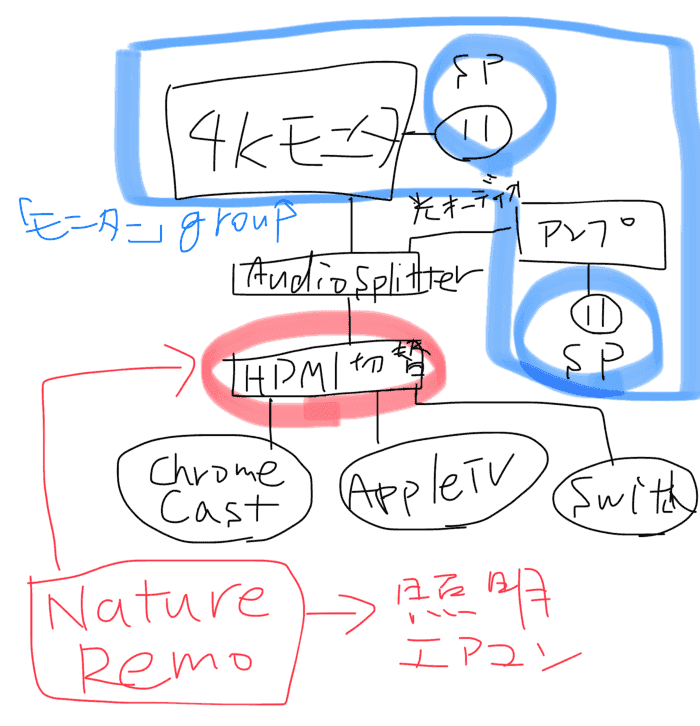

Google Homeを発売日に買ってから色々と試行錯誤をして来ましたが、だいたい構成が固まって来たので書き残しておきます。

下の図が大まかな構成です。

図中のSPはスマートプラグの略です。

もともとは、フィリップスの4kモニターの前段にHDMIオーディオ分離器とHDMI切替器を使っていました。分離した音声は、光オーディオケーブルでHDMI端子のないアンプにつながっています。

HDMI切替機には、Chromecast UltraとAppleTV、PC、Nintendo Switchなどが付いています。これをNature Remoで切り替えます。この切替はIFTTTを使い、Google AssistantとNature Remoを使い連携をするというごく普通の構成で行なっています。

[**Philips 43型ワイド液晶ディスプレイ (4K対応/IPSパネル/5年間フル保証) BDM4350UC/11**  
_Philips 43型ワイド液晶ディスプレイ (4K対応/IPSパネル/5年間フル保証)…_amzn.to](http://amzn.to/2qgMJcS "http://amzn.to/2qgMJcS")

[**Philips 43型ワイド液晶ディスプレイ (4K対応/IPSパネル/5年間フル保証) BDM4350UC/11**  
_Philips 43型ワイド液晶ディスプレイ (4K対応/IPSパネル/5年間フル保証)…_amzn.to](http://amzn.to/2qgMJcS "http://amzn.to/2qgMJcS")

厄介なのがPhilipsのモニターです。このモニターはリモコンでは操作が出来ず、入力信号がオフになればスリープにはなりますが、電源は裏側のハードスイッチによるオンオフのため、切替器や音声分離器で電源を制御していました。ですが、4k60Hz対応（HDCP2.2も対応）のものに切り替えたタイミングでスリープが出来ないという状況になりました。切替器は以下のものを、分離器は別の似たような製品を使っています。

[**ラトック 4K60Hz対応 5入力1出力 HDMIセレクター（RP-HDSW51-4K）**  
_■■■■■ 特徴 ■■■■■ ■5台のHDMI機器を切り替えてテレビに出力 本製品は、5入力1出力を搭載したHDMIセレクターです。最大5台のHDMI出力機器とテレビ1台を接続可能で、ユーザーが選択したポートの映像をテレビ側に出力します。…_amzn.to](http://amzn.to/2EKpxHc "http://amzn.to/2EKpxHc")

[**ラトックシステム 4K60Hz/HDCP2.2対応HDMIオーディオ分離器 RS-HD2HDA-4K**  
_◆4K60Hz、HDCP2.2対応のHDMIオーディオ分離器◆「HDMI」「光デジタル」「アナログ(ステレオミニ)」の音声出力に対応◆最新の音声フォーマット「Dolby Atmos」「DTS:X」に対応 ／_amzn.to](http://amzn.to/2EGK1QS "http://amzn.to/2EGK1QS")

せっかくGoogle Homeもあることだし、できれば音声でモニターの電源をオンオフしたいと思い、スマートプラグを導入しました。

[**Wifiスマートプラグ スマートコンセント タイマーソ ワイヤレスタ ソケットリモートコントロールプログラマブル電気スイッチ、GMYLE…**  
_仕様 : モデル: WS-1 プラグのタイプ: Bタイプ 電力定格: 100-240VAC 10A 交流周波数: 50/60Hz 動作温度: -10°C ~ +40 °C WiFi 規格: Wi-Fi 2.4GHz b/g/n アプリ対応:…_amzn.to](http://amzn.to/2lJjDhC "http://amzn.to/2lJjDhC")

このスマートプラグを使うと、Smartlifeというアプリと連携をすることで、Google Homeからの操作ができるようになります。また、Google Assistantアプリの中でスマートホームの設定からデバイスを「部屋」に所属させることができます。もともとはこの部屋というのは、部屋の照明などを一発でつけたり消したりするものだとは思うのですが、これで「モニター」という部屋に4kモニターとアンプを所属させることで一斉にオンオフをしています。便利。

他にもスマートプラグの便利なところは、当たり前だけど電源のトグルができること（人類は状態を覚えたくない）と、Google Assistantで機器のエイリアスを設定できるため、日本語でも英語でも共通の設定で動くことです。Nature Remoで不便だなと思っていたところが解消されて非常に便利です。

皆さんも是非楽しいGoogle Homeライフをエンジョイしてください。
