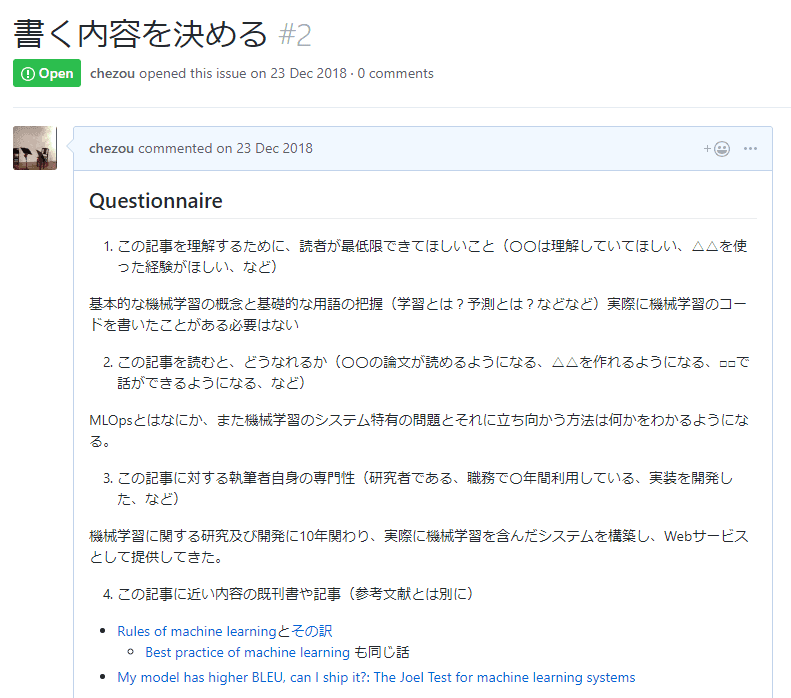
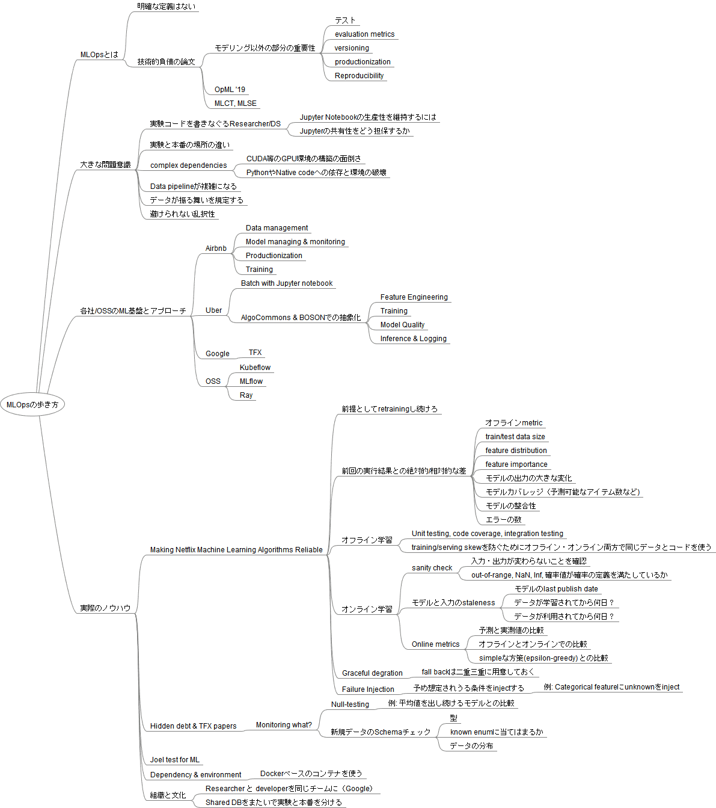
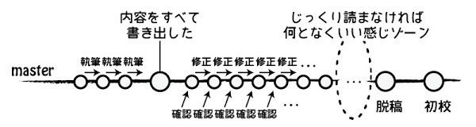

先日、ラムダノートから創刊された「n月刊ラムダノート」に「MLOpsの歩き方」を寄稿しました。

[**『n月刊ラムダノート』創刊のお知らせ**
_このたびラムダノートでは、計算機全般を扱う新しい不定期刊行誌『n月刊ラムダノート』（n-monthly Lambda…_www.lambdanote.com](https://www.lambdanote.com/blogs/news/n "https://www.lambdanote.com/blogs/news/n")

他の著者の記事などでいろいろと話題になっていますが、「TCPの再送制御機構」から『「コルーチン」とは何だったのか？』、そして僕の書いたMLOpsの話までと、幅広いテーマが取り扱われています。

[**新雑誌「n月刊ラムダノート」の『「コルーチン」とは何だったのか？』の草稿を公開します - まめめも**
_『Ruby でつくる Ruby』などでお世話になっているラムダノートが、新しい雑誌 「n月刊ラムダノート」 を創刊しました。 コンピュータ関係の技術情報の記事だけが載るそうです。創刊号は、『 TCP…_mametter.hatenablog.com](https://mametter.hatenablog.com/entry/2019/03/27/211140 "https://mametter.hatenablog.com/entry/2019/03/27/211140")

個人的には、[グルドンで宣伝したおかげ](https://mstdn.guru/@chezou/101792759121359160)か[ITmedia NEWSデビュー](https://www.itmedia.co.jp/news/articles/1903/25/news070.html)したのでちょっと嬉しかったです。

僕が書いた内容はMLOpsと呼ばれる、機械学習システムやプラットフォームで皆が手探りに行っている本番環境への適用や運用が、なぜ機械学習が絡むと難しいか、どういうアプローチがあるのか、といったところを（網羅的ではないかもしれませんが）ある種サーベイ論文のような形でまとめてみました。良ければ読んでいただいて感想を聞けると嬉しいです。

### 寄稿するまでにしたこと

「n月刊ラムダノート」は皆様の記事の寄稿を受け付けています。詳しくは以下の記事をお読みいただければと思います。

[**『n月刊ラムダノート』への寄稿をお待ちしています**
_n月刊ラムダノート創刊号へのたくさんの応援ありがとうございます。n月刊ラムダノートは、1号分の記事が集まったら次号が発行される不定期刊行の技術解説誌です。…_www.lambdanote.com](https://www.lambdanote.com/blogs/news/n-1 "https://www.lambdanote.com/blogs/news/n-1")

ターゲットとしている記事は、上記の記事から抜粋すると

*   「自分が専門とする分野の解説を、関連する他分野の技術者や若者に向けて残しておきたい」
*   「公開したい技術文書があるけれど、論文のようにフォーマルな内容ではないから、個人ブログで公開するしかないかな」
*   「技術書を書きたい。でも、いきなり本を一冊書くのは大変だ」

という感じです。「仕事ではじめる機械学習」のときも思いましたが、プロに編集していただくと、自分の思考や考えが理解されやすい形に整理されるというメリットがとても大きいので、知ってもらいたいネタがある人は是非応募して欲しいと思っています。

でも、「いきなり雑誌の寄稿とか…」と思う方の助けになればと思い、自分がしたことなどをまとめていこうと思います。

#### 1\. 寄稿する決意を固める

2018年11月頃に [keiichiro shikano](https://medium.com/u/ddbef12a969)さんから、「こういうような雑誌を立ち上げたいんだけど、BERTの記事書いてもらえませんか？」と言われたのがきっかけです。BERTの話はもっと適切な人がいると思ったのでお断りしましたが、かねてよりまとまった文章にしたいと思っていたMLOpsについて書かせてくださいという話をしました。

いろいろと雑誌の方向性をお聞きする中で、人工知能学会の「[私のブックマーク](https://www.ai-gakkai.or.jp/resource/my-bookmark/)」という、あるトピックに関する論文よりは軽いサーベイ記事のことを思い出し、サーベイ＋それらを体系化ができればいいなと思いOKしました。

議論の中で 「いろんなIT系技術書から1章ずつ選んできた解説記事の集まり」というコンセプトも出てきたのですが、わかりやすいなと思う反面1章が一番大変だったなぁ…というのを思い出しました。

#### 2\. 書く内容をぼんやり考える

記事募集の中でも言及されていたように、まずは以下の質問に自分で答えを作ります。

1.  この記事を理解するために、読者が最低限できてほしいこと（〇〇は理解していてほしい、△△を使った経験がほしい、など）
2.  この記事を読むと、どうなれるか（〇〇の論文が読めるようになる、△△を作れるようになる、□□で話ができるようになる、など）
3.  この記事に対する執筆者自身の専門性（研究者である、職務で〇年間利用している、実装を開発した、など）
4.  この記事に近い内容の既刊書や記事（可能なら参考文献とは別に）

この時点で、GitHubのprivateレポジトリをいただいていたので、issueにまとめていきました。

また、合わせて章立てやコンテンツを考えるためのMindmapを作りました。とはいえ、自分の知っているだけの情報で足りるかがわからないので、3の情報収集と並行してブラッシュアップしていました。

MLOpsの歩き方のマインドマップ

#### 3\. 下調べをする

MLOpsは産業界でボトムアップに動いている分野なので、まとまった論文になっているものはそこまで多くないのが現状です。ベースとなるGoogleのMLの技術的負債に関する論文や、すべての起点であるGoogleのTFX論文、それからFacebook, Uber, Airbnbなど各社の論文、スライドを改めて読み始めます。（なお、TFX論文は各社のML基盤に影響を与えているのでMLOpsに興味がある人は読むことをおすすめします）

文章の構造や論文やスライドは[Notion](https://www.notion.so/)を使ってメモしていきました。以下が、そのメモです。本文というところに初稿へのリンクもあります。

[https://www.notion.so/Guide-book-for-MLOps-aab7579e4fe4496aa69f5675d989e64f](https://www.notion.so/Guide-book-for-MLOps-aab7579e4fe4496aa69f5675d989e64f)

Notionの編集画面

Notionのいいところは、だらだらと1ページで書き始めて一部をくくりだしてsubページにしようと思う場合手軽にできるところです。

#### 4\. 初稿を書く

材料を揃えたら、あとは考えていた構成に合わせて書いていくだけです。とはいえ、サーベイ的な要素が強いので「どう体系化したらいいだろう」というのは手探りで整理をしていきました。ちょうど、年末年始という時間があったので、「年末進行失敗するとこうなるのか～」と思いながら書いていました。

まず目指したのは、[鹿野さんの言うところ](http://note.golden-lucky.net/2016/05/gitgithub.html)の「内容をすべて書き出した」状態です。

「執筆・編集のためのGit（GitHub）ワークフローを考えてみた」より

ちなみに、初稿を書くのもNotionで書いてMarkdownでexportしました。iPad Proで原稿を書いたり、途中で調べたものの追加をPixel 3でやったりといろいろなデバイスや環境でやれるのが楽でした。

#### 5\. 編集に入っていただく

ざっと書き出して、自分の中で構造をある程度こねこねしたら、いよいよGitのcommitをしてGitHubでの編集に入ってもらいます。

とはいえ、この段階では事例紹介色が強く、課題と解決策の対応が弱いという不安を抱えながらpushしました。この不安はissueとPRをしていただきながら編集によって解消されたのですが、一人では解決できなかったと思います。

PRベースの編集の様子

著者である自分はコンテンツの足し算をしたがるのですが、編集者からは足すことはできないので、構造に手を入れたり引き算をすることで論旨を明確にするのだ、という話を聞いたときには目からウロコでした。

#### 6\. 上がってきたPDFをチェックする

紙とPDFでのですので、上がってきた原稿が体裁を整えた形のPDFになって受け取ります。これを最後にチェックして、ミスのチェックをします。いつも思うのが、MarkdownやRe:view, Sphinxなどが生成するPDFから商業用の体裁になると、中身がすごく良くなったように感じますね。

最後の修正を終えたら、著者としては原稿への作業は終了です。

#### 7\. 発売前に宣伝する

これはoptionalなのですが、発売前に自分たちが主催するMLCTというイベントがあったため、そこの主催者のお話のコーナーで宣伝させていただきました。

なお、そこで宣材用に草稿を渡していただいたのですが、表紙を見て初めて他の著者の方を知りぶったまげました。

### 記事を書いてみませんか？

技術書典のおかげで、技術系同人誌に対するハードルがとても下がったと思います。「n月刊ラムダノート」はテーマ設定がきちんとできれば、それに近い感覚でプロの編集を受けられるのは良いのではと思います。紙の力はまだまだ偉大で、職場などで物理で広まるというのは強力です。その恩恵を手軽に受けられるのも魅力でしょう。（在庫とか自分で管理したくないよね…）

ブログを書くより腰を据えて書きたいけど、本を一冊書くのはしんどいし時間もかかる。プロの編集の力も借りて、自分の頭の中にある情報をまとめて広めたい、そういう人には「n月刊ラムダノート」はピッタリの場所でしょう。
