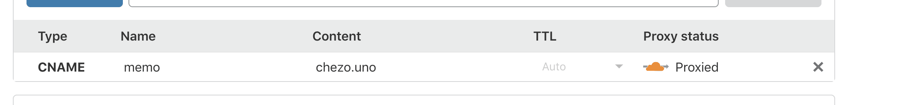

# NotionのページをCloudflareでsub domainに転送する

Added By: Aki Ariga
Description: Notionでカスタムドメインをサブドメインまで設定する
Tags: Notion
Created at: November 16, 2019 11:50 PM
Last edited at: December 6, 2021 3:35 PM


Notionはリッチなメモツール（？）としてじわじわと人気が出ている。モバイルアプリでもPCでも書けるのでメモ書きや調べ物をするのにも重宝しているし、最近ではwebクリッパーがあるので便利にセルフブックマーク用途に使っている。

mediumのpay wall圧力のおかげでblogの移行先を色々と探していたのだけれど、まずは雑なメモを置ける場所を公開してみようと思う。

**2021/10/29追記**
~~この方法は完全に使えなくなったので、諦めて [memo.chezo.uno](http://memo.chezo.uno) を [chezou.notion.site](http://chezou.notion.site) にリダイレクトすることにした。~~

<aside>
💡 **2021/12/06追記**
下記の設定は古いので ****[https://fruitionsite.com/](https://fruitionsite.com/) に従って設定するのが良いでしょう。

kudos: [https://shinofara.dev/Notion-custom-domain-657bd43c5b834cb18121d8c459052d66](https://shinofara.dev/Notion-custom-domain-657bd43c5b834cb18121d8c459052d66)

</aside>

# カスタムドメインの設定方法

残念なことに、Notionまだカスタムドメインを提供していないのだけれど、それをCloudflareのworkerを使って実現するgistと記事を見つけたので試してみた。

大まかなやり方は

「Cloudflareのworkersを使うとJavaScriptを使ってredirectを設定できる」

というものである。

オリジナルのgistはmayneyaoさんがこちらに上げている。

[notion.so custom domain](https://gist.github.com/mayneyao/b9fefc9625b76f70488e5d8c2a99315d)

mayneyaoさんは英語がネイティブでないため、スクリーンキャストを使って説明をしているが、英語の記事にはこちらの記事があり、こちらのほうがわかりやすかった。

[Use a custom domain for a public Notion page](https://notion-tricks.com/Use-a-custom-domain-for-a-public-Notion-page-c65c2475c520432e8bd87195edf7c464)

# サブドメインの設定方法

どちらの記事でも、サブドメインなしのドメインを設定しているが、これに付け加えてsub domainを指定したいときの設定を書く。

## 1. javascript中のMY_DOMAINをサブドメインまで指定する

見ていただければわかるとおり。

```jsx
const MY_DOMAIN = "memo.chezo.uno"
```

ちなみに、 `START_PAGE` はパブリックなユーザー名の入っていないページなのでGoogle Chromeのプライベートモードなどで確認してから貼ると良い（自分はこれにドハマリした）

あと、CORSヘッダーはデフォルトが全部受け入れることになっているので、ちょっと制限した。

```jsx
const corsHeaders = {
  "Access-Control-Allow-Origin": "chezo.uno",
  "Access-Control-Allow-Methods": "GET",
  "Access-Control-Allow-Headers": "Content-Type",
}
```

## 2. DNSでCNAMEを指定する

この場合、 `memo` というCNAMEを [`chezo.uno`](http://chezo.uno) にProxiedされるように設定を追加すればよい。



以上で、 [`memo.chezo.uno`](http://memo.chezo.uno) がNotionになっていると思う。

---

[Back to home](https://memo.chezo.uno/)