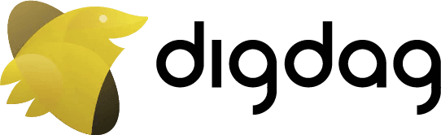

[digdag](https://www.digdag.io/)はsimpleなyamlでworkflowを書けるOSSでTreasure Dataが中心になって開発しています。

digdag本家のv0_10ブランチをベースにPythonクライアントを作りました。位置づけとしてはdigdagのREST APIを叩く薄いwrapperです。

GitHubにソースコードは公開してありますし、[PyPI](https://pypi.org/project/tdworkflow/)にもおいてあるので

```bash
pip install tdworkflow
```

で試すことができます。

Google Colaboartoryノートブックがあるので、TDアカウントがある人は試してもらえると良いと思います。（実行にはGoogleアカウントでログインが必要です）

[Google Colaboratory](https://colab.research.google.com/drive/1vOHXZ3PBsyUHYShb3x1cQ7WzgF7miZ48#scrollTo=2LQdWsBo84hZ)

### Treasure Workflowにつなぐ例

```python
import os

from tdworkflow.client import Client

apikey = os.getenv("TD_API_KEY")
client = Client(site="us", apikey=apikey)
# Or, write endpoint explicitly
# client = Client(endpoint="api-workflow.treasuredata.com", apikey=apikey)

projects = client.projects("pandas-df")

secrets = {"td.apikey": apikey, "td.apiserver": "https://api.treasuredata.com", "test": "secret-foo"}

client.set_secrets(projects[0], secrets)

client.secrets(projects[0])
# ['td.apikey', 'td.apiserver', "test"]
client.delete_secrets(projects[0], ["test", "td.apiserver"])
```

### digdagにつなぐ例

Treasure Workflowのための、と書いてあるけれどOSSのv0_10ブランチベースなので、0.9.x系でも動くと思います。以下の例では [localhost:65432](http://localhost:65432) にあるdigdagサーバーに接続しています。

```python
import tdworkflow
import requests
session = requests.Session()
client = tdworkflow.client.Client(endpoint="localhost:65432", apikey="", _session=session, scheme="http")
client.projects()
# [Project(id=1, name='python-tdworkflow', revision='134fe2f9-ded3-4e7c-af8e-8a82d55d688b', archiveType='db', archiveMd5='5Lc6F6m3DtmBN4DA5MzK8A==', createdAt='2019-11-01T13:03:26Z', deletedAt=None, updatedAt='2019-11-01T13:03:26Z')]
```

## モチベーション

目的としては、Google Colabolatoryからtreasure-boxesというサンプルワークフローをTDにデプロイすることが当初のゴールでした。digdadのsecretsを設定するのにdigdag CLIからじゃないとだめとかが面倒くさいなあと思い、まぁREST APIがあるから大丈夫だろうと思ってカッとなって作りました。

## ドキュメントとGitHub repo

[chezou/tdworkflow](https://github.com/chezou/tdworkflow)

[tdwokflow - tdworkflow documentation](https://tdworkflow.readthedocs.io/en/latest/)

最近やたらとapidocとSphinxでドキュメント生成しているのだけど、その話もまとめられればと思っています。

APIデザイン等は変更される可能性がまだまだありますが、バグなどがあれば、GitHubのissueへお願いします。

---

[Go back to home](https://memo.chezo.uno/)