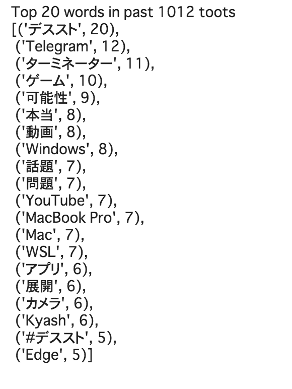

Google Colabolatoryのフォームを使えばエンジニアではない人もテキスト解析をぽちっと解析できる環境ができることがわかったので、マストドンのトレンドワード分析のためのノートブックを書いてみた。

ノートブックはこちら。

[Google Colaboratory](https://colab.research.google.com/drive/1kWvx8pIVPc6D6TyAwHWjk7nnZolX4VrU#scrollTo=F52dqFS5Luaq)

## なぜMeCab + NeologdではなくspaCy+GiNZAなのか

最初は、mecab+neologdを使っていたのだけれど、名詞だけの抽出だと"MacBook Pro"が"MacBook"と"Pro"と単語が分割されすぎる嫌いがあってコンテキストが欠落してしまうと全然うれしくないと思って頭を抱えていたところ、spaCyとMegagon Labsが開発する日本語用のGiNZAのチュートリアルを見つけたので試してみた。(どうでもいいけど、GiNZAはPyPIでwheel配布しないかな…)

[はじめての自然言語処理 spaCy/GiNZA を用いた自然言語処理 | オブジェクトの広場](https://www.ogis-ri.co.jp/otc/hiroba/technical/similar-document-search/part4.html)

spaCy+GiNZAを使うと、以下のような簡単なコードで、キーワード（この場合、固有名詞と名詞句）が取れる。

```python
import neologdn
import spacy
nlp = spacy.load('ja_ginza')

def extract_words(sentence):
    docs = nlp(sentence)
		
    words = set(str(w) for w in docs.noun_chunks)
    words.union(str(w) for w in docs.ents)
    return words

text = "キーワードを抽出したいセンテンスをここにいれます。"
extract_words(neologdn.normalize(text))
```

特に名詞句を勝手にとってくれるのが楽で、先の"MacBook Pro"が1単語として獲得できる。

また、Neologdは辞書をいちいちgit cloneしてbuildしないといけないため、インストールに時間がかかるため、Colabで実行するにはちょっと待ち時間が長い。

## 実際に使った感じ

マストドンでは、[@rbtnn](https://mstdn.guru/@rbtnn)さんが特定の期間のtootをリストできる[マストドンピッカー](https://rbtnn.github.io/mstdn-picker/)があるのだけれど、これのURLを入れればその期間（一日全体のキーワードだったり、Podcast放送中）のキーワードが取れるので意外と便利。

とはいえ、ストップワードをチクチク設定しているのはいつもの通り。本当はbotをどこかで動かして定期的にtootしたいところだが、気が向いたらかな。



ある日の上位20個のトレンドワード。デスストが流行ってる

---

[Back to home](https://memo.chezo.uno/)