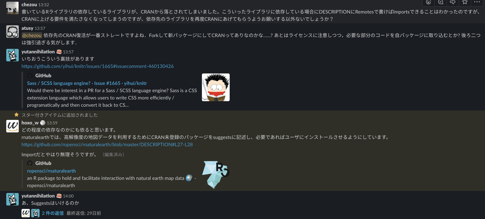

# tl;dr

- CRANに上げてたパッケージにGitHubのみリリースのパッケージへ依存を追加したら、自分もCRANに上げられなくなった
- CRANはclosedな手動の塊なので、もう上げないよと依存先のメンテナは言った
- もうCRANは忘れて、GitHubに上げればええやん ← イマココ

# ここまでのあらすじ

1年前にこんな記事を書きました。

[あなたの知らない煽りの世界 | Democratizing Data](https://chezo.uno/post/2018-12-16_dialogues-with-computer-dce83c32e67e/)

実はこれを書いていたのは、先日も記事に書いたRTDを久しぶりにリリースするというときだったと思います。

[RとTreasure Data | Democratizing Data](https://chezo.uno/post/2019-12-04-r-and-td/)

当時は、なんでこんなにリリースコマンドのときに質問ガンガンするんだとか思いながらこれを見ていたと思います。

ご存じない方のために説明すると、CRANとはRのセントラルパッケージリポジトリで、承認を得ないと登録できません。PyPIと違って、きっと malicious なパッケージもこれで防げますね！そこまで見てるかはしらんけど。

[2019/12/06追記]

全然だめみたいです

[https://twitter.com/yutannihilation/status/1202740273513521153?s=19](https://twitter.com/yutannihilation/status/1202740273513521153?s=19)

[/追記]

実はCRANサブミット時に、linterなどチェックを通しつつパッケージがルールにマッチしているかを人手で最後のチェックをしているのです。なので、2週間に一回くらいアップデートしろとか色々書いてあります。当時は、へー、頑張ってるんだなーとか思いながらサブミットをしていましたが、何しろ12月だったのでメールの返事が帰ってきません。なんだ、おいこのプロセスと当時も思っていました。余談ですが、日本人は正月に休みますがアメリカやヨーロッパだと12月がホリデーシーズンです。

## 久しぶりにCRANにパッケージをサブミットした

で、1年弱たって、RTDに新機能を追加してバージョンアップを図ります。今回は、msgpackを使ったバルクインポートを導入です。ついに、embulkへの依存が不要になりました！

ところで、Rのmsgpack実装は野良のものがわらわらあるんですが、msgpack streamに対応していたのがこのパッケージでした。

[crowding/msgpack-r](https://github.com/crowding/msgpack-r)

正直data frameからmsgpack streamへの変換がハマりどころいっぱいありましたが、なんとか実装できました。

で、このパッケージCRANに昔はあったようなのですがarchiveされてしまっていました。

最初は、 DESCRIPTION の SuggestsとRemotesに書いておいたのですが、まぁ `devtools::check` にRemotesが引っかかるではありませんか。そっかー、そういうこともあるよねー、という気持ちで困ったときのr-wakalangに相談してみました。

すると、識者の意見が出るわ出るわ。いやー、本当にr-wakalangは最高ですね！



テクニックとして出たのは、Suggestsには書くけど適宜ユーザーには必要になったらインストールさせるよう関数を用意するというものでした。

[ropensci/rnaturalearth](https://github.com/ropensci/rnaturalearth/blob/master/DESCRIPTION#L27-L28)

それでは、諸々済ませていざサブミット！


やあまた会ったね、Uweさん。彼は実は1年前にもすごく待った末にrejectしてくれました。なになに？SuggestsにあるやつがCRANにないって？うーん、困ったなということでまたr-wakalangにすごすごと戻ります。


なるほど、cran-comments.md! そうだね、僕たちには説明をする場所がある！というわけで、cran-comments.mdに実行時にインストールするから問題ないよ。という説明を書いて再度submit!


ところで、僕のcran-comments.mdは読んでくれたかな？まぁ読んでないよね。なになに、"Let me read them for you" だって？僕そのドキュメントもう何回もよんだわ！

うーん、どうやらrnaturalearthはCRANには上がっていませんが、Additional_repositoriesに上がっているようです。なるほど、これなら `install.packages` で入れられますね。

```r
Additional_repositories: http://packages.ropensci.org
```

探してみると、GitHub pagesにRパッケージをアップロードして[自前レポジトリを作っている人](https://github.com/unDocUMeantIt/repos)がいました。なるほど！自前レポジトリに上げればCRANに上げれるんだ！

はて、CRANにパッケージを上げるために依存先を自前リポジトリに上げる...？控えめに言って糞だぞ？

## 依存先をCRANへと上げるようお願いする

仕方がないので、作戦変更です。msgpack-rの作者に頭を下げてCRANにあげてくれ！と頼むしかありません。自分のパッケージじゃないものを上げるために自前でリポジトリをホストするなんて正気の沙汰ではありません。

で、帰ってきたお返事（の抄訳）がこちら。

[https://twitter.com/chezou/status/1196308261877628928](https://twitter.com/chezou/status/1196308261877628928)

前述したとおり、CRANでは最後の人手でのチェックがあるのですが、そこの際にサーバサイドでチェックが走ります。で、このチェックというのがローカルで確認できるものとはどうも違うようで、特にWindowsのC依存のあるビルドが絡んでくると大変です。msgpack-rはRcppを経由してCで書かれたものをwrapしているので、当然そこの面倒臭さはつきまといます。

誰得なんだこのシステムは。

というわけで、CRANは諦めました。

## GitHubにリリースでええやん

GitHubからのインストール自体は、 `devtools::install_github` を使えばできるのですが、 `devtools` が入っていない人もいるかも知れません。でもね、そういう人のためにinstall-github.meという便利なサイトがあるんです。

```r
source("https://install-github.me/chezou/RTD@v0.2.0")
```

と書けばバージョンを指定してインストールができます。アップデートは多分自分でしないといけませんが...。

Rのパッケージを書くのは過去、RTD含めて3個しか行っていませんが、今どきこのきつい中央集権的なレポジトリのスタイルは厳しいなぁと思いました。

今ではCRANのパッケージを削除したいくらいです。GitHub最高！

---

[Back to home](https://memo.chezo.uno/)