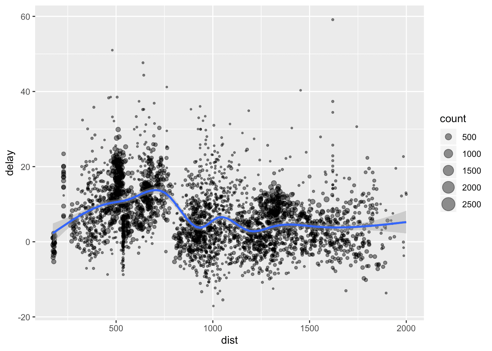

この記事は、[Arm Treasure Data advent calendar](https://adventar.org/calendars/3932) 3日目です。

公式ドキュメントは、 [Rについてはあまり書かれていない](https://support.treasuredata.com/hc/en-us/articles/360001487927-R-Language-Driver-Install)のですが、RからTreasureDataを使うにはRJDBC以外にもいくつかの方法があります。

基本的には、RPrestoとRTDをおさえておくのが良いでしょう。

- [RPresto](https://github.com/prestodb/RPresto)
  - Facebookが開発しているPrestoのR client。TreasureDataでもアドホックなクエリを投げるときに便利
- [RTD](https://github.com/treasure-data/RTD)
  - Rからdata frameをTreasure Dataにアップロードするのに使えるR client
  - (12/18追記) レポジトリの場所がtreasure-dataの下になりました
- [sparklytd](https://github.com/chezou/sparklytd)
  - RStudio社が開発するRのSpark clientであるsparklyrのplugin
  - 内部で使うtd-sparkはSparkのサポートバージョンが上がるのが速いが、sparklyrのSparkの新バージョンサポートが遅いので少し低調なメンテナンス

実際の、RPrestoとRTDの使い方は以下のRmarkdownを見ていただくのが良いかと思います。
https://rpubs.com/chezou/TD-from-RPresto-RTD


# RTDのインストール

インストールは、 `devtools::install_github` を使うか、 `install-github.me` を使うことでできます。

RTDは v0.2.0 からCRANに上げるのを辞めました。これはこれで一つの記事が書けるのですがそれはまた別の機会に譲ろうと思います。

余談ですが、CRANとの戦いの際にはr-wakalangの皆様に支えていただきました。Rに関する開発はもはやあそこなしには成り立ちません。[Slack](https://github.com/tokyor/r-wakalang)にぜひ参加するといいと思います。パッケージングから統計モデリングも話まで物凄い勢いで有識者が答えてくれます。


```R
source("https://install-github.me/treasure-data/RTD@v0.2.0")
```

インストール後は、`apikey` と `endpoint` を適切なものを渡して上げることで、uploadができます。例えば `nycflights13` パッケージの `flights` データをアップロードしてみましょう。

```R
library(RTD)

client <- Td(apikey = Sys.getenv("TD_API_KEY"), endpoint="api.treasuredata.com")
td_upload(client, "test", "flights", nycflights13::flights, overwrite=T)
```

v0.1.0 ではembulkが必須でしたが、今のバージョンは bulk import APIを使うようになっているため、特に追加でツールをインストールする必要はありません。

# RPrestoでの接続

`src_presto` する際には、 `user` に TDのAPI keyを渡すこと、hostは[こちらのendpoint](https://support.treasuredata.com/hc/en-us/articles/360001474288-Sites-and-Endpoints#Endpoints)を参照してください。schemaはDatabase名、 catalogは `td-presto`のままにしてください。

```R
library(RPresto)
library(dplyr)

db <- src_presto(
  host="https://api-presto.treasuredata.com",
  port=443,
  user=Sys.getenv("TD_API_KEY"),
  schema='test',
  catalog='td-presto'
)

flights_tbl <- tbl(db, 'flights')
```

`flights_tbl` にテーブルが変数として割り当てられました。が、実際にはdplyrの諸々の処理を実行するときにSQLが走るのでalias程度に考えてください。

# dplyrとggplot2で可視化する

それでは、 `flights_tbl` をdplyrを使い集計して飛行機の平均遅延時間などを算出して、ggplot2で可視化してみましょう。

```R
delay <- flights_tbl %>%
  group_by(tailnum) %>%
  summarise(count = n(), dist = mean(distance, na.rm = TRUE), delay = mean(arr_delay, na.rm = TRUE)) %>%
  filter(count > 20, dist < 2000) %>%
  collect

# plot delays
library(ggplot2)
ggplot(delay, aes(dist, delay)) +
  geom_point(aes(size = count), alpha = 1/2) +
  geom_smooth() +
  scale_size_area()
```

このような図ができたかと思います。



それでは、HappyなRとTreasureDataライフを！
