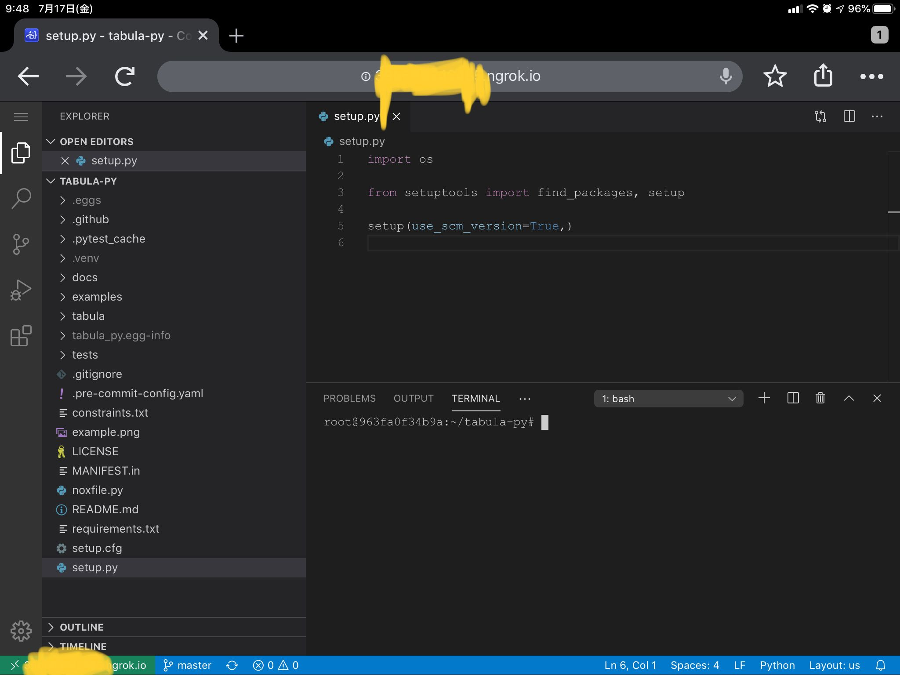
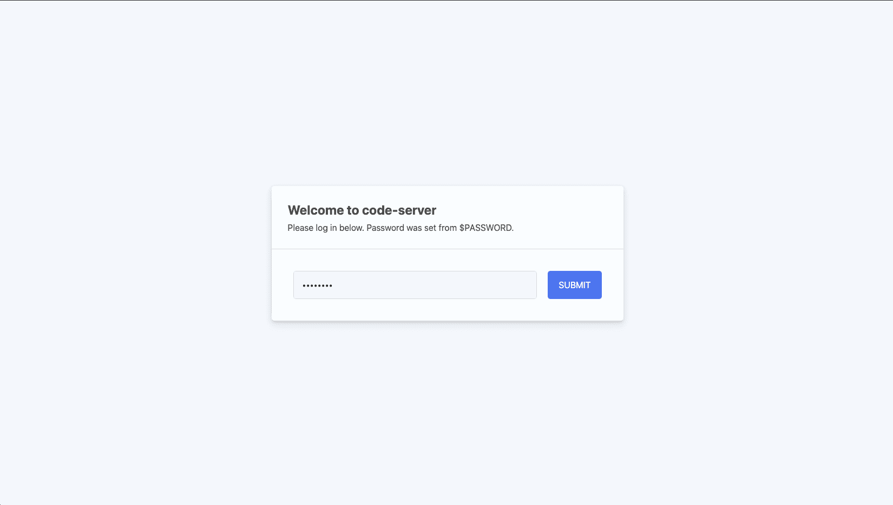

iPadからアクセスする図

元ネタはToward DataScienceの記事から。mediumの有料記事なのとssh tunnelとか冗長だったので簡潔なノートブックを作った。

[Colab on steroids: free GPU instances with SSH access and Visual Studio Code Server](https://towardsdatascience.com/colab-free-gpu-ssh-visual-studio-code-server-36fe1d3c5243)

## 何ができるか

- Colabで動かしたVS Code(code-server)がブラウザからアクセスできる
- sshのトンネルとか不要なのでiPadとかからもVS Codeが動く
- Google Driveにデータを永続化するので、セッション切れてもまた再開できる
- code-server側のパスワードを設定できるので、一応誰からでも使えるわけではない（ランダムでアタックされるとかは知らない...）

## やること

1. [ngrok](https://ngrok.com/)のfreeアカウントを作り、Auth tokenを手に入れる
2. 下のnotebookをColabで動かす。途中でgetpassで要求されるngrokのAuth tokenと、code-server用のパスワード（これは自分で生成する）を入れる
    
    [code-server.ipynb](https://gist.github.com/chezou/858d663381625c9bb1c868e0c95969c6)
    
3. `print(str_ssh)` で出てきたURL（2個めのセルの実行結果）にアクセスする

とりあえず、tabula-pyのpytestが走るのは確認できた。罠としてはデフォルトvenvが入ってないので、 `apt-get install python3-venv` を実行しておくほうがいいこと（1個めのセルに入ってる）。

code-serverでパスワードを要求される図

pytestが完了した図

なお、iPadからの実行時、Blutoothキーボードがないとterminalに仮想キーボードがかぶってうまく入力できないので注意が必要。

---

[Back to home](https://memo.chezo.uno/)
