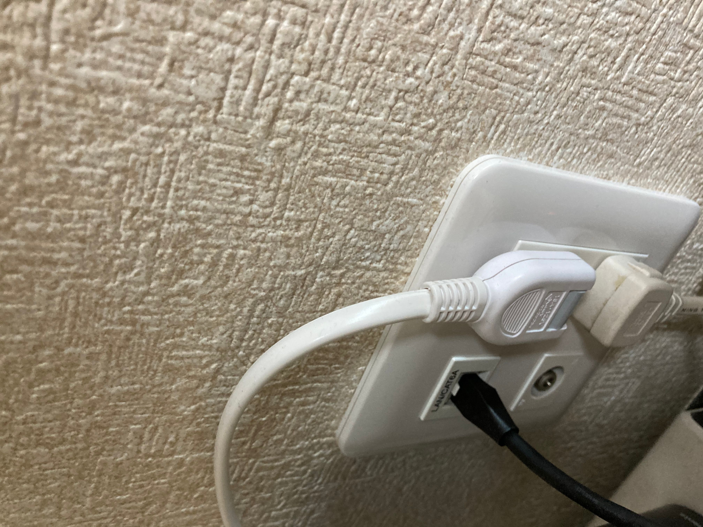
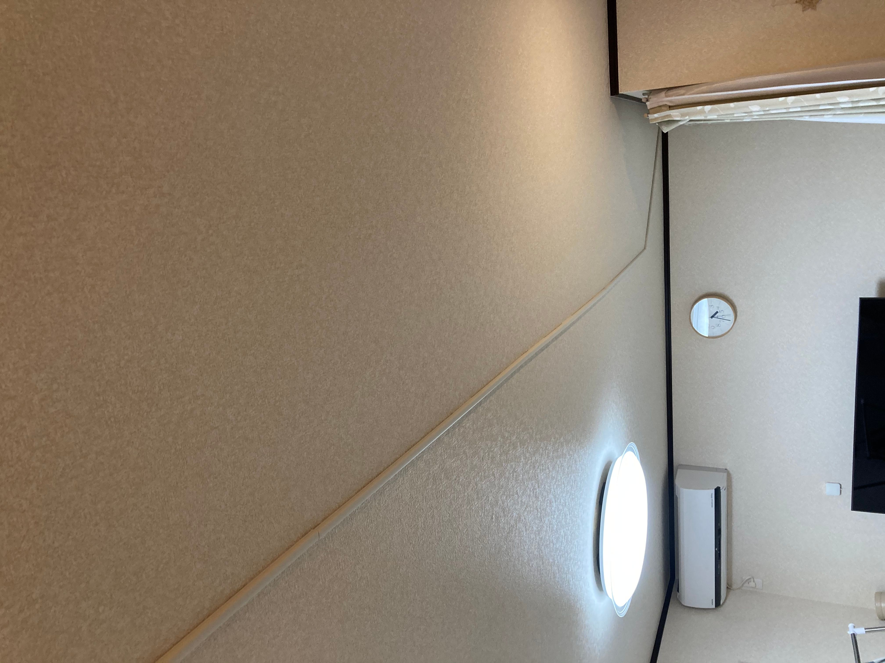

このお話は、[pyspaアドベントカレンダー](https://adventar.org/calendars/5310)の11日目です。昨日はwozozoでした。多分彼はこの記事をチラ見して「長過ぎる。地雷乙」と言うでしょう。

3階建ての家でインターネットを安定させるために、NETGEARのOrbiというメッシュWiFiを構築していたのだが、どうにも調子が悪いので有線LANを張り巡らせました。これはその奮闘記です。なお、筆者はネットワーク系は素人なので用語などが不正確な場合がありますががあしからず。あと、面倒なので以降語尾はですます調じゃなくなります。

## メッシュWiFi購入

事前にメッシュWiFIを色々調べたが、どうもNETGEARのOrbiが良いらしいという話を聞いていた。NETGEARが素晴らしいのは購入前にこういう環境だけどどのモデルを買えば良いのか？という相談をできること。これは素晴らしい。当時WiFi-6対応のモデルは出ておらずでかい筐体のOrbiと日本向けの小さいOrbi Microの二種類が出ていたのでどちらを何台買えば良いのかわからなかった。

電話でこういう環境でこれくらいの広さなんだけどと言うと、「3階建ての場合はOrbiを3台です。これ以外ありません」とサポートの人が自身を持って答えてくれた。へー、そうなんだ。Microの方が安いしそこまで広くないからそれでいいかなと思っていたけど餅は餅屋だ。そう思ってOrbiをサテライト2台付きの3台セットを購入した。



設置した当初は、うおおお無線LAN速い！安定する！と喜んでいたが、よくよく設置して調べてみると1台で全部屋カバーしてるじゃん。まあいいか、一応レスポンス良くなるし。と思いながら、サテライト1台は封印することに。

しかし、その時はまだ地獄の始まりだということを知らなかった。

## フルWFHのはじまり

例によって全面的なWFHが2月から始まって、テレカンをする機会が激増した。すると、なんか無線LANが遅いことに気づいた。OrbiはIIJmioひかりが使っているDS-Liteこそ対応してないが、[IPoEオプション](https://www.iijmio.jp/campaign/imh/monthly202001.html#features02)をオンにしてみるもまだ遅い。色々と切り分けてみると、Orbiの設置場所を変えたときにNTTの終端装置とOrbi間のLANケーブルを変更したのだが、その時に古いケーブルを指したらCat 5eでも有線LANの速度が全然出ていなかった。ケーブルって劣化するんだ...。



それでも、どうも夕方特定の時間帯のテレカンが途中で途切れる減少に気づいた。あと、ちょいちょい深夜にサテライトがピンクの光を発して落ちている（のをSynologyのNASの疎通確認が落ちたメールで気づいた）。

夕方といえば、電子レンジじゃないか。NTTの終端装置が置かれた2階にOrbi本体を設置し、1階の作業部屋のサテライトに飛ばしているのだが、すこし距離があるため2.4GHz帯を使ってサテライトとの通信をしているぽいぞ。あれ、5GHz帯のバックホールとは一体...。この辺からwozozoから「また地雷踏んだの」と言われる日々が続いた。

ともあれ、これが続くようでは仕事に支障をきたす。Orbiには幸い有線バックホールという親機とサテライト間を有線でつないでメッシュをより安定させる機能があることは知っていた。そんな折、太田さんのこの記事を見て書いた感想からお墨付きをもらったので有線LAN工事をする決意を固める。

[UniFiで自宅に巨大スタジアム並のエンタープライズWiFi環境を整えた | Moratorium](https://www.kzk9.net/post/202008_unifi/)



## 有線LAN工事をする

いろいろ調べて、ウェブソフトさんという会社を選んだ。

[WI-FI　つながらない、WI-FI　届かない、WI-FI　不安定、WI-FI　遅い、等がありましたら、ご相談ください。家庭内lan、個人のlan工事、LAN配線、LAN配線工事、ウェブソフト株式会社。](http://www.websoft.co.jp/)

ポイントは以下の3つ

- Cat 6aに対応していることをサイトで明示していた
- Webで依頼した仮見積もりの詳細をメールで返信してくれた（他社は電話でまくしたてるように返してきた）
- 値段も妥当な範囲だった

今サイトを見るとHTTPSじゃないし懐かしい感じのサイトだが、見積もりや対応含めて良さそうだなと思ったのでお願いすることにした。

事前にわかっていたのだが、我が家には壁コンセントの裏に[CD管という壁内を通す管](https://techabe.com/re_cd.htm)がほとんどなかった。「ほとんど」というのは2階と3階にはついていたが、肝心の2階と1階にはなかったため、壁に穴を開けて屋外配線をすることにした。

TVのアンテナはないのにアンテナ線だけ張り巡らされていたが、壁からCAT 6aが生えてきた

工事の結果こうなった。めでたしめでたし、かに思えたが...。



## 不安定な有線バックホールとの戦い

しばらく安定したかのように見えたのだが、まだ一つ謎の現象が残っていた。

> ちょいちょい深夜にサテライトがピンクの光を発して落ちている（のをSynologyのNASの疎通確認が落ちたメールで気づいた）

そう、これがまだ続くのである。

正確には朝起きると1階のOrbiサテライトがピンクの光を発して死んでいるのである。定期的にネットワークのトラブルシュートからスタートする一日は非常にストレスフルだった。大体、西海岸の人々とやり取りするため朝8時台からテレカンが入っているのだ。朝ご飯の準備をしながら子供の面倒を見てインターネットの面倒も見る。さらに寝てる間のメンションも見る。どう見てもキャパオーバーである。

NETGEARのサポートに問い合わせても、Orbi一式を初期化してください、と言われそれでなんか復活した雰囲気、みたいなのを繰り返していた。

そうした時にMLSEのオンラインカンファレンス配信担当をする日の朝に事件が起きた。



もう耐えかねて、有線バックホールなのになぜ死ぬ、と思いながら1階のOrbiに有線でぶら下がっている端末を全部物理のHUBに切り替えて、Orbi自体の有線バックホールを使わないようにした。

ひとまずこれでカンファレンスは凌いだものの、数日したらまさかの現象が発生した。

## 悪さをする端末の特定

こんどは朝起きたらOrbi親機もピンク色になっているのである。OrbiやNTTの終端装置も再起動をするも、翌日になるとまた再発するというのを2日繰り返した。大体寝る前に見つけてOrbiの再起動をしていたのだが、2日目の朝には再起動をしてもネットワークがつながらない。切り分けてみると、そもそも有線LANで接続したNTTのルータにもpingが通らないしIP直接叩いても反応がない。

うーん、と思ってやたらランプが点滅してる経路があるなということで追いかけてみると、そこには会社のMBPがいた。試しにそいつ（につながっているThinkPadのType-Cのドック）につながっているLANケーブルを抜いてみた。



戻った。不安定だったのが嘘のように戻ったのである。NTTのルータにもすぐに接続ができるようになった。

ははーん、過去の親会社のVPNソフトが悪さをして1Mbpsとかしかでなくなる罠にハマったので、会社のMacでなにかやんちゃなソフトウェアが動いているに違いない、と思い調べた。案の定、Code42とかいうバックアップソフトのLAN側の帯域を制限したらだいぶ安定するようになった。どうやらこのソフト（だけではないのかもしれないが）、スリープ時とアクティブなときとで帯域制限が違う値が設定できるのだが、スリープに入るとものすごい勢いで通信をしていたらしい。そりゃ昼間に気づかないわけだ。加えて、ThinPadのType-CドックはUSB接続のLANアダプターとは違い、ACアダプターで給電していてそれはもうすこぶる安定している。熱でやられて速度が遅くなったりしないのだ。ThinkPad Type-Cドックはいいぞ。というわけで、安定して通信をすることを許していたらしい。

会社のMBPは、夜電源を抜くと翌朝再起動しないと起動しない呪いにかかっていたためドックに繋ぎっぱなしにしていたのである。それが裏目に出た。

なお、今は帯域制限してもなんか怪しい気がしたので、ドックから有線LANを抜く運用にしている（ドックとは！ちなみに、okapisさんによるとLinuxでドックがものすごいパケットを送るケースがあるらしいのでドックの可能性もあるかもしれない...。なお、会社のITの人も有線LANは夜にぬけと言っていました）

おかげで今はすこぶる調子が良い。

ついでに天井にも有線LANの配線をした

## Key takeaways

本文に書いたものも書かなかったものも学びとして。

- 有線LANのケーブルは腐るので古いものは捨てよ
- iPhoneやiPad, PCは買い換えると無線LANの規格が新しくなってそれだけで速度向上が見込める
- ボトルネックの切り分けのために有線LANポート内蔵のPCはあったほうが良い
- 会社の端末固有の問題か切り分けるために同じOSの端末でABテストをできると良い
- 最適化を繰り返すとボトルネックが移動する（ので、逐次潰していく）

最後に、友人からのありがたい言葉を貼っておく。



明日はねじです。

インターネット
