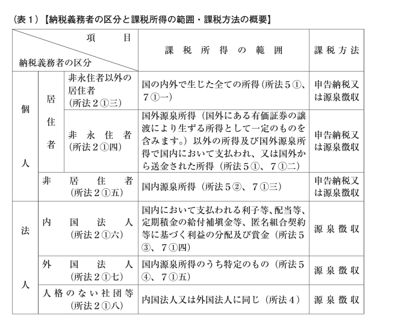

# 日本国外で出版社と取引をする際の所得税の源泉徴収の扱い

Added By: Aki Ariga
Description: 海外移住した際の、所得税の扱いについてまとめました
Tags: tax
Created at: November 9, 2021 10:40 AM
Last edited at: February 7, 2022 8:24 PM

<aside>
⚠️ この記事は2021年11月段階で体験したことに基づき書いています。この情報は、あくまで参考程度に止め、原則的に税に関する不明な点は[国税局電話相談センター](https://www.nta.go.jp/taxes/shiraberu/sodan/denwa-sodan/index.htm#a-02)に電話して確認してください。

</aside>

私はカナダに居住をしており、日本の税務的には非居住者となります。カナダは日本と租税条約を結んでおり、源泉徴収が必要なケースでも日本に支払う所得税の軽減をすることができます。

今回は、出版社との2種類の取引をするにあたって、カナダ在住の私が調べて実施した源泉徴収の扱いとそれに伴う手続きをこの記事にまとめます。

私がした取引は、以下の2つの種類の取引をしました

- 書籍の印税（著作物の使用料、いわゆるロイヤリティ収入）
- 書籍の有償での校正

これらの取引が、どのように源泉徴収されるべきか・されないべきかを書いていきます。

## 重要なソース

以下の手引を一通り読むと良いでしょう。ここに書いてあるのは令和3年度版なので、年度が変わると法令が変わる可能性があります。

- 令和3年度版 源泉徴収のあらまし 第10 非居住者又は外国法人に支払う所得の源泉徴収事務
    - [https://www.nta.go.jp/publication/pamph/gensen/aramashi2020/pdf/12.pdf](https://www.nta.go.jp/publication/pamph/gensen/aramashi2020/pdf/12.pdf)
- 租税条約に関する届出書等の電磁的提供に関するFAQ
    - [https://www.nta.go.jp/taxes/tetsuzuki/shinsei/annai/joyaku/denjiteikyo/pdf/0021003-199_03.pdf](https://www.nta.go.jp/taxes/tetsuzuki/shinsei/annai/joyaku/denjiteikyo/pdf/0021003-199_03.pdf#page5)

## 重要なポイント

そのという点が最も重要なポイントになります。

- 非居住者か？
- 所得が国内源泉所得か？

「源泉徴収のあらまし 第10 非居住者又は外国法人に支払う所得の源泉徴収事務」より。個人の非居住者は、国内源泉所得の場合にのみ源泉徴収の対象となる

上の表を見ると、非居住者でかつ国内源泉所得である場合において源泉徴収が発生することがわかります。この書類は源泉徴収対象外の場合がわかりにくいので気をつけてください。ではこの2つの要件を見ていきましょう。

## 非居住者か？

非居住者とは、国税庁の[こちらの文章](https://www.nta.go.jp/taxes/shiraberu/taxanswer/gensen/2875.htm)によると

> 我が国の所得税法では、「居住者」とは、国内に「住所」を有し、又は、現在まで引き続き1年以上「居所」を有する個人をいい、「居住者」以外の個人を「非居住者」と規定しています。
> 

となります。

この「住所の推定」は以下の別紙によると、2つの要件のどちらかに該当するかで判定します。

[別紙　住所の推定｜国税庁](https://www.nta.go.jp/taxes/shiraberu/taxanswer/gensen/2875-1.htm)

1. その者が国外において、継続して一年以上居住することを通常必要とする職業を有すること
2. その者が外国の国籍を有し又は外国の法令によりその外国に永住する許可を受けており、かつ、その者が国内において生計を一にする配偶者その他の親族を有しないことその他国内におけるその者の職業及び資産の有無等の状況に照らし、その者が再び国内に帰り、主として国内に居住するものと推測するに足りる事実がないこと

私の場合は、日本国籍なので2は関係ありません。1に関してもソフトウェアエンジニアは一般的に継続して一年以上居住することを通常必要する職業であり、非居住者の判定ができそうです。

## 国内源泉所得か？

「国内源泉所得」というのは、「源泉徴収のあらまし 第10 非居住者又は外国法人に支払う所得の源泉徴収事務」にも以下のように記載されています。

> 課税対象とする所得をその所得の発生源泉地が国内にあるもの、いわゆる国内源泉所得に限ることとしています。
> 

実際には、判定に関する条件として以下の2つがポイントとなります。

- 恒久的施設を持っているか
- その所得の区分は租税条約上、課税対象となっているか

### 恒久的施設

恒久的施設は、ざっくりいうと日本に商売をするための拠点を持っているかということなのですが、これ自体で一つの記事が書ける類のものなので、割愛します。少なくとも、日本国外で執筆活動を行い日本の出版社と取引をしていている人は持っている可能性は低い（例えば、実家は特に恒久的施設とはみなされない）ので、調べて見てください。

[No.2883　恒久的施設（PE）（令和元年分以後）｜国税庁](https://www.nta.go.jp/taxes/shiraberu/taxanswer/gensen/2883.htm)

### 租税条約上の課税対象か（印税）

所得の区分に関してですが、印税（著作権使用料）は「使用料等（十一号所得）」となります。これは、租税条約を結んでいる国によって扱いが異なってきます。

以下の引用した表を見ると、アメリカの場合は源泉地国免税のため日本では免税、カナダは債務者主義を取っている国になるため、日本の出版社との取引の場合は日本にて源泉徴収がなされます。ただし、カナダの場合は租税条約により最大10%までの軽減税率が適用されます。

「源泉徴収のあらまし 第10 非居住者又は外国法人に支払う所得の源泉徴収事務」より

### 租税条約上の課税対象か（校正作業）

校正作業の場合は、一般的にその作業によって著作権がレビュアーに発生しないため、人的役務の提供（サービスの提供）という扱いになります。この所得は「人的役務の提供事業の対価（六号所得）」となります。

この場合、租税条約の多くは恒久的施設がない限り、原則として日本の租税は免除されることになります。

つまり、この作業をした場合源泉徴収は行われません。もし、源泉徴収がされてしまった場合は後述の誤納額の還付請求を行います。

## 実際の手続きは何をするか

### 著作権使用料に関する手続き

著作物の使用料に関しては以下の書類を源泉徴収前に出版社を介して提出します。

- 源泉徴収前で、支払いまでに手続きが間に合いそうな場合
    - 使用料に対する所得税及び復興特別所得税の軽減・免除（申請書名「租税条約に関する届け出書（使用料に対する所得税及び復興特別所得税の軽減・免除）」
        
        [［手続名］租税条約に関する届出（使用料に対する所得税及び復興特別所得税の軽減・免除）｜国税庁](https://www.nta.go.jp/taxes/tetsuzuki/shinsei/annai/joyaku/annai/1648_41.htm)
        
- 源泉徴収後
    - 租税条約に関する届出書
    - 租税条約に関する源泉徴収税額の還付請求（申請書名「租税条約に関する源泉徴収税額の還付請求書」）
        - 出版社側で「源泉徴収納付書の控え」が必要（取得に時間がかかるので要注意）
        
        [［手続名］租税条約に関する源泉徴収税額の還付請求（発行時に源泉徴収の対象となる割引債及び芸能人等の役務提供事業の対価に係るものを除く）｜国税庁](https://www.nta.go.jp/taxes/tetsuzuki/shinsei/annai/joyaku/annai/1648_49.htm)
        

これらの租税条約に関する書類の提出は令和3年から電子的にPDFで提出が可能となりました。

以下の書類に詳しいですが、

[https://www.nta.go.jp/taxes/tetsuzuki/shinsei/annai/joyaku/denjiteikyo/pdf/0021003-199_03.pdf](https://www.nta.go.jp/taxes/tetsuzuki/shinsei/annai/joyaku/denjiteikyo/pdf/0021003-199_03.pdf#page5)

1. 電子署名を行い電子証明書を付す
2. 源泉徴収義務者から通知された識別符号（ID）及び暗証符号（パスワード）を用いる
3. 源泉徴収義務者に届出書等提出者等確認書類を提示する

とされています。

電子署名はハードルが高いので使わず、提出者等確認書類も領事館などで「居住者証明」の取得が必要となり、こちらの取得の金銭的・人的コストがかかるため、IDとパスワードによる提出を行いました。

こちらは、出版社にIDとパスワードを発行してもらい、それをもとにPDFのファイル名のprefixにIDを付与して(`GivenId_tax_refund.pdf`)、複数書類あったのでzipにパスワードをかけて送付しました。IDとパスワードの使い方・管理方法については特に法令での指定はないようです。

また、合わせて滞在国でtax returnをする際に源泉徴収済みであることを示す納税証明書を、出版社に依頼して取得しましょう。

- 源泉徴収に係る所得税及び復興特別所得税の納税証明願（申請署名「源泉徴収に係る所得税及び復興特別所得税の納税証明願」）
    - 出版社側で「当該源泉所得税及び復興特別所得税を納付した際の所得税徴収高計算書の写し」として「源泉徴収納付書の控え」が必要（取得に時間がかかるので注意）

[［手続名］源泉徴収に係る所得税及び復興特別所得税の納税証明願｜国税庁](https://www.nta.go.jp/taxes/tetsuzuki/shinsei/annai/gensen/annai/1648_31.htm)

### 人的役務の提供に関する手続き

もし、印税以外の人的役務に関して源泉徴収されてしまった場合は、以下の書類を出版社に提出するよう依頼します。

- 源泉所得税及び復興特別所得税の誤納額の還付請求
    
    [［手続名］源泉所得税及び復興特別所得税の誤納額の還付請求｜国税庁](https://www.nta.go.jp/taxes/tetsuzuki/shinsei/annai/gensen/annai/1648_22.htm)
    

<aside>
💡 消費税は非居住者が海外で作業した場合は免税になります。そのため、消費税の請求はしないようにしましょう

</aside>

## 困ったら国税局電話相談センターに電話しよう

日本で雇っている税理士がいればもちろんその方に相談すればよいのですが、困ったら[国税局電話相談センター](https://www.nta.go.jp/taxes/shiraberu/sodan/denwa-sodan/index.htm#a-02)に電話しましょう。出国時に所轄税務署が決まると思いますので、そこに電話をして問い合わせます。担当の税務署に一度電話をかけて、1→ 1(所得税)または2(源泉徴収等)を選びます。

出版社もこうした作業はたまにしか発生しないため、その時々の法令の改正についていけないことが多いです。また、申請をしないと間違った納税をしたときに二重課税になる恐れがあります。自分で調べて電話相談センターの人から得たアドバイスをもとに進めると、円滑に手続きが進むと思います。

なお、難しい問題の場合電話の折り返しがありうるため、日本との電話は楽天モバイルと楽天ミニがとても役に立ちました。

---

記事が気に入ったらbuymeacoffeeでサポートしていただけると嬉しいです

[chezou is a podcaster and technical blogger and open source developer](https://www.buymeacoffee.com/chezou)

---

[Back to home](https://chezou.notion.site/)